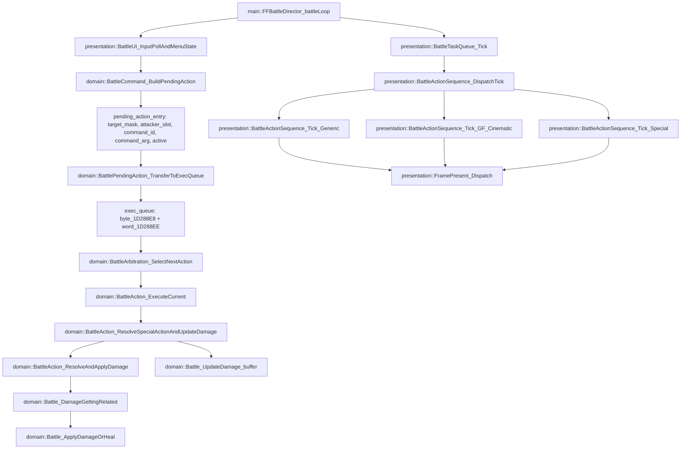

## Main Battle Loop Architecture (Text + Diagram)

Scope: `main::FFBattleDirector_battleLoop` (0x47CCB0) and how the domain tick feeds presentation.

### Overview (text)
The battle loop is a state machine keyed on `mode_StateGlobal == 3`. After battle initialization finishes, the per-frame tick runs under `mode3_subsub_step == 3` and `mode_3_subsubsubstep == 4`. Within that tick:
- Domain logic resolves actions and applies damage.
- Presentation is driven later via queued tasks and render tick functions.

### Key Nodes
- `main::FFBattleDirector_battleLoop` (0x47CCB0): battle state machine and per-frame tick.
- `presentation::BattleUI_InputPollAndMenuState` (0x4A8772): input poll + menu state updates.
- `presentation::BattleUI_EnqueueCommand` (0x4AD620): enqueue UI command events.
- `domain::BattlePendingAction_Write` (0x484D20): writes pending action record + target mask.
- `domain::BattlePendingAction_TransferToExecQueue` (0x4847F0): transfers pending actions into exec queue.
- `domain::BattleArbitration_SelectNextAction` (0x485460): selects next action from exec queue.
- `domain::BattleAction_ExecuteCurrent` (0x4856C8): builds/executes the current action context (not hit in live player-attack trace; likely conditional).
- `domain::BattleAction_ResolveSpecialActionAndUpdateDamage` (0x485160): resolves actions and pushes damage results.
- `domain::BattleAction_ResolveAndApplyDamage` (0x48FE20): enters damage pipeline.
- `domain::Battle_DamageGettingRelated` (0x4922B0) → `domain::Battle_ApplyDamageOrHeal` (0x494410).
- `presentation::BattleTaskQueue_Tick` (0x500CC0): dispatches presentation tasks.
- `presentation::BattleActionSequence_DispatchTick` (0x50A790): selects presentation tick path.
- `presentation::BattleActionSequence_Tick_*` (0x50A9A0 / 0x50B2A0 / 0x50B830): sequence ticks.
- `presentation::FramePresent_Dispatch` (0x41DF14): backend present/flip dispatch.

### Mermaid Diagram

### Update Notes
- Replace any `domain::` or `presentation::` labels once more precise names are confirmed.
- Add additional nodes for ATB accumulation, AI gating, and action arbitration as they are identified.
