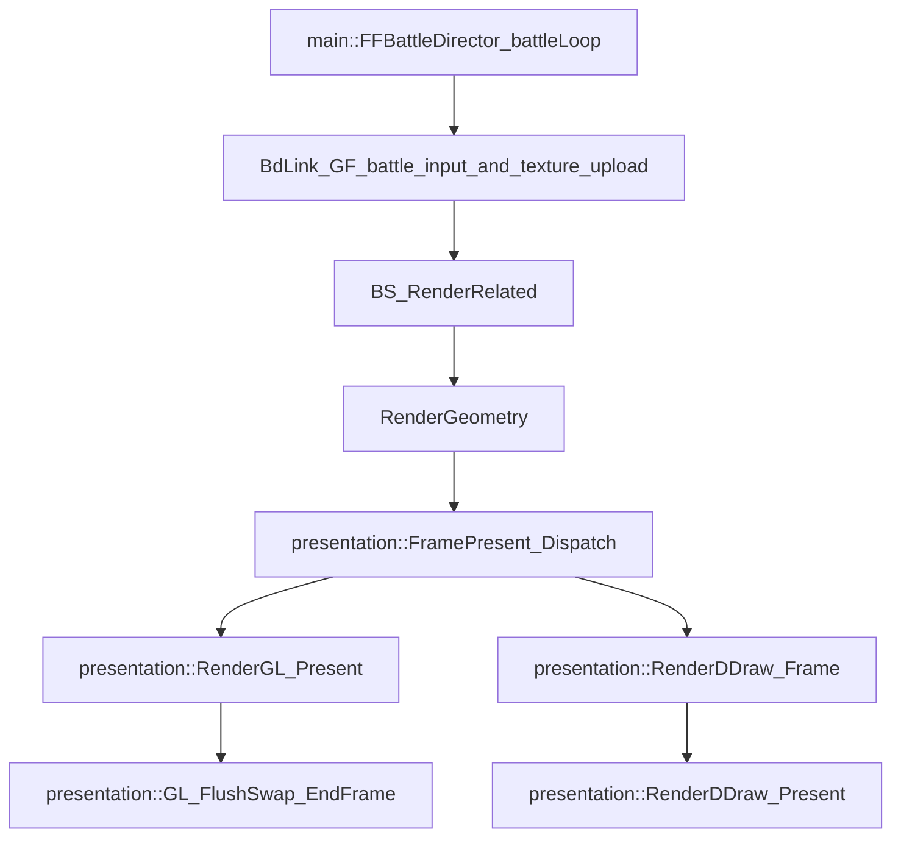

## Evidence
- The battle loop (`main::FFBattleDirector_battleLoop`, 0x47CCB0) enters per-frame tick at `mode_3_subsubsubstep == 4` and calls:
  - `j_battle_run_battle_file_callback_2_sub_482590`
  - `BdLink_GF_battle_input_and_texture_upload` (0x500900)
- `BdLink_GF_battle_input_and_texture_upload` feeds battle presentation tasks (camera, stage, texture) and reaches `BS_RenderRelated` (0x500FD0) via its call graph.
- Frame present is dispatched by `presentation::FramePresent_Dispatch` (0x41DF14), which jumps to the active backend vtable entry 4.

## Battle Presentation Branch (Domain → Presentation)
`main::FFBattleDirector_battleLoop` (0x47CCB0)
→ `BdLink_GF_battle_input_and_texture_upload` (0x500900)
→ battle render task chain (camera, stage, texture)
→ `BS_RenderRelated` (0x500FD0)
→ `RenderGeometry` (0x5099D0)

This chain prepares the battle scene geometry and camera state. It is **presentation-only** and does not affect domain state directly.

## Frame Present / Swap
The final present/flip for the frame is **not called directly** from the battle loop. It is executed through the global renderer dispatch:
`presentation::FramePresent_Dispatch` (0x41DF14)
→ backend vtable entry 4
→ `presentation::RenderGL_Present` (0x439CF3) **or** `presentation::RenderDDraw_Frame` (0x43C761)
→ `presentation::GL_FlushSwap_EndFrame` (0x445137) **or** `presentation::RenderDDraw_Present` (0x40B50E)
→ `SwapBuffers` / DirectDraw blt

## Mermaid Diagram

## TODO
- Identify the exact dispatcher that calls `presentation::FramePresent_Dispatch` during battle (likely a global per-frame renderer loop).
- Confirm whether `BdLink_GF_battle_input_and_texture_upload` has any non-presentation side effects that must remain enabled when presentation is replaced.
