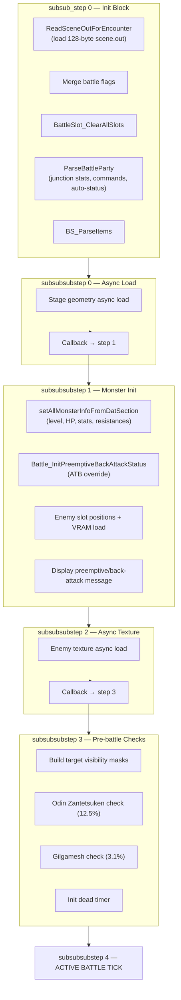

# Battle Initialization Sequence

Complete state machine and initialization flow from scene load to the first active battle tick.

> Cross-references: [battle_loop.md](battle_loop.md) (per-frame tick), [atb_system.md](atb_system.md) (ATB accumulation), [enemy_ai_vm.md](enemy_ai_vm.md) (AI scripts), [../reference/battle_slot_layout.md](../reference/battle_slot_layout.md) (slot struct), [../reference/address_catalog.md](../reference/address_catalog.md) (master address list).

## State Machine Overview

`main::FFBattleDirector_battleLoop` (`0x47CCB0`) drives the battle module through a three-level state machine.

### Level 1: `mode_StateGlobal`

| Value | Phase |
|-------|-------|
| 3 | Battle (init + active tick + cleanup) |
| 4 | Load overlay (`btitle.ovl`) |
| 5 | Level-up / XP-AP reward screen |
| 8 | Card game (Triple Triad) |
| 100 | Exit battle, return to field / world map |

### Level 2: `mode3_substep` (within `mode_StateGlobal == 3`)

| substep | Description |
|---------|-------------|
| 0 | Reset countdowns to 0, transition to 1 |
| 1 | Match `COMBAT_SCENE_ID` against `battle_mode_related` list, transition to 2 |
| 2 | `Battle_LoadOverlayModule` (`0x47E410`) — loads battle overlay, transitions to 3 |
| 3 | **Open Stage** — main init, active tick, cleanup (see Level 3 below) |

### Level 3: `mode3_subsub_step` (within substep 3)

| subsub_step | Description |
|-------------|-------------|
| 0 | **Init block**: scene load, party/item parse, enemy visibility. Sets `mode3_subsub_step = 1`. |
| 1 | Falls through to `mode_3_subsubsubstep` switch (battle phases). |
| 2 | **Cleanup**: `Battle_EndCleanupAndTransition` (`0x4868C0`) — saves state, counts outcomes, transitions `mode_StateGlobal`. Resets to 0. |

### Level 4: `mode_3_subsubsubstep` (within subsub_step 1)

| Step | Functions | Description |
|------|-----------|-------------|
| **0** | `Battle_RunFileLoadingCallbacks`, `BdLink_GF_battle_input_and_texture_upload` | Async stage geometry load. Callback `0x47DD80` sets step = 1 on completion. |
| **1** | `setAllMonsterInfoFromDatSection`, `Battle_InitPreemptiveBackAttackStatus`, enemy position + VRAM load, `Battle_DisplayPreemptiveMessage` | Monster init, preemptive check, slot positioning. Code sets step = 2. |
| **2** | `Battle_RunFileLoadingCallbacks`, `BdLink_GF_battle_input_and_texture_upload` | Async enemy texture upload. Callback `0x47DD70` sets step = 3 on completion. |
| **3** | Odin check, Gilgamesh check, `AI_BATTLE_ACTIVE_FLAG = 1`, `Battle_InitDeadTimer` | Pre-battle checks. Code sets step = 4. |
| **4** | **Active battle tick** (every frame) | See [battle_loop.md](battle_loop.md). |



---

## Init Block Detail (subsub_step 0)

Executed once at battle start, in this order:

| # | Address | Function | Role |
|---|---------|----------|------|
| 1 | — | `init_battle_file_callback_2` | Register file-loading callback for stage |
| 2 | — | `input_structure_vibrate_init` | Controller vibration init |
| 3 | `0x482D10` | `Battle_InitTimerState` | Init timer/countdown state |
| 4 | — | `byte_1D280C3 = 1` | Mark battle frame processing active |
| 5 | — | `mode_3_subsubsubstep = 0` | Reset phase counter |
| 6 | — | `BATTLE_TRANSITION_COUNTDOWN = -1` | No transition pending |
| 7 | — | `BATTLE_RESULT_CODE = 0` | No battle result yet |
| 8 | `0x48F050` | `Battle_SeedRNG(rand())` | Seed battle RNG |
| 9 | — | `BS_CameraRelated_battle_reset` | Camera position reset |
| 10 | — | `CURRENT_ENCOUNTER_ID = COMBAT_SCENE_ID` | Copy scene ID |
| 11 | `0x48D0E0` | `ReadSceneOutForEncounter` | Load 128-byte scene.out entry at offset `scene_id << 7` via `Archive_IO_LoadFile` |
| 12 | — | Flag merge | Merge `CURRENT_ENCOUNTER_DATA_SCENE_OUT.battle_flags` into `ENCOUTER_BATTLE_FLAG` |
| 13 | `0x48D020` | `Battle_ResetXPAndItemRewards` | Zero all XP/Gil/Item/Card accumulators |
| 14 | `0x48C740` ×3 | `Battle_InitActionQueueGroup(1)`, `(2)`, `(0)` | Init action queues for party melee, party ranged, enemies |
| 15 | — | `BattleSlot_SetEnemyVisibility` | Set which of 8 enemy slots are active from scene data |
| 16 | `0x48C620` | `BattleSlot_ClearAllSlots` | Clear all 11 battle slots (status = dead, hp = 0) |
| 17 | `0x48B7E0` | `ParseBattleParty` | **Master party init** (see [Party Init](#party-initialization) below) |
| 18 | — | `BS_ParseItems` | Parse inventory items for battle |
| 19 | `0x48D1F0` | `Battle_ResetAttackHitCount` | Reset hit counter |
| 20 | — | Presentation setup | `SomeListManipulation` calls for scenario, UI, monster visibility |
| 21 | — | `mode3_subsub_step = 1` | Transition to phase 1 (async loading) |

---

## Party Initialization

`ParseBattleParty` (`0x48B7E0`) orchestrates all party slot setup.

### Pre-loop

1. Clear status/ATB buffers for all party slots.
2. Collect **known magic** from all 3 party members' junction data into `SG_KNOWN_MAGIC` bitmask.
3. Reset `RARE_ITEM_ABILITY_IN_IT = 0`.

### Per-slot (i = 0..2)

Four functions run in sequence for each party slot:

#### a. `ParseBattleCharacter(charId, slotId)` — `0x495530`

Copies save-game data (`SG_ARRAY_CHARA_DATA`, stride 152) to intermediate
`F_CHAR_DATA`. Steam `.ff8`: LZS payload, classic savemap at decompressed
`+0x180`, array at savemap `+0x490` (file `+0x610`):

- `ModelID`, `CurrentHP`, `Experience`, `AltModel`, `WeaponID`
- Level calculated from XP via `getCharaXP_sub_496240` / `getCharaXP_sub_4961D0`
- Junction abilities → `JFlag` bitmask (support abilities like Auto-Haste, Initiative, etc.)
- Accumulates `RARE_ITEM_ABILITY_IN_IT` (party-level abilities: Rare Item, Enc-Half, etc.)
- GF junction list (up to 16 GFs, with alive/KO state)
- Battle commands from `SG_ARRAY_CHARA_DATA.Commands` + Battle Seal lockout check
- 9 base stat percentages stored at `F_CHAR_DATA` offsets +455..+463

#### b. `Battle_CalculateJunctionStats(charId, slotId)` — `0x495960`

Computes **final stats** from junction data. For each stat:

```
final = basePct[statIdx] × GetCharacterStat(level, charId, statIdx) / 100
```

| Stat | Index | Cap | Formula Variant |
|------|-------|-----|-----------------|
| HP | 0 | 9999 | `GetCharacterHP` (see [HP Formula](#character-hp-formula)) |
| STR | 1 | 255 | STR/VIT/MAG/SPR variant |
| VIT | 2 | 255 | STR/VIT/MAG/SPR variant |
| MAG | 3 | 255 | STR/VIT/MAG/SPR variant |
| SPR | 4 | 255 | STR/VIT/MAG/SPR variant |
| SPD | 5 | 255 | SPD/LUCK variant |
| LUCK | 8 | 255 | SPD/LUCK variant |
| HIT | 7 | 255 | `GetCharacterHit` |
| EVA | 8 | 255 | `GetCharacterEva` |

Also computes: `elem_def[0..7]`, `hit_status_1`/`hit_status_2`, `mental_res[0..12]`.

#### c. `Battle_InitPartySlotStatusFromChar(slotId)` — `0x48B5F0`

Reads `F_CHAR_DATA` abilities dword (offset +400) and applies auto-statuses:

| Ability Bit | Effect |
|-------------|--------|
| `0x1000` | `status_2 \|= 0x80` — Auto-Reflect |
| `0x2000` | `status_2 \|= 0x40` — Auto-Shell |
| `0x4000` | `status_2 \|= 0x20` — Auto-Protect |
| `0x8000` | `status_2 \|= 0x02` — Auto-Haste |
| `0x10000` | ATB starts at MAX — Initiative |

Then calls `Battle_InitATB_MaxAndReset` + `Battle_InitATB_RandomFromSpeed` (see [ATB Init](#atb-initialization)).

#### d. `setBattleSlotData(slotId)` — `0x48B310`

Copies computed stats from `F_CHAR_DATA` → `BATTLE_SLOT_DATA[slot]`:

- `current_hp`, `max_hp`, `level`, `str`, `vit`, `mag`, `spr`, `spd`, `luck`, `hit_percent`, `eva`
- `elem_def[8]`, `mental_res` (default 100, overwritten from character data)
- `hit_status_1`, `hit_status_2`, `hit_element`, `hit_element_percent`
- Sets `STATUS2_HAS_MAGIC` if character has any stocked magic
- Ability `0x8000` → boosts Confuse/Berserk `mental_res` to 200
- Ability `0x80000` → boosts **all** `mental_res` to 200
- Calls `Battle_ComputeCrisisLevelFromHP` for initial crisis level

### Post-loop

`Battle_FinalizePartySetup` (`0x495EC0`) — iterates all 16 GFs, sets up GF battle data for each existing GF.

---

## Character Stat Formulas

### `GetCharacterStat` (`0x496440`)

**For STR / VIT / MAG / SPR** (stat indices 1–4):

```
stat = CapTo255(
    weaponBonus
    + (growthC + level × growthA / 10 + level / growthB − level² / growthD) / 4
    + baseStat
    + junctionMult × spellCount / 100
)
```

**For SPD / LUCK** (stat indices 5, 8):

```
stat = CapTo255(
    weaponBonus
    + growthC + level × growthA + level / growthB − level / growthD
    + baseStat
    + junctionMult × spellCount / 100
)
```

Where:

- `growthA/B/C/D` — character-specific growth curve params from `K_CHARACTER` table (36-byte entries, base `0x1CFAD78`)
- `baseStat` — `SG_ARRAY_CHARA_DATA[charId].STR` / `.VIT` / etc.
- `junctionMult` — `K_MAGIC[spellId].statJunctionValue`
- `spellCount` — number stocked (high byte of `SG_ARRAY_CHARA_DATA.Magic[idx]`)
- `weaponBonus` — `K_WEAPON[weaponId].strBonus` (STR only; also handles Laguna/Kiros/Ward dream weapons)

### Character HP Formula

`GetCharacterHP` (`0x496310`):

```
HP = MaxHP_save + growthC_HP + level × growthA_HP
     + spellCount × K_MAGIC[spell].hpJunctionValue
     − 10 × level² / growthD_HP
```

---

## Enemy Initialization

### `setAllMonsterInfoFromDatSection` (`0x48BA10`)

Iterates up to 8 enemy positions from scene data. For each visible enemy:

1. `setMonsterInfoFromDatInfoSection(slot, level_code, com_id)` (`0x48BBD0`)
2. Determine level complexity: low (`< med_level_start`), med, high (`>= high_level_start`)
3. `BattleSlot_ApplyMonsterStatScaling(slot)` (`0x48C1C0`)
4. Set visibility / targetable / loaded flags from `CURRENT_ENCOUNTER_DATA_SCENE_OUT`
5. Clear draw spell IDs for dead enemies
6. `Battle_InitDrawSpellAvailability` (`0x48C7A0`) — marks draw spells as known/unknown from `SG_KNOWN_MAGIC`

### Monster HP Formula

`setMonsterInfoFromDatInfoSection` (`0x48BBD0`):

```
HP = level × (hp[0] + 100 × hp[2])
   + 10 × (hp[1] + 100 × hp[3])
   + level² × hp[0] / 20
```

Where `hp[0..3]` are the 4 HP curve parameters from the monster `.dat` info section.

### Monster Stat Scaling

`BattleSlot_ApplyMonsterStatScaling` (`0x48C1C0`) applies level-based stat curves from the monster info section. Each stat uses a 4-byte parameter set at a specific offset:

| Stat | Info Offset | Formula Class |
|------|-------------|---------------|
| HP | +28 | Quadratic (HP/VIT variant) |
| STR | +32 | Linear |
| VIT | +36 | Quadratic (HP/VIT variant) |
| MAG | +40 | Linear |
| SPR | +44 | Linear |
| SPD | +48 | Linear |

**Quadratic** (HP, VIT): `CapTo255((c + lvl×a/10 + lvl/b − lvl²/d) / 4) × modifier / 10`

**Linear** (STR, MAG, SPR, SPD): `CapTo255(c + lvl×a + lvl/b − lvl/d) × modifier / 10`

### Monster Level Determination

The `level_code` byte in scene data selects the algorithm:

| Code | Algorithm | Function |
|------|-----------|----------|
| 0–100 | Literal level | (inline) |
| 101–200 | `min(code−100, avg ± avg/5)` clamp `[1,100]` | `0x48C140` |
| 201–250 | `GetPartyAverageLevelWithRandomness` + (code − 200), then cap 100 | (inline) |
| 251 | `avg ± (rng&3)` clamp `[1,65]` | `0x48C020` |
| 252 | Random 1–100 | (inline) |
| 253 | `rng % jittered_avg` (0→1), cap 100 | `0x48C0A0` |
| 254 | Exact party average (no randomness) | `0x48B2E0` |
| 255 | Party avg ± `avg/5` (most common) | `0x48BFA0` |

**GetPartyAverageLevelWithRandomness** (`0x48BFA0`): average of party slots whose `com_file_id != 0xFF`, then 50% chance to add or subtract `avg/5`. Clamped to `[1, 100]`.

2026-08-30 IDB recut: [[projects/re-ff8/references/g22-init-static-layouts-2026-08-30]].

### Innate Monster Statuses

Applied from `flag_byte_1` of the monster info section:

| Flag | Effect |
|------|--------|
| `ZOMBIE` | `status_1 \|= 0x40`, death resistance = 255 |
| `FLY` | `status_2 \|= Float` (BYTE1 bit 5) |
| `AUTO_REFLECT` | `status_2 \|= STATUS2_REFLECT` |
| `AUTO_PROTECT` (bit 7) | `status_2 \|= STATUS2_PROTECT` |
| `AUTO_SHELL` | `status_2 \|= STATUS2_SHELL` |

---

## ATB Initialization

### `Battle_InitATB_MaxAndReset` (`0x484490`)

```
MAX_ATB = 4000 × (SG_BATTLE_SPEED_SETTING + 1)
CUR_ATB = 0
```

### `Battle_InitATB_RandomFromSpeed` (`0x4844D0`)

```
CUR_ATB = MAX_ATB / 100 × (SPD / 4 + random(0..127) + 1 − 35)
CUR_ATB = clamp(CUR_ATB, 0, MAX_ATB)
```

### Overrides

- **Initiative ability** (bit `0x10000`): `CUR_ATB = MAX_ATB` (starts with full gauge).
- **Preemptive** (`BACK_PREEMTIVE_INFO = 3 or 4`): party ATB = full, enemy ATB = 0.
- **Back attack** (`BACK_PREEMTIVE_INFO = 1 or 2`): party ATB = 0 (unless Initiative), enemy ATB = full.
- **Normal** (`BACK_PREEMTIVE_INFO = 0`): standard random from speed.

See also [atb_system.md](atb_system.md) for per-frame ATB accumulation after init.

---

## Preemptive / Back-Attack System

`Battle_InitPreemptiveBackAttackStatus` (`0x48AFD0`) determines the battle start type.

### Determination Flow

1. If `ENCOUTER_BATTLE_FLAG < 0` → **Normal** (result 0).
2. If `BATTLE_FORCE_PREEMPTIVE` flag set → forced preemptive.
3. If `BATTLE_FORCE_BACK_ATTACK` flag set → forced back attack.
4. Otherwise, RNG-based (2026-08-30 IDB):
   - `ENCOUTER_BATTLE_FLAG` bit `0x80` already forced type 0 (signed `< 0`).
   - Bits `0x20` / `0x40` force type 1 / 2. IDB `FORCE_PREEMPTIVE`/`BACK` names disagree with the ATB table — cite bits.
   - Base +20 if every enemy is Death or `flag_byte_2` bit 0; plus `Battle_CheckPreemptiveImmunity(2, −20)`.
   - Roll = that + `Battle_GetRandomInt()` (8-bit).
   - If `RARE_ITEM_ABILITY_IN_IT` bit 0 → roll −20; also demotes a back result (`v5==2`) to normal.
   - `flag_byte_2` bit 4 (`AlwaysBack` name) **blocks preemptive** (`v5==0` → 1). It does **not** force back.
   - `v5`: `<20` preemptive pair, `20–235` normal, `≥236` back pair. Map: 1→type 0; 0→3 or 4; 2→1 or 2.

### `BACK_PREEMTIVE_INFO` Values

| Value | Meaning | Party ATB | Enemy ATB | Visual |
|-------|---------|-----------|-----------|--------|
| 0 | Normal | Random from SPD | Random from SPD | Standard positions |
| 1 | Back attack (A) | 0 | Full | Normal orientation |
| 2 | Back attack (B) | 0 + back status | Full | Party turned around |
| 3 | Preemptive (A) | Full | 0 | Normal orientation |
| 4 | Preemptive (B) | Full | 0 + flank status | Enemies turned around |

### Display Messages

`Battle_DisplayPreemptiveMessage` (`0x48AEF0`) shows text based on `BACK_PREEMTIVE_INFO`:

| Value | `BattleText_GetMiscText()` index |
|-------|----------------------------------|
| 1 | 46 |
| 2 | 45 |
| 3 | 44 |
| 4 | 47 |

---

## Pre-Battle Checks (subsubsubstep 3)

Final checks before the active tick begins:

| # | Address | Function | Details |
|---|---------|----------|---------|
| 1 | — | `CAN_BATTLE_BE_PAUSED = 1` | Enable pause menu |
| 2 | `0x485FF0` | `Battle_BuildTargetVisibilityMasks` | Build party/enemy targeting bitmasks |
| 3 | — | Clear pending action buffer | Zero 20-byte buffer |
| 4 | `0x47D8A0` | `Battle_EnqueueInitialPartyActions` | Slots 0–6: enqueue `special_id=0` group 0 iff `flag 0x01 && 0x10 && !0x80`. Party init writes `0x8801` (no `0x10`). DAT writes `0x11`. Loaded `0x80` blocks. Not Attack. |
| 5 | — | `AI_BATTLE_ACTIVE_FLAG = 1` | Enable AI processing |
| 6 | `0x482E00` | `Odin_BattleInit_ZantetsukenCheck` | 32/255 (12.5%) if `SG_ODIN_ANGEL_GILGA_FLAG` bit 1 set AND all alive enemies have death resistance < 200 |
| 7 | `0x4831F0` | `Gilgamesh_BattleInit_TriggerCheck` | 8/255 (3.1%) if Gilgamesh flag set. Random selects attack variant 0–3 |
| 8 | `0x482F70` | `Battle_InitDeadTimer` | `BATTLE_DEAD_TIMER = K_MISC.dead_timer` |

---

## Battle End Detection

Five per-frame checks run during the active tick (subsubsubstep 4):

| Priority | Address | Function | Condition | `BATTLE_RESULT_CODE` |
|----------|---------|----------|-----------|----------------------|
| 1 | `0x4863F0` | `BattleTick_CheckScriptedBattleEnd` | AI script sets `unk_1D28E2D` | 1 |
| 2 | `0x486450` | `BattleTick_CheckPartyWipe` | All party dead + Phoenix fails | 1 |
| 3 | `0x486390` | `BattleTick_CheckTimerExpiry` | `ENCOUTER_BATTLE_FLAG & 0x04` + timer expired (scene != 317) | 3 |
| 4 | `0x486500` | `BattleTick_CheckAllEnemiesDead` | All enemy `status_1 & 5` set | 4 |
| 5 | `0x4862A0` | `BattleTick_CheckEscapeSuccess` | Escape flag + eligible party member | 2 |

### `BATTLE_RESULT_CODE` (`0x1CFF6E7`)

| Value | Outcome | Next `mode_StateGlobal` |
|-------|---------|-------------------------|
| 0 | Battle ongoing | — |
| 1 | Party wipe (Game Over) | 100 (exit) |
| 2 | Escape success | 5 (XP screen) |
| 3 | Timer expired | 100 (exit) |
| 4 | All enemies dead (Victory) | 5 (XP screen) or 100 (no-XP if `NO_EXP_SCREEN` flag) |

### Phoenix Auto-Revive

`Battle_PhoenixAutoReviveCheck` (`0x483270`):

- Triggered when `BattleTick_CheckPartyWipe` finds all party dead.
- Requires `SG_ODIN_ANGEL_GILGA_FLAG` bit 2 (Phoenix / Angel Wing ability).
- Probability: 64/255 (25.1%).
- Does **not** trigger in scene 317.

### End Transition

`Battle_EndCleanupAndTransition` (`0x4868C0`):

1. Save party HP and status back to save-game data.
2. Clear `STATUS2` bit 0x20 (remove battle-only status flags).
3. Return stolen/obtained items to inventory.
4. Increment counters: `SG_BATTLE_VICTORY_COUNT` (victory), `SG_BATTLE_ESCAPED` (escape), or `SG_UNUSED_IN_FIELD_1` (wipe/timer).
5. Set `mode_StateGlobal` → 5 (level-up screen) or 100 (exit to field).
6. Stop all SFX, reset battle animation state.

### XP Distribution Formula

`BattleEnd_DistributeXpAp` (`0x494D40`):

Per enemy slot (if damaged):

```
xp = (maxHP − currentHP) × (5 × baseXP × monsterLevel / partyAvgLevel − baseXP) / maxHP
```

- Clamped to [1, 60000].
- Total XP = sum across all enemy slots, capped at 60000.
- Dead/petrified party members receive 0 XP.
- GF XP = total XP / (number of junctioned GFs for that party member).
- GF AP = fixed AP per battle from `BCI_GF_AP_EARNED`.
- `ENCOUTER_BATTLE_FLAG` bit 3 set → no XP awarded.

---

## Key Globals

| Address | Name | Type | Description |
|---------|------|------|-------------|
| `0x1CFF6E0` | `COMBAT_SCENE_ID` | `u16` | Scene ID for current battle |
| `0x1CFF6E2` | `ENCOUTER_BATTLE_FLAG` | `u16` | Battle flags bitmask |
| `0x1CFF6E7` | `BATTLE_RESULT_CODE` | `u8` | Battle outcome (0–4, see above) |
| `0x1D28E08` | `BACK_PREEMTIVE_INFO` | `u8` | Battle start type (0=normal, 1–2=back, 3–4=preemptive) |
| `0x1D28DE4` | `BATTLE_DEAD_TIMER` | `u16` | Dead timer countdown (from `K_MISC.dead_timer`) |
| `0x1D28E01` | `BATTLE_END_TYPE` | `u8` | End transition type (0=victory+music, 1=victory silent, 2=escape, 3=wipe) |
| `0x1D28E1D` | `GILGAMESH_TRIGGERED_FLAG` | `u8` | Gilgamesh one-shot (0=no, 1=triggered this battle) |

## Confidence

- **State machine map**: High (decompiled directly from `0x47CCB0`, all branches verified).
- **Party init call chain**: High (decompiled 4 functions in sequence, cross-referenced).
- **Character stat formulas**: High (decompiled `GetCharacterStat` and `GetCharacterHP`; matches Ultimania formulas).
- **Monster HP/stat formulas**: High (decompiled `setMonsterInfoFromDatInfoSection` and `BattleSlot_ApplyMonsterStatScaling`).
- **Preemptive system**: High (full call chain decompiled including all 4 helper functions).
- **ATB init**: High (two functions decompiled, Initiative override confirmed).
- **Battle end detection**: High (all 5 check functions decompiled).
- **XP formula**: Medium-High (decompiled but some variable naming uncertain).
