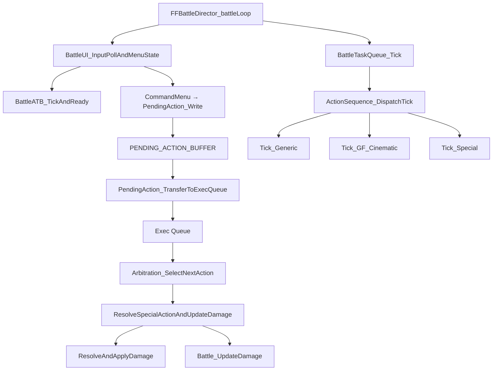

# Battle Loop

## State Machine

`main::FFBattleDirector_battleLoop` (`0x47CCB0`) is the battle module state machine. The per-frame battle tick executes when:

- `mode_StateGlobal == 3` (battle)
- `mode3_subsub_step == 3`
- `mode_3_subsubsubstep == 4`

## Per-Frame Tick Flow

Within the active tick, the engine runs in this order:

1. **Input/ATB**: `BattleUI_InputPollAndMenuState` (`0x4A8772`) polls input, calls `BattleATB_TickAndReady` (`0x4842B0`) to advance ATB gauges (see `systems/atb_system.md`).

2. **Pending → Exec**: `BattlePendingAction_TransferToExecQueue` (`0x4847F0`) transfers active pending actions into the execution queue (see `reference/pending_action.md`).

3. **Arbitration**: `BattleArbitration_SelectNextAction` (`0x485460`) selects the next action from the exec queue.

4. **Resolution**: `BattleAction_ResolveSpecialActionAndUpdateDamage` (`0x485160`) resolves actions → damage pipeline (see `systems/damage_pipeline.md`).

5. **Presentation**: `BattleTaskQueue_Tick` (`0x500CC0`) dispatches queued presentation tasks (see `systems/render_bridge.md`).

## Initialization Phases

Before the per-frame tick begins, battle init runs through `mode_StateGlobal == 3` substeps: load `COMBAT_SCENE_ID`, parse scene/out data, initialize party/enemy slots, apply preemptive/back-attack modifiers, then transition into the active tick.

## Mermaid Diagram

