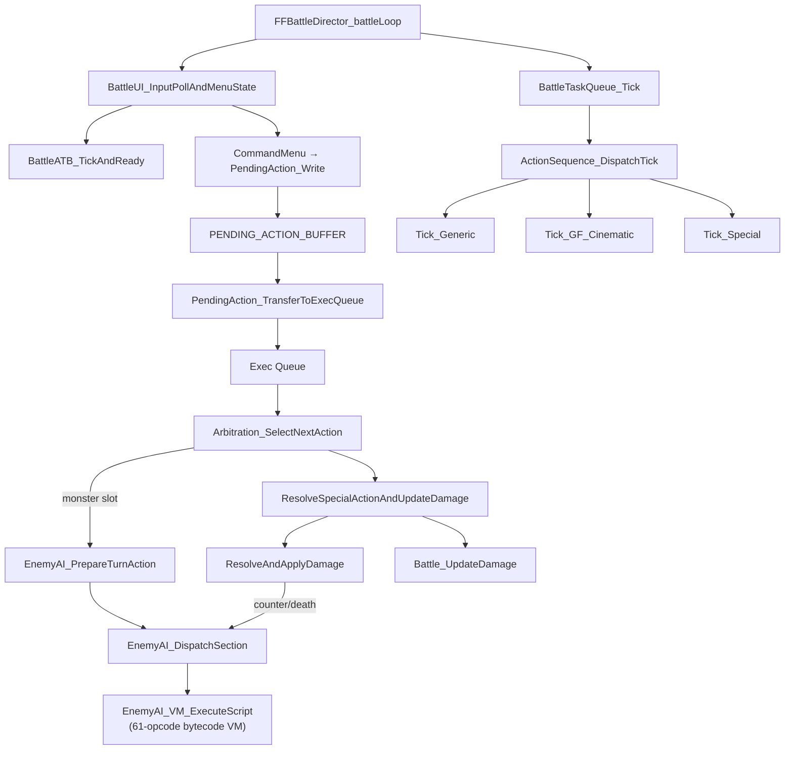

# Battle Loop

## State Machine

`main::FFBattleDirector_battleLoop` (`0x47CCB0`) is the battle module state machine. The per-frame battle tick executes when:

- `mode_StateGlobal == 3` (battle)
- `mode3_subsub_step == 3`
- `mode_3_subsubsubstep == 4`

## Per-Frame Tick Flow

Within the active tick, the engine runs in this order:

1. **Input/ATB**: `BattleUI_InputPollAndMenuState` (`0x4A8772`) polls input, calls `BattleATB_TickAndReady` (`0x4842B0`) to advance ATB gauges (see `systems/atb_system.md`).

2. **Pending → Exec**: `BattlePendingAction_TransferToExecQueue` (`0x4847F0`) transfers active pending actions into the execution queue (see `reference/pending_action.md`).

3. **Arbitration**: `BattleArbitration_SelectNextAction` (`0x485460`) selects the next action from the exec queue. For monster slots, this calls into the Enemy AI VM (see `systems/enemy_ai_vm.md`).

4. **Resolution**: `BattleAction_ResolveSpecialActionAndUpdateDamage` (`0x485160`) resolves actions → damage pipeline (see `systems/damage_pipeline.md`).

5. **Presentation**: `BattleTaskQueue_Tick` (`0x500CC0`) dispatches queued presentation tasks (see `systems/render_bridge.md`).

## Initialization Phases

Before the per-frame tick begins, battle init runs through `mode_StateGlobal == 3` substeps:

1. Load `COMBAT_SCENE_ID` and scene.out data (128 bytes at offset `scene_id << 7`).
2. Clear all 11 battle slots, parse party (junction stats, commands, auto-statuses), parse items.
3. Async-load stage geometry (step 0 → callback → step 1).
4. Init enemy slots from `.dat` data (level scaling, HP formula, stat curves, innate statuses).
5. Determine preemptive / back-attack and override ATB accordingly.
6. Async-load enemy textures (step 2 → callback → step 3).
7. Pre-battle checks: Odin (12.5%), Gilgamesh (3.1%), dead timer, target visibility.
8. Transition to active tick (step 4).

See **[battle_init.md](battle_init.md)** for the complete state machine, formulas, and function addresses.

## Mermaid Diagram

