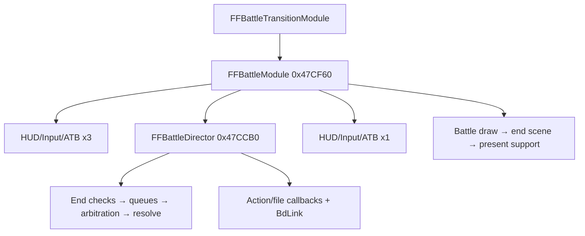

# Battle Loop

## Ownership Hierarchy

The battle loop has two distinct owners:

- `main::FFBattleModule` (`0x47CF60`) is the **whole-frame owner**. `FFBattleTransitionModule` (`0x559890`) installs it as the recurring module callback, separately from `FFBattleInitSystem` (`0x47CE10`) and `FFBattleExitSystem` (`0x47CEF0`). One call owns one battle frame.
- `main::FFBattleDirector_battleLoop` (`0x47CCB0`) is the **domain director** called once from that frame owner while the battle is not paused. It owns battle initialization, the recurring domain tick, result detection, and cleanup.

`main::FFModuleHandler_main_loop` starts at `0x4706B0`. Address `0x4709EC` is only an interior assignment site where that dispatcher stores `main::FFBattleModule` as a module callback.

## Active State Guard

The recurring director tick executes under the four-level state:

- `mode_StateGlobal == 3`
- `mode3_substep == 3`
- `mode3_subsub_step == 1`
- `mode_3_subsubsubstep == 4`

The older shorthand `mode3_subsub_step == 3` is incorrect: value `3` belongs to `mode3_substep`; the active subsub state is `1`.

## Whole-Frame Order

`main::FFBattleModule` runs, in order:

1. Begin the graphics scene and prepare battle render buffers.
2. Evaluate the battle pause request.
3. If `mode_Battle_AnimationState == 3`, call `BattleUI_HudInputAndATBTick` (`0x4A84E0`) three times.
4. If `!IS_BATTLE_PAUSED`, call `FFBattleDirector_battleLoop` once.
5. If `mode_Battle_AnimationState == 3`, call `BattleUI_HudInputAndATBTick` once more and render cursor/menu state.
6. Handle `exit_battle` module switching.
7. Draw the battle frame, end the scene, and run window/present support.
8. Pace the next frame through `UpdateRateRelated` (`0x4020F0`).

Input, command-menu readiness, and ATB therefore live in the frame/HUD layer, not at the beginning of the director's active block.

## Director Active-Tick Order

Within the active `subsubsubstep == 4` case, the director runs:

1. Refresh enemy/Griever names and set the in-logic flag.
2. Run the five battle-end checks.
3. Update the escape held-input presentation latch.
4. Transfer all pending entries to the execution queues.
5. Enqueue enemy counter actions.
6. Reset all three queue groups if an end result was latched.
7. If no action is locked, arbitrate and synchronously resolve/commit the selected action.
8. Tick statuses and Angelo/Odin when their gates permit.
9. Process action and deferred callback chains.
10. Pump battle-file callbacks, run `BdLink_GF_battle_input_and_texture_upload`, and update transition/message tails.

Outcome HP/status is committed during selection/resolution. Multi-frame action sequences are presentation, although their completion and callback state can still gate later domain progress.

## Initialization And Handoff

Before the active tick, the director:

1. Loads `COMBAT_SCENE_ID` and the `scene.out` record.
2. Clears all 11 slots, parses party/items, and seeds battle RNG.
3. Loads stage and enemy resources asynchronously.
4. Initializes enemy data, ATB, positions, target masks, scripted summons, and dead timer.
5. Writes `mode_3_subsubsubstep = 4` at `0x47D6F8`.

That write is the post-init handoff. The same frame still calls `Battle_RunFileLoadingCallbacks` (`0x47D702`) and `BdLink_GF_battle_input_and_texture_upload` (`0x47D707`); the first recurring active block starts on the next director entry at `0x47D70F`.

See **[battle_init.md](battle_init.md)** for the complete initialization state machine.

## Replacement Boundaries

- **Whole battle frame:** hook `main::FFBattleModule` at `0x47CF60`. This is the only seam that replaces pause, HUD/input/ATB, director dispatch, battle rendering, and frame pacing together.
- **Domain only:** hook the director or its active case at `0x47D70F`. The surrounding HUD and frame-render work remains native.
- **Post-native-init takeover:** allow the director to reach `3 / 3 / 1 / 4`, then transfer ownership. File callbacks, action/deferred callbacks, serialization latches, and cleanup must be preserved or faithfully replaced.

The native return seam was confirmed live on 2026-07-12. A replacement can set up a native-compatible result and return control so the director reaches `mode3_subsub_step=2`; `Battle_EndCleanupAndTransition` then commits party/reward state, enters mode 5 for victory/escape, runs `FFBattleExitSystem`, and transfers to `BattleRewardMenu_MainLoop`. Transient pending/exec/latch bytes do not need a blanket zero: native battle init clears the state block before the next encounter.

