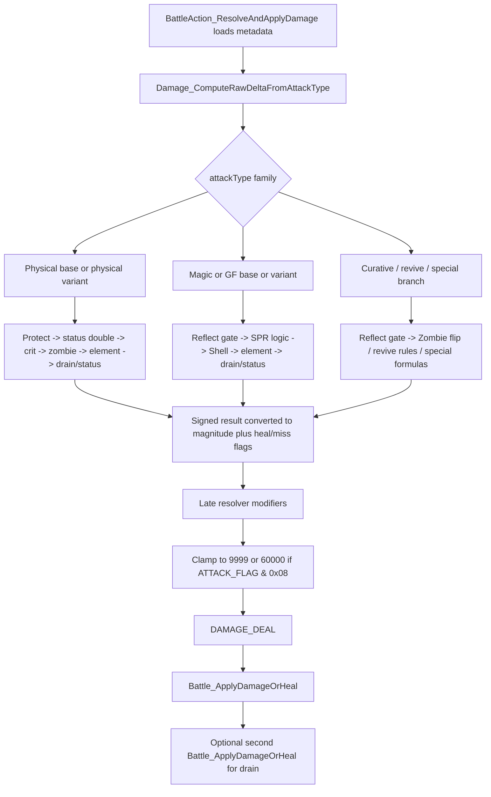

# Damage Formula And Attack Flags

> [!warning] Runtime blocker
> No live debuggee is attached to the current IDA session (`debugger_on = false`, `process_state = 0`). This note is therefore a static-analysis staging artifact: it is ready to merge as a reconstruction of formula structure and confirmed flag semantics, but not as runtime-validated damage samples.

This note tightens [[projects/re-ff8/concepts/damage-status-pipeline]], [[projects/re-ff8/references/battle-slot-and-command-layouts]], and [[projects/re-ff8/references/battle-address-catalog]] without editing shared pages directly.

## Confirmed conclusions

- `BattleAction_ResolveAndApplyDamage` loads per-hit metadata first, calls `Damage_ComputeRawDeltaFromAttackType` for the raw magnitude, then applies a late cap and only then calls `Battle_ApplyDamageOrHeal`.
- The confirmed `ATTACK_FLAG` bits actually read by the current damage path are:
  - `0x03` -> low two damage-class bits
  - `0x08` -> Break Damage Limit (`9999 -> 60000`)
  - `0x10` -> reflectable action gate
- `Battle_ApplyDamageOrHeal` does not participate in the numeric base formula. It commits already-capped magnitude, performs KO/heal bookkeeping, handles the second drain application, and contains the separate GF summon-charge absorb branch documented in [[gf_charge_absorption]].
- The elemental math already isolated in [[elemental_resolution]] is directly reused here:
  - magic/GF uses `damage * (900 - elem_def) / 100`
  - physical uses `damage += damage * HIT_ELEMENT_PERCENT * (800 - elem_def) / 10000`
- Support and status-only actions do **not** bypass the raw-delta layer entirely. Zero-power magic/GF support actions still traverse `ComputeMagicAndGFDamage`, can still run status application, and only collapse to "no visible damage" after that pass.
- No direct reader in the current `ATTACK_FLAG` xref set consumes bits above `0x10`. Known row values such as `0x21` therefore remain only partially decoded.^[ambiguous]

## Metadata families and source tables

`BattleAction_ResolveAndApplyDamage` pulls `attackType`, `attackFlags`, power, element, hit%, crit bonus, and status payload from different families before dispatch:

- `K_MAGIC` -> magic, draw-cast, Slot, and command `247`
- `K_ITEM` -> items (`K_ITEM.unknown2` is the field that is actually loaded into `ATTACK_FLAG`)
- `K_BATTLE_COMMAND_ABILITY` -> command-family actions like Treatment / Recover / Revive / Darkside-side paths
- `K_ENEMY_ATTACK` -> enemy attacks
- `K_GF_JUNCTIONABLE` -> GF actions (`attackType`, `gfPower`, `attackFlags`, `powerMod`, `levelMod`)
- `K_SHOT`, `K_TEMP_CHAR`, `K_RINOA_LIMIT_PART_2`, `K_DUEL`, `K_RENZOKUKEN_FINISHER` -> physical-like special families that also populate `HIT_ELEMENT_PERCENT`
- fallback physical path -> attacker slot fields plus `K_WEAPON`

Useful runtime/formula inputs confirmed in `BATTLE_SLOT_DATA`:

- attacker: `str`, `mag`, `luck`, `level`, `hit_percent`, `hit_element`, `hit_element_percent`
- target: `vit`, `spr`, `eva`, `luck`, `current_hp`, `max_hp`, `elem_def[8]`, `mental_res[...]`, `status_1`, `status_2`, `flag_data`

## `ATTACK_FLAG` table

### Confirmed bits

| Mask | Confirmed meaning | Static basis |
| --- | --- | --- |
| `0x0003` | low damage-class bits | `last_attacker_attack_type = ATTACK_FLAG & 3` in the resolver, plus family-specific gates below |
| `0x0008` | Break Damage Limit | late clamp at `0x491125..0x491141` raises cap from `9999` to `60000` |
| `0x0010` | reflectable action | `GetReviveHP`, `ComputeMagicAndGFDamage`, `computeCurativeMagic`, and `BattleStatus_QueueActionIfStatusFlagged_TODO` all test `ATTACK_FLAG & 0x10` before queuing a reflect bounce |

### Confirmed low-class semantics

| `ATTACK_FLAG & 3` | Meaning | Evidence |
| --- | --- | --- |
| `0` | physical/contact class | physical raw-delta path clears `Sleep | Confuse` (`0x4001`), and enemy death presentation has a special branch gated by `test ATTACK_FLAG, 3 == 0` |
| `1` | magical class | `ComputeMagicAndGFDamage` halves damage on Shell only when `(ATTACK_FLAG & 3) == 1` |
| `2` | item-like class | `computeCurativeGFMagicItem` applies the party `Med Data` doubling only when `(ATTACK_FLAG & 3) == 2` |
| `3` | reset / currently unclassified class | resolver resets `ATTACK_FLAG = 3` before loading real metadata; no unique numeric branch was closed for class `3` in this pass ^[ambiguous] |

### Reflect semantics

The `0x10` bit is best documented as "reflectable", not "already reflected":

- if the bit is clear, magic/curative/revive helpers apply directly;
- if the bit is set and the target currently has Reflect (`status_2` low-byte sign bit), the helpers queue a bounce record through `byte_1D28DCC/CD/CE`, mark a miss, and return `0`;
- command family `247` bypasses that queue and behaves like the already-reflected magic path.^[inferred]

### Still open

- No current xref proves a use for `0x20` or higher bits inside the numeric damage path.
- `K_GF_JUNCTIONABLE[9]` / Cerberus still carries `attackFlags = 0x21`, but only the low bit is currently explained by code consumption.^[ambiguous]

## Formula family split

## 1. Physical-like families

Primary entries:

- `ATTACK_TYPE_PHYSICAL_ATTACK`
- `ATTACK_TYPE_PERCENT_PHYSICAL_DAMAGE`
- `ATTACK_TYPE_RENZOKUKEN_FINISHER`
- `ATTACK_TYPE_KAMIKAZE`
- `ATTACK_TYPE_EVERYONES_GRUDGE`
- `ATTACK_TYPE_PHYSICAL_ATTACK_IGNORE_TARGET_VIT`
- Squall gunblade path via `ContainPhysicalDamageFormula`

### Physical hit / crit gates

The standard physical branch runs:

1. if `ATTACK_FLAG & 3 == 0`, clear `Sleep | Confuse` via `RelatedToStatus1And2(target, 0, 0x4001)`;
2. if the target is Petrified or in the `0x180800` invulnerability family, abort unless the special bypass bit `HIT_STATUS_2 & 0x04000000` is set;
3. if the target is `Sleep | Stop` or `HIT_ATTACK_HITPERCENT == 0xFF`, skip the ordinary hit% roll and proceed directly;
4. otherwise compute:

```text
chance = HIT_ATTACK_HITPERCENT
       + attacker.luck / 2
       - target.eva
       - target.luck

final_hit = floor(255 * max(chance, 0) / 100)
```

5. critical chance is:

```text
crit = 255 * (RELATED_TO_CRIT_BONUS + attacker.luck) / 255
```

Blind (`status_1 & 0x0008`) quarters `HIT_ATTACK_HITPERCENT` before the hit roll.

### Base physical formula

Normal physical base damage, `Everyone's Grudge`, and the "ignore target VIT" variant all reduce to `ComputeWithDamageSTRFormula`:

```text
target_vit = target.vit
if target.status_2 & VIT_0_STATUS_MASK:
    target_vit = 0

base =
    rand(240..272)
  * attackPower
  * ((265 - target_vit)
     * (attacker.str + attacker.str * attacker.str / 16)
     / 256)
  / 16
  / 256
```

Variant overrides:

- percent physical: `attackPower * target.current_hp / 16`, unless the target has `flag_data & 0x10000`, in which case the hit becomes a miss and returns `0`
- kamikaze: `5 * attacker.max_hp`
- Everyone's Grudge: `attackPower * party_target.NumKills`, but only against party targets
- ignore target VIT: same formula with `target_vit = 0`

### Physical post-processing order

`HpModifierComputationForPhysical` applies modifiers in this order:

1. Protect halves damage.
2. A second target status mask doubles damage.^[ambiguous]
3. Crit doubles damage.
4. Zombie halves damage.
5. Elemental blend uses `HIT_ELEMENT_PERCENT` and `elem_def`.
6. Drain side-effect amount is computed when `HIT_STATUS_2 & 0x8000`.
7. A separate charged-target branch can modify the drain payload only; it does not change the main damage magnitude.
8. Status payloads in `HIT_STATUS_1` / `HIT_STATUS_2` are evaluated through `DoesMentalStatusHit`.
9. If the final signed result is negative, the helper flips sign and sets the heal bit before returning.

Important invariants:

- crit, Protect, Zombie, and the elemental blend all happen **before** the late resolver cap;
- drain uses the already-postprocessed physical magnitude, not the raw base formula;
- the physical helper never applies the `9999` or `60000` cap itself; that happens later in `BattleAction_ResolveAndApplyDamage`.

## 2. Magic / GF families

Primary entries:

- ordinary magic
- magic ignore SPR
- GF
- GF ignore SPR
- percent current HP magic / gravity-like
- percent GF damage (Diablos family)
- level-attack style magic branch

### Magic formula

Ordinary magic and "ignore SPR" magic share the same base shape:

```text
target_spr = target.spr
if target.status_2 & VIT_0_STATUS_MASK:
    target_spr = 0

base =
    rand(240..272)
  * attackPower
  * ((265 - target_spr)
     * (attackPower + attacker.mag)
     / 4)
  / 256
  / 256
```

Additional rules:

- enemy casters (`attacker_slot >= 3`) halve the ordinary magic result;
- Shell halves the result only when `(ATTACK_FLAG & 3) == 1`;
- an additional unresolved target status bit at `0x00080000` halves magic/GF damage again when present.^[ambiguous]
- element is then applied through `damage * (900 - elem_def) / 100`, with the already-confirmed Zombie+Holy override from `elemental_resolution`.

### GF damage formula

GF damage uses `GF_LEVEL`, `GF_LEVEL_MOD`, `GF_POWER_MOD`, `GF_BOOST`, and `GF_SUMMON_MAG_BONUS`:

```text
base =
    rand(240..272)
  * ((GF_SUMMON_MAG_BONUS + 100) / 100)
  * (GF_BOOST / 100)
  * attackPower
  * (265 - target_spr)
  * (GF_LEVEL_MOD * GF_LEVEL / 10 + attackPower + GF_POWER_MOD)
  / 8
  / 256
  / 256
```

Variants:

- GF ignore SPR -> same formula with `target_spr = 0`
- Diablos / percent GF damage -> `GF_LEVEL * target.max_hp / (GF_POWER_MOD - GF_LEVEL_MOD + 100)`, blocked by `flag_data & 0x10000`
- percent current HP magic -> `attackPower * target.current_hp / 16`, also blocked by `flag_data & 0x10000`
- level-attack style magic uses a divisibility gate: if `target.level % HIT_ATTACK_HITPERCENT != 0`, the hit misses before formula application

### Magic/GF status-only behavior

`ComputeMagicAndGFDamage` still runs status logic even when `attackPower == 0`:

- it can still apply `HIT_STATUS_1` / `HIT_STATUS_2` through `BattleStatus_ApplyHitStatus_NoDrain`;
- if status lands and power is `0`, the function marks the hit as "effect only" via `byte_1D27ADD |= 1`;
- if power is `0` and no status lands, the function marks a miss instead.

That is why support GFs like Cerberus still flow through the damage helper even though their `gfPower` is `0`.

## 3. Curative families

### Curative magic

`computeCurativeMagic` handles ordinary restorative magic and the max-HP percentage variant:

```text
curative_magic =
    attackPower
  * rand(240..272)
  * ((attackPower + attacker.mag) / 2)
  / 256
```

Variant `a4 == 8` becomes:

```text
attackPower * target.max_hp / 16
```

Confirmed behavior:

- `ATTACK_FLAG & 0x10` plus target Reflect queues a reflect bounce instead of healing;
- Shell halves restorative magic magnitude too;
- Petrify forces the result to `0`;
- Zombie flips the sign, clears the heal bit, and turns the outcome into damage;
- the same Earth-vs-Float and invulnerability-family miss gates from the magic path are reused here.

### Curative GF / item helper

`computeCurativeGFMagicItem` covers White Wind, curative items, and Angelo Recover:

- curative item -> `50 * attackPower`
- Angelo Recover -> `attackPower * target.max_hp / 16`
- White Wind uses `attacker.max_hp - QUISTIS_CURRENT_HP[...]` style state, but the exact semantic identity of that helper storage is still not fully named.^[ambiguous]

Confirmed behavior:

- hit chance is a simple percentage roll against `HIT_ATTACK_HITPERCENT`;
- if `(ATTACK_FLAG & 3) == 2`, the attacker is a party slot, and the attacker has the `Med Data` ability bit, the curative amount is doubled;
- Zombie flips heal into damage exactly like curative magic;
- status payloads can still apply through `HIT_ATTACK_ENABLER`.

## 4. Revive families

`GetReviveHP` and `computeResurrection` confirm two distinct revive paths:

- ordinary revive clears KO and restores `max_hp / 8`;
- Phoenix Down / Mug-style revive becomes `max_hp / 4` when the attacker has `Med Data`;
- full revive clears KO and returns a sentinel so the caller can replace it with `target.max_hp` (or `1` if max HP is zero);
- Zombie targets do **not** follow normal revive logic: both helpers redirect into `ComputeMagicAndGFDamage`, so revive-on-zombie is treated as offensive holy-like damage.

Both helpers also reuse the same reflectable `ATTACK_FLAG & 0x10` gate.

## 5. Fixed / gravity-like / special families

Confirmed special branches:

- percent physical damage -> `attackPower * current_hp / 16`
- percent magic damage -> `attackPower * current_hp / 16`
- target current HP minus 1 -> `current_hp - 1`
- fixed damage -> `100 * attackPower - HIT_ATTACK_HITPERCENT`
- fixed GF-level damage -> `1000 * (attackPower * GF_LEVEL / 1000 + 1)`
- one-HP damage -> `1`
- draw-cast reuses the ordinary magic branch, then scales the result by `(rand + 10) / 150`

`Card`, `Scan`, `Lv Down`, `Lv Up`, `Angelo Search`, and `Moogle Dance` stay in the same router but do not contribute a conventional damage formula; they are best treated as effect/status/control branches rather than numeric damage branches.

## Formula-order diagram



## Late-stage invariants after raw formula

These modifiers happen in `BattleAction_ResolveAndApplyDamage`, after the raw family helper returns:

- some command families triple damage before the cap; the current symbolic names at `0x491067` are noisy and should stay provisional.^[ambiguous]
- Angel Wing (`status_2 & 0x02000000`) multiplies outgoing magic damage by `5`
- an additional global at `byte_1D28E19` can halve the result before the cap
- the final cap is:

```text
if ATTACK_FLAG & 0x08:
    cap = 60000
else:
    cap = 9999
```

- any still-negative result is clamped to `0` before writing `DAMAGE_DEAL`
- if drain was armed, the resolver performs a second `Battle_ApplyDamageOrHeal` on the attacker using `LINKED_TO_DRAIN_`

## Useful structures and globals

High-signal globals confirmed in this pass:

- `ATTACK_FLAG` at `0x1D28E0E`
- `HIT_TYPE_2` at `0x1D27ADE`
- `HIT_ELEMENT` at `0x1D2A244`
- `HIT_ELEMENT_PERCENT` at `0x1D2A241`
- `HIT_ATTACK_HITPERCENT` at `0x1D2A238`
- `RELATED_TO_CRIT_BONUS` at `0x1D2A23B`
- `DAMAGE_DEAL` at `0x1D27AE4`
- `GF_LEVEL`, `GF_POWER_MOD`, `GF_LEVEL_MOD`, `GF_BOOST`, `GF_SUMMON_MAG_BONUS` for GF damage families

Useful slot fields:

- stats: `str`, `vit`, `mag`, `spr`, `eva`, `luck`, `level`
- `elem_def[8]`
- `mental_res[0x28]`
- `current_hp`, `max_hp`
- `status_1`, `status_2`
- `flag_data`

## Runtime evidence still missing

Because no live battle was attached to IDA, this pass could **not** produce the requested controlled sample table for:

- physical
- magic
- GF
- item
- enemy attack
- heal
- drain
- gravity-style / percent current HP

The exact blocker is not "formula uncertainty"; it is absence of a live debuggee. The highest-value live captures remain:

1. break at `0x4922B0` and `0x494410` for one sample in each family above;
2. watch `ATTACK_FLAG`, `HIT_TYPE_2`, `HIT_ELEMENT`, `HIT_ELEMENT_PERCENT`, `HIT_ATTACK_HITPERCENT`, `RELATED_TO_CRIT_BONUS`, `DAMAGE_DEAL`;
3. snapshot attacker/target slot stats and final HP deltas;
4. compare one `ATTACK_FLAG & 0x08` sample against the `60000` cap and one reflectable `0x10` sample against a Reflect target.

## Merge assessment

- Ready to merge as a **static-analysis staging artifact** for formula families, cap logic, and confirmed `ATTACK_FLAG` bits.
- Not ready to promote as a fully runtime-confirmed shared wiki update until a live battle captures the missing sample matrix and verifies one concrete runtime case for each major family.^[ambiguous]

## Related

- [[projects/re-ff8/concepts/damage-status-pipeline]]
- [[projects/re-ff8/references/battle-slot-and-command-layouts]]
- [[projects/re-ff8/references/battle-address-catalog]]
- [[projects/re-ff8/concepts/battle-state-model]]
- [[projects/re-ff8/references/research-prompt-backlog]]
