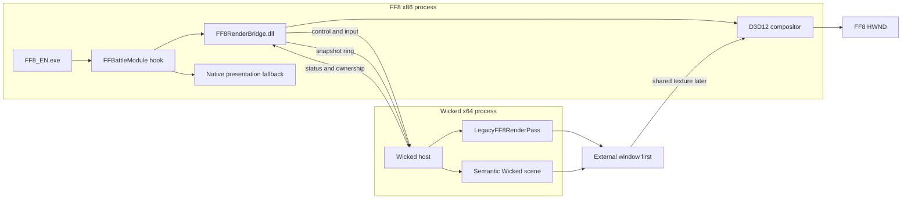

# External Battle Renderer Architecture

> [!important] Design status
> This page specifies a future implementation. The native `FFBattleModule` takeover seam is proven, but the bridge DLL, IPC protocol, Wicked host, shared texture, and `LegacyFF8RenderPass` do not exist yet. Architectural choices are marked as inferred until prototyped.

## Objective

The target is a progressive renderer replacement rather than a one-shot rewrite:

1. preserve native FF8 battle simulation and presentation initially;
2. observe and mirror native frames without changing them;
3. reproduce native output in a D3D12 `LegacyFF8RenderPass`;
4. promote camera, stage, actors, animation, effects, particles, and HUD into semantic Wicked objects one family at a time;
5. retain a per-object legacy fallback until the semantic replacement satisfies visual and behavioral gates.

The baseline implementation uses three runtime boundaries:

- **FF8 process, x86** — original executable and authoritative battle state;
- **bridge DLL, x86** — reversible hooks, capture, transport, input return, and fallback control;
- **Wicked host, x64** — prewarmed renderer, semantic scene, legacy replay pass, and final composition.

Wicked Engine can be built for x86, but this design deliberately keeps it out of the FF8 process. Process isolation avoids coupling FF8's old runtime, allocators, graphics compatibility stack, and address space to the modern renderer.^[inferred]

## Proven Native Boundary

The whole-frame owner is `main::FFBattleModule` (`0x47CF60`):

- paused frame: HUD/input ×4, native frame support, present;
- active frame: HUD/input ×3, director, active domain, file callbacks, BdLink, HUD/input ×1, present;
- ABI: `int __cdecl FFBattleModule(int game_object)`.

The post-init ready state is:

```text
mode_StateGlobal == 3
mode3_substep == 3
mode3_subsub_step == 1
mode_3_subsubsubstep == 4
```

The transition frame must finish its native file-callback and BdLink tail before ownership changes. See [[projects/re-ff8/references/battle-loop-takeover-feasibility]].

## Target Topology



## Responsibility Boundaries

### FF8 executable

Until a subsystem is explicitly promoted, FF8 remains responsible for:

- battle init and encounter data;
- authoritative slots, queues, AI, RNG, damage, status, and rewards;
- HUD input and ATB;
- native presentation scheduler, camera, assets, and effects;
- module cleanup and return.

### Bridge DLL

The bridge is intentionally narrow:

- verify executable identity before installing hooks;
- detour and restore `FFBattleModule`;
- observe phase/ownership state;
- copy native data into pointer-free snapshots;
- publish lifecycle and presentation events;
- receive renderer status and player-input commands;
- guard native vs external presentation feature flags;
- suppress native present only when an external frame is confirmed ready;
- fall back to the original function on timeout, crash, protocol mismatch, or renderer loss.

The bridge must not silently become a second battle-domain implementation. Domain replacement is a different project track.

### Wicked host

The host owns:

- `wi::Application` and its Win32 window;
- renderer initialization and asynchronous prewarming;
- snapshot consumption and interpolation;
- legacy packet replay;
- semantic Wicked ECS objects;
- modern assets and effects;
- renderer-side UI;
- telemetry, visual comparison, and capture;
- shared texture export when that phase is reached.

## Process Lifecycle

### Host startup

The host should launch with FF8 or with the bridge, not when a battle starts.^[inferred]

```text
Host process start
  -> create hidden/borderless window
  -> wi::Application::SetWindow()
  -> initialize Wicked systems asynchronously
  -> compile/load required shaders
  -> create LegacyFF8RenderPass
  -> preload shared fallback assets
  -> publish HOST_READY
  -> remain warm and idle
```

Wicked's `wi::initializer::InitializeComponentsAsync()` supports background initialization. A readiness handshake must distinguish process existence from renderer readiness.

### Battle attach

```text
Bridge sees transition to ready state
  -> publish BEGIN_BATTLE(build, encounter, generation)
  -> host creates BattleScene generation
  -> bridge continues native passthrough
  -> host acknowledges SCENE_READY
  -> ownership remains Native until the selected phase gate passes
```

### Battle detach

```text
Bridge sees native cleanup or module exit
  -> publish END_BATTLE(result, generation)
  -> host retires battle resources after GPU fence
  -> bridge restores Native ownership
  -> native FF8 reward/menu flow continues
```

Every battle uses a monotonically increasing `battle_generation`. Late packets from a previous battle are discarded.

## Communication Channels

### Control channel

A named pipe is the recommended baseline for low-frequency reliable messages:

- protocol/version handshake;
- build hash and address-map ID;
- host readiness;
- begin/end battle;
- renderer ownership changes;
- errors and rollback requests;
- input commands when renderer-side UI becomes active.

Named pipes simplify framing, access control, disconnect detection, and diagnostics compared with inventing reliability over shared memory.^[inferred]

### Snapshot channel

A shared-memory single-producer/single-consumer ring is recommended for frame data:

- producer: x86 bridge;
- consumer: x64 host;
- fixed-size slots with a variable payload offset table;
- atomic sequence counters, never raw pointers;
- overwrite-oldest policy for presentation snapshots;
- no blocking of the FF8 thread.

The renderer consumes the newest complete snapshot. Missing intermediate presentation frames are acceptable; blocking the authoritative FF8 frame is not.

### GPU output channel

The first POC should use a separate borderless Wicked window. Cross-process D3D12 sharing comes later:

1. Wicked renders to an exportable texture;
2. it creates a shared resource handle and shared fence;
3. the bridge-side D3D12 compositor opens those handles;
4. the host signals frame completion;
5. the compositor waits, copies/composes into its swapchain, and signals release;
6. both sides track resource generations across resize/device loss.

This requires a Wicked D3D12 integration adapter below or beside `wi::graphics::GraphicsDevice`; it is not assumed to be a ready-made Wicked API.^[inferred]

## Protocol Handshake

All ABI-visible fields use fixed-width integers and explicit packing. No STL type, C++ object, process pointer, or Wicked entity handle crosses the process boundary.

```cpp
struct ProtocolHello {
    uint32_t magic;              // 'F8WR'
    uint16_t major;
    uint16_t minor;
    uint8_t  process_bits;       // 32 or 64
    uint8_t  endian;             // little
    uint16_t reserved;
    uint8_t  exe_sha256[32];
    uint64_t address_map_id;
    uint64_t feature_bits;
};
```

Handshake failure leaves FF8 in native mode. Minor versions may negotiate optional fields; major mismatch is fatal to external ownership.

## Snapshot Timing Model

FF8 battle logic is approximately 15 Hz. Wicked may render at 60/120 Hz.

Each snapshot carries:

- `battle_generation`;
- `logic_tick`;
- `presentation_sequence`;
- `qpc_timestamp`;
- `is_paused`;
- phase flags;
- previous/current transform samples;
- event range since the previous snapshot.

The host interpolates presentation only:

```text
render_time = host_now - interpolation_delay
alpha = clamp((render_time - tick_n.time) / tick_duration, 0, 1)
```

It must not interpolate discrete domain state such as death, target masks, command ownership, or result code. Teleports and animation discontinuities set a `NO_INTERPOLATION` flag.

## Window And Composition Modes

### Mode A — observer window

- Wicked owns a normal debug window;
- FF8 remains fully native;
- ideal for protocol inspection and scene debugging.

### Mode B — borderless overlay

- Wicked window tracks FF8 client bounds;
- transparent or opaque composition;
- simplest visible replacement POC;
- requires focus, DPI, Z-order, minimized state, and Alt-Tab handling.

### Mode C — shared-texture composition

- FF8 window remains the only visible window;
- bridge compositor presents Wicked output;
- native present is conditionally suppressed;
- highest integration and highest synchronization risk.

Exclusive fullscreen should be out of scope initially. Borderless-windowed mode provides deterministic composition and recovery.^[inferred]

## Input Ownership

Input ownership is independent from rendering ownership:

- `NativeHudInput` — native HUD/input/ATB remains authoritative;
- `MirroredInput` — host observes but cannot issue commands;
- `ExternalUiInput` — host sends validated semantic commands to the bridge;
- `ExternalDomainInput` — only valid if the battle domain itself is later replaced.

The initial renderer migration keeps `BattleUI_HudInputAndATBTick` native. Wicked must not send duplicate commands while the native HUD is active.

## Presentation Ownership State

```text
Native
  -> ObserveOnly
  -> LegacyExternal
  -> HybridSemantic
  -> SemanticExternal
```

Transitions are explicit and acknowledged by both processes. `LegacyExternal` cannot start while native file callbacks or a half-owned BdLink effect still require native presentation progress.

Per-feature ownership is tracked separately:

```cpp
struct RenderOwnership {
    Owner camera;
    Owner stage;
    Owner actors;
    Owner effects;
    Owner particles;
    Owner hud;
    Owner present;
};
```

`HybridSemantic` allows Wicked actors with legacy-native effects, or the inverse, without forcing an all-or-nothing migration.

## Runtime Backend Provenance

Static imports in the analysed executable include:

- `DirectDrawCreate` / `DirectDrawEnumerateA`;
- OpenGL and WGL entry points;
- `SwapBuffers`.

The attached process also loaded `d3d9.dll`, `d3dx9_29.dll`, and the NVIDIA D3D9 user-mode driver. This is not DirectDraw. It suggests that a compatibility or overlay layer may translate the native backend to D3D9, but module presence alone does not prove the active present path.^[ambiguous]

Phase P0 must trace:

- DirectDraw `Flip`/`Blt`;
- OpenGL `SwapBuffers`;
- D3D9 `Present`/`EndScene`;
- call stacks and creating module.

Both an upstream native call and a downstream translated D3D9 present may fire in the same frame.

## Native Fallback And Failure Policy

Fallback is a required product feature, not debug scaffolding.

Trigger native fallback on:

- host disconnect or heartbeat timeout;
- snapshot protocol mismatch;
- Wicked device removal;
- shared-texture/fence timeout;
- unsupported executable hash;
- unknown render packet schema;
- backlog beyond configured latency;
- explicit operator hotkey.

Rules:

1. never suppress native presentation before an external frame is ready;
2. stop external input before restoring native HUD input;
3. retire shared GPU resources only after both processes acknowledge;
4. restore original hook bytes only at a safe suspended point;
5. record the rollback reason and battle generation;
6. prefer one duplicated frame over one lost authoritative tick.

## Suggested Source Layout

This is a future layout, not a request to create code now:

```text
renderer-migration/
  protocol/              # generated C-compatible schemas
  bridge-x86/            # hooks, snapshots, IPC, compositor
  wicked-host-x64/       # wi::Application and render paths
  legacy-render-pass/    # packet replay shaders and PSOs
  semantic-scene/        # FF8-to-Wicked entity adapters
  tools/                 # capture, replay, golden comparison
  schemas/               # versioned packet/resource manifests
```

## Non-Goals

- Replacing the authoritative battle domain in the renderer POC.
- Decoding all proprietary FF8 asset formats before the first visible result.
- Injecting the full Wicked runtime into the FF8 process.
- Sharing process-local pointers or Wicked entities.
- Launching Wicked cold on every battle.
- Removing native presentation before a rollback path exists.

## Open Questions

- Which backend and compatibility layer own the live present path?
- What is the earliest stable draw-packet boundary around `RenderGeometry` (`0x5099D0`)?
- Can Wicked expose cross-process textures/fences without maintaining a large engine fork?
- Which native effect families can be packet-replayed before `.00/.01` semantic decoding?
- How should an external HUD arbitrate keyboard/controller focus with FF8?
- What latency budget preserves the feel of native input and camera?

## Related

- [[projects/re-ff8/references/battle-loop-takeover-feasibility]]
- [[projects/re-ff8/concepts/ff8-wicked-bridge-semantic-model]]
- [[projects/re-ff8/references/wicked-engine-integration-reference]]
- [[projects/re-ff8/references/legacy-ff8-render-pass-d3d12]]
- [[projects/re-ff8/references/wicked-ff8-migration-phases]]
- [[projects/re-ff8/skills/implementing-wicked-ff8-bridge]]
- [[projects/re-ff8/concepts/battle-lifecycle]]
- [[projects/re-ff8/concepts/draw-magic-and-render-bridge]]
