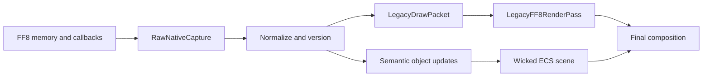

# FF8 Wicked Bridge Semantic Model

> [!important] Contract status
> The FF8 addresses and native behavior referenced here are extracted. The cross-process schemas and semantic object model are a proposed implementation contract and remain inferred until a bridge prototype serializes and replays them.

## Purpose

The bridge must avoid two traps:

1. exposing raw x86 pointers as if they were durable object identities;
2. committing too early to a high-level Wicked representation that cannot replay unknown native effects.

The model therefore supports three representations simultaneously:

```text
RawNativeCapture
  -> LegacyDrawPacket
  -> SemanticWickedObject
```

- **RawNativeCapture** preserves bytes, addresses, register context, and provenance for reverse engineering.
- **LegacyDrawPacket** is pointer-free and replayable, but still mirrors native rendering concepts.
- **SemanticWickedObject** expresses intent: actor, camera, material, animation, emitter, effect, or HUD element.

An object can remain legacy while another object in the same frame is semantic.

## Design Principles

### Stable identity over memory identity

Process pointers are observations, not identifiers. Stable IDs are derived from:

- battle generation;
- native slot index;
- encounter scene ID;
- effect invocation sequence;
- resource content hash;
- semantic object kind.

### Read-only presentation mirror

Renderer snapshots do not become authoritative simply because they contain HP, status, target, or command values. The FF8 process remains authoritative until a separate domain-replacement project explicitly changes that contract.

### Explicit provenance

Every field belongs to one provenance class:

- `Extracted` — named native field or proven output;
- `Derived` — deterministic conversion from extracted values;
- `Inferred` — semantic interpretation not yet proven;
- `Opaque` — captured bytes preserved for later decoding.

### Version everything

Schema, build address map, resource manifest, and packet format are independently versioned. A compatible frame requires all four IDs to be understood.

## Representation Pipeline



## Frame Envelope

Every published snapshot starts with a fixed header:

```cpp
struct BattleFrameHeader {
    uint32_t magic;                  // 'F8BF'
    uint16_t schema_major;
    uint16_t schema_minor;
    uint64_t address_map_id;
    uint64_t battle_generation;
    uint64_t logic_tick;
    uint64_t presentation_sequence;
    uint64_t qpc_timestamp;
    uint32_t payload_size;
    uint32_t payload_crc32;
    uint32_t flags;
    uint32_t event_count;
};
```

Suggested flags:

```text
PAUSED
TRANSITION_FRAME
NO_INTERPOLATION
NATIVE_PRESENT_ACTIVE
LEGACY_PACKETS_VALID
SEMANTIC_SCENE_VALID
END_OF_BATTLE
CAPTURE_INCOMPLETE
```

The payload uses offsets relative to the beginning of the slot, never process addresses.

## Stable ID Scheme

```cpp
struct RenderObjectId {
    uint64_t battle_generation;
    uint32_t kind;
    uint32_t local_id;
};
```

Recommended `local_id` rules:

- actor: battle slot `0..10`;
- stage: `COMBAT_SCENE_ID`;
- action/effect: monotonic invocation ID;
- camera script: invocation ID + native camera slot;
- HUD element: stable semantic enumeration;
- resource: index into a content-addressed manifest.

Resources surviving battles use a global 128-bit content hash rather than a battle-local ID.

## Core Scene Objects

### `BattleScene`

Represents one encounter generation:

```cpp
struct BattleScene {
    uint16_t encounter_id;
    uint16_t scenario_id;
    uint32_t battle_flags;
    ResourceId stage_resource;
    CameraRigId camera;
    Span<BattleActorId> actors;
    Span<EffectInstanceId> effects;
};
```

Native sources:

- `COMBAT_SCENE_ID` at `0x1CFF6E0`;
- `CURRENT_ENCOUNTER_DATA_SCENE_OUT` at `0x1D287DC`;
- stage load and camera IDs from native init.

The first semantic version may leave `stage_resource` unresolved and render the stage through legacy packets.

### `BattleActor`

One actor maps primarily to `BATTLE_SLOT_DATA[slot]`:

```cpp
struct BattleActor {
    RenderObjectId id;
    uint8_t slot;
    uint8_t actor_kind;              // party, enemy, GF proxy, reserved
    uint8_t com_file_id;
    uint8_t visibility;
    TransformSample previous;
    TransformSample current;
    ResourceId model;
    SkeletonInstanceId skeleton;
    AnimationStateId animation;
    uint32_t presentation_flags;
};
```

Domain-only values such as HP/status may be mirrored in a separate `ActorUiState`; they should not contaminate the render transform or model identity.

Slot reuse increments an actor incarnation counter. A newly spawned monster in slot 5 must not inherit the renderer identity of a destroyed slot-5 actor.

### `MeshAsset`

Semantic mesh data:

```cpp
struct MeshAsset {
    ResourceId id;
    VertexLayoutId layout;
    Span<Submesh> submeshes;
    Bounds bounds;
    SkeletonAssetId skeleton;
    OpaqueSourceRef native_source;
};
```

Promotion levels:

1. opaque native buffer range;
2. decoded positions/UV/colors/indices;
3. semantic submeshes and material slots;
4. Wicked `wi::scene::MeshComponent`.

Original bytes and content hash remain linked even after promotion.

### `SkeletonAsset` And `SkeletonInstance`

The asset defines hierarchy and bind pose; the instance defines current pose:

```cpp
struct SkeletonAsset {
    ResourceId id;
    Span<int16_t> parent_index;
    Span<Matrix4x4> inverse_bind;
};

struct SkeletonInstance {
    RenderObjectId actor;
    ResourceId skeleton;
    Span<Transform> local_pose;
    uint64_t pose_tick;
};
```

The `.00` section roles and actor model skeleton layouts remain partly ambiguous. Until decoded, animation can remain in native draw replay.^[ambiguous]

### `AnimationState`

Animation semantics must preserve both clip identity and native timeline:

```cpp
struct AnimationState {
    ResourceId clip;
    uint32_t native_sequence_id;
    uint32_t native_frame;
    float normalized_time;
    float playback_rate;
    uint32_t flags;
};
```

Do not synthesize `normalized_time` when native playback is discontinuous; publish `NO_INTERPOLATION`.

### `LegacyMaterial`

The fidelity pass needs state rather than a premature PBR interpretation:

```cpp
struct LegacyMaterial {
    ResourceId texture;
    ResourceId palette;
    uint32_t blend_mode;
    uint32_t depth_mode;
    uint32_t cull_mode;
    uint32_t sampler_mode;
    uint32_t color_operation;
    uint32_t alpha_test;
    uint32_t native_flags;
};
```

Modern material semantics are added later:

```text
LegacyMaterial
  -> UnlitSemanticMaterial
  -> Wicked PBR MaterialComponent
```

The legacy material remains available as a rollback path.

### `TexturePage` And `Palette`

Texture identity separates texel indices from palette contents:

```cpp
struct TexturePage {
    ResourceId id;
    uint16_t width;
    uint16_t height;
    uint16_t format;
    uint16_t palette_entries;
    ResourceId palette;
    BlobRef pixels;
};
```

This supports:

- direct RGBA uploads when native output is already expanded;
- indexed texture + palette shader lookup;
- deterministic palette swaps;
- original sampling and transparency semantics.

Texture cache keys include pixel hash, palette hash, format, and color-key rules.

### `CameraRig`

The first semantic camera mirrors final native outputs:

```cpp
struct CameraRig {
    Float3 eye;
    Float3 target;
    Float3 up;
    float fov;
    float near_plane;
    float far_plane;
    Float2 screen_shake;
    uint32_t ownership_flags;
    uint32_t script_id;
};
```

Native sources include:

- `Battle_Camera_world_*` / `LookAt_*`;
- view block near `0x1D97778`;
- `word_1D8E038` FOV/projection;
- `word_1D8E03C/3E` shake;
- `dword_1D97704` takeover;
- `cameraRelated_pointerAnimColl` overlay state.

Later promotion may decode camera scripts rather than mirror their final matrices. See [[projects/re-ff8/concepts/battle-camera-architecture]].

### `EffectInstance`

Effect identity is not the same as damage identity:

```cpp
struct EffectInstance {
    RenderObjectId id;
    uint16_t effect_id;
    uint8_t command_type;
    uint8_t owner_slot;
    uint16_t target_mask;
    uint16_t family;
    uint32_t phase;
    uint32_t flags;
    ResourceId file_00;
    ResourceId file_01;
};
```

The stable native signal is `effect_id`, routed through:

- `MagicList_Logic`;
- `MagicList_TextureLoad`;
- `g_GfSequenceContextSharedB`;
- `Tick_Generic`, `Tick_GF_Cinematic`, or `Tick_Special`.

Damage/status are already committed separately. `EffectInstance` only describes presentation.

### `ParticleEmitter`

Particle semantics should not be guessed from rendered quads alone:

```cpp
struct ParticleEmitter {
    RenderObjectId id;
    EffectInstanceId effect;
    uint32_t emitter_type;
    uint32_t seed;
    uint32_t spawn_count;
    ResourceId texture;
    OpaqueBlob native_parameters;
};
```

Migration states:

- native-generated draw packets;
- decoded emitter parameters with native timeline;
- fully Wicked-generated particles.

Unknown emitter parameters stay opaque and versioned.

### `HudLayer`

Rendering and input are separate:

```cpp
struct HudLayer {
    uint32_t render_owner;
    uint32_t input_owner;
    Span<ActorUiState> actor_ui;
    CommandMenuState command_menu;
    Span<BattleMessage> messages;
};
```

Initial state:

- native input owner;
- native HUD render owner;
- Wicked observer only.

Wicked HUD rendering may be promoted before Wicked input, but it must mirror native cursor/menu state without issuing commands.

### `DamagePresentation`

Domain output is a presentation event:

```cpp
struct DamagePresentation {
    uint64_t event_id;
    uint8_t source_slot;
    uint8_t target_slot;
    int32_t hp_delta;
    uint32_t display_flags;
    uint32_t status_visual_flags;
};
```

Its source is the 24-byte `BATTLE_DAMAGE_RESULT_BUFFER` written by `Battle_UpdateDamage` (`0x48EF80`). The renderer never recomputes damage.

## Legacy Draw Packet

The replay representation must be complete enough to reproduce a draw without consulting FF8 memory:

```cpp
struct LegacyDrawPacket {
    uint64_t packet_id;
    uint32_t pass;
    uint32_t order;
    PrimitiveTopology topology;
    VertexLayout layout;
    BlobRef vertices;
    BlobRef indices;
    Matrix4x4 world;
    Matrix4x4 view;
    Matrix4x4 projection;
    LegacyMaterial material;
    Rect viewport;
    Rect scissor;
    uint32_t flags;
    OpaqueBlob unknown_state;
};
```

Required properties:

- deterministic order;
- self-contained resource references;
- explicit coordinate space;
- no mutable pointer back to FF8;
- original opaque state preserved when not decoded;
- packet hash for replay regression.

## Resource Manifest

Large resources do not travel every frame:

```cpp
struct ResourceManifestEntry {
    ResourceId id;
    uint32_t type;
    uint32_t format_version;
    uint64_t byte_size;
    uint8_t sha256[32];
    BlobLocation location;
    Provenance provenance;
};
```

The bridge publishes `RESOURCE_DECLARE`, then the host requests or maps missing blobs. Frame packets only reference `ResourceId`.

Resource invalidation occurs on:

- content hash change;
- battle generation for transient arenas;
- native texture upload overwrite;
- Wicked device reset;
- schema decoder version change.

## Coordinate And Unit Contract

The bridge records native integer/fixed-point values and normalized floating-point values side by side until conversion is proven:

```cpp
struct NativeAndNormalizedTransform {
    int32_t native[12];
    Matrix4x4 normalized;
    uint32_t conversion_id;
};
```

The conversion specification must define:

- handedness;
- axis mapping;
- world-unit scale;
- matrix storage order;
- clip-space depth range;
- pixel-center convention;
- winding order;
- UV origin;
- FOV units.

Visual parity cannot be debugged reliably without a single versioned conversion ID.

## Time And Interpolation

Three clocks are kept distinct:

- FF8 logic tick;
- FF8 presentation sequence;
- Wicked render frame.

Actor and camera transforms use previous/current samples. Effect phase changes, relays, visibility, death, spawn, and resource swaps are discrete events.

The host never advances native effect state speculatively. It may interpolate transforms between confirmed samples, but it cannot invent an effect completion.

## Presentation Events

Events are ordered within a battle generation:

```text
ActorSpawned
ActorDespawned
ActorVisibilityChanged
ActionPresentationStarted
EffectAssetReady
EffectPhaseChanged
CameraOwnershipChanged
DamagePresentationEmitted
BattleMessageChanged
PresentationBarrierEntered
PresentationBarrierReleased
BattleEnded
```

AI relays `0x70`, `0x71`, and `0x74` become presentation barrier events, not draw calls.

Each event is idempotent by `(battle_generation, event_id)`.

## Ownership And Promotion

```cpp
enum class RenderOwner : uint8_t {
    Native,
    ObserveOnly,
    LegacyReplay,
    SemanticWicked
};

struct ObjectOwnership {
    RenderObjectId object;
    RenderOwner owner;
    RenderOwner fallback;
    uint32_t promotion_version;
};
```

Promotion protocol:

1. capture native baseline;
2. create semantic candidate hidden from final output;
3. render native and candidate for comparison;
4. satisfy visual/timeline gates;
5. switch candidate to primary;
6. retain legacy fallback;
7. remove fallback only after coverage across the canonical scenario set.

## Per-Family Migration

### Stage

```text
Native framebuffer
  -> stage draw packets
  -> decoded static mesh
  -> Wicked MeshComponent + semantic material
  -> modern lighting/material variant
```

### Party and enemies

```text
native packets
  -> stable slot/incarnation identity
  -> mesh + transform
  -> skeleton + pose
  -> semantic animation state
```

### Magic and GF

```text
native effect packets
  -> EffectInstance by effect_id
  -> decoded .00 resources
  -> decoded .01 timeline
  -> Wicked particles/meshes/camera
```

Migration is per `effect_id`; unknown effects remain legacy.

### Camera

```text
final native view matrix
  -> semantic eye/target/FOV
  -> native script decode
  -> optional modern camera direction
```

### HUD

```text
native HUD
  -> mirrored HUD state
  -> Wicked visual clone
  -> optional modern layout
  -> external input ownership
```

## Native Source Map

High-signal sources:

- actors: `BATTLE_SLOT_DATA` (`0x1D27B10`, stride `0xD0`);
- encounter: `CURRENT_ENCOUNTER_DATA_SCENE_OUT` (`0x1D287DC`);
- damage presentation: `BATTLE_DAMAGE_RESULT_BUFFER` (`0x1D28344`);
- effect descriptor: `g_GfSequenceContextSharedB` (`0x1D99A50`);
- effect files: `Magic_b_00/01`, arena `0x20DFAB8`;
- camera outputs: `0xB8B7F0..0xB8B7FC`, view block `0x1D97778`;
- FOV/shake: `word_1D8E038`, `word_1D8E03C/3E`;
- task queue: `battle_task_2_stru` (`0x1D96D68`);
- pause: `IS_BATTLE_PAUSED` (`0x1D28DE9`).

## Validation Rules

Every semantic adapter must provide:

- source build hash and address-map ID;
- raw fixture and normalized fixture;
- round-trip or replay test where applicable;
- visual golden scenario;
- timing/barrier assertions;
- unknown-field preservation;
- native fallback;
- explicit ownership transition test.

An adapter is not complete because one screenshot looks correct.

## Open Questions

- Exact stage and actor mesh packet boundary around `RenderGeometry` (`0x5099D0`).
- `.00` section roles for every effect family.^[ambiguous]
- `.01` scene opcode semantics and particle emitter model.^[ambiguous]
- Native actor skeleton, pose, and weapon attachment layouts.
- Palette/color-key/blend rules at the active runtime backend.
- HUD render-state extraction independent from HUD input.
- Whether all required native transforms exist before final CPU/GPU submission.

## Related

- [[projects/re-ff8/concepts/external-battle-renderer-architecture]]
- [[projects/re-ff8/references/legacy-ff8-render-pass-d3d12]]
- [[projects/re-ff8/references/wicked-ff8-migration-phases]]
- [[projects/re-ff8/concepts/battle-state-model]]
- [[projects/re-ff8/concepts/battle-camera-architecture]]
- [[projects/re-ff8/concepts/gforce-cinematic-architecture]]
- [[projects/re-ff8/references/gf-asset-loading-and-authoring]]
