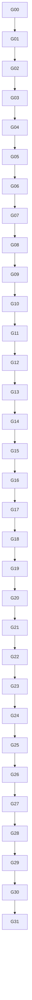

# Battle ISO Migration — Testable Unit Groups

> [!important] Purpose
> This page is the executable roadmap for [[projects/re-ff8/skills/implementing-iso-battle-migration]]. It separates architecture from scheduling. A group is a milestone; a unit is the smallest reviewable implementation increment. A group is complete only when every unit and the group gate pass.

> [!success] Current implementation checkpoint — 2026-07-24
> The [[projects/final-fantasy-viii-reimaginated/final-fantasy-viii-reimaginated|remaster implementation]] has closed G05 with strict live evidence. P0.8 has characterized G06 cadence, validated a bounded ATB-only ownership pilot and closed the five-gate semantic observation matrix. Complete G06/BattleUI ownership is still open, so G07–G31 and P1 remain locked.

Status notation in the foundation groups:

- `[x]` means implemented and covered by the current offline/live evidence.
- `[ ]` means still required by the strict original gate, even if the constrained P0 checkpoint can operate safely without it.
- Group status text takes precedence over the historical profile label.

## 1. Delivery Profiles

The project must never use one vague “working” label. Each profile fixes an ownership boundary and a fidelity claim.

| Profile | Unlocked after | Replacement owns | Explicitly still permitted |
| --- | --- | --- | --- |
| **P0 Harness** | G04 | Bootstrap, maps, ABI shims, observation hooks, state import/export | All native battle behavior; no replacement claim |
| **P1 AttackSlice** | G09 | One scripted physical Attack path inside the replacement director seam | Native init, outer frame, sealed presentation compatibility unit, field/reward modules |
| **P2 GameplayDomain** | G20 | All supported command families, damage/status, AI, callbacks, latches, and ATB from an imported post-init state; terminal detection/handoff is not claimed | Native init, outer frame, sealed presentation compatibility unit; scripted/normalized input |
| **P3 BaseLoop** | G23 | Init → input/ATB → director/domain → terminal cleanup/handoff for supported content | Native outer frame and sealed native presentation compatibility unit; generic host services |
| **P4 FrameOwned** | G30 | Init, Frame, Exit, UI/HUD, scheduler, camera, effects, draw construction, and battle resources | Generic VFS, audio, OS input/timing, graphics backend, field/reward modules; declared visual gaps allowed |
| **P5 FullISO** | G31 | Everything battle-owned for the certified content matrix | Only approved generic host services; no original battle-owned call or hidden fallback |

> [!warning] BaseLoop is not FullISO
> P3 is an autonomous gameplay loop, but it may still use the original presentation subsystem as one sealed compatibility unit. It must not retain only half of that subsystem. File callbacks, BdLink tasks, action sequences, camera, effects, and battle draw remain together until G25–G29 replace them.

> [!note] Scripted input is acceptable before playable UI
> P1–P3 may consume a deterministic `InputFrame` script. This avoids calling `BattleUI_HudInputAndATBTick`, which combines input, pending-command writes, ATB advancement, and HUD work. A native HUD pass must never run concurrently with replacement ATB/pending ownership.

## 2. Port Strategies

Every reachable function or data-driven dispatcher receives exactly one current strategy in the port manifest.

| Code | Strategy | Rule |
| --- | --- | --- |
| `SEM` | Semantic port | Reimplement from a recovered typed specification; preferred for stateful core logic |
| `CLIFT` | C lift | Clean decompiler output, preserve control/arithmetic order, replace absolute accesses with typed adapters |
| `BLIFT` | Opaque binary lift | Copy executable instructions into the DLL and relocate every branch, data reference, jump table, import, and callback escape |
| `HOST` | Host-service adapter | Keep a proven non-battle generic service behind a narrow C ABI |
| `NCOMP` | Native compatibility unit | Temporarily keep a complete native battle-owned subsystem outside the claimed replacement boundary; forbidden in P4/P5 |
| `DEFER` | Deferred | Not implemented and therefore not part of a completed profile |

### 2.1 Opaque logic is allowed; opaque boundaries are not

A lifted block may remain logically unexplained when:

1. its exact entry ABI and all exits are known;
2. all direct and indirect call targets are enumerated;
3. every process-global read/write is represented in the address map;
4. escaping callback pointers and retained context pointers are tracked;
5. all x86 relative branches, absolute operands, jump tables, and code/data aliases are relocated;
6. static reference scanning and runtime call auditing show no accidental return to original battle code;
7. deterministic fixtures cover its observable contract.

`BLIFT` code lives in the DLL and can qualify for P5. Calling the original executable’s function is not lifting and cannot qualify.

### 2.2 Analyzed does not mean removed from the closure

A function already documented in the wiki remains in the reachable graph. Good documentation changes its likely strategy to `SEM`; it does not remove the implementation obligation. Only a proven `HOST` edge may leave the DLL in P4/P5.

## 3. Unit Contract

Each unit record must define:

- unit ID and owning group;
- supported executable hash and source RVAs;
- direct and indirect dependencies;
- globals/fields read and written;
- input/output contract;
- selected port strategy;
- allocation and pointer-lifetime domain;
- deterministic fixtures;
- in-process smoke scenario where applicable;
- current confidence and open blockers.

No unit may be marked done only because it compiles.

## 4. Test Levels

| Level | Scope | Required proof |
| --- | --- | --- |
| **T0 Static** | ABI, layouts, closure, relocation | `sizeof`/`offsetof`, disassembly review, unresolved-edge report |
| **T1 Unit** | One helper, parser, opcode, formula, or queue operation | Deterministic inputs and exact state/output assertions |
| **T2 Subsystem** | One group | Multi-unit scenario, RNG cursor checks, state transition checks |
| **T3 In-process** | One replacement boundary | Safe hook, call audit, memory-write allowlist, repeated entry/exit |
| **T4 Profile** | P1–P4 gate | Scenario matrix for every feature claimed by that profile |
| **T5 Certification** | P5 | Full content matrix, visual/semantic evidence, soak/failure tests, zero battle-native calls |

### 4.1 In-game injection command contract

> [!warning] Implemented primitives; target orchestration still pending
> The hardened [[projects/ffscriptloader/ffscriptloader|FFScriptLoader]] now provides non-interactive `validate`/self-test commands, architecture and PE validation, explicit bootstrap export/payload, bounded timeouts, and loaded-module reuse. The exact manifest/suite/evidence-aware `validate` and `test` syntax below is still the target consolidated interface. The 2026-07-18 P0 run used `make_bootstrap_payload.py`, `make_suite_payload.py`, the injector, `capture_live_canaries.py`, and the runtime evidence buffer directly.

Each group owns offline tests named `Gxx.*` and one versioned suite at `battle-iso/tests/in-process/Gxx.suite.toml`. A suite declares setup, safe injection point, scripted or manual actions, assertions, timeout, cleanup, and whether cases require a fresh FF8 process. `validate` checks the suite, DLL machine type, executable manifest, profile/group compatibility, and required symbols without touching the target. `test` loads `ff8_battle_iso.dll`, calls the exported bootstrap and test entry point, waits for completion, retrieves evidence, runs cleanup, and returns nonzero on any failed assertion or incomplete rollback.

Use this PowerShell setup from the repository root, adjusting the two built-artifact paths if the selected CMake configuration uses a different output directory:

```powershell
$Repo = "C:\Users\djden\source\repos\retro-eng\re-ff8"
$LoaderRepo = "C:\Users\djden\source\repos\FFScriptLoader"

Push-Location $LoaderRepo
cmake --preset relwithdebinfo-x32
cmake --build --preset relwithdebinfo-x32 --target app_injector
Pop-Location

Push-Location "$Repo\battle-iso"
cmake --preset relwithdebinfo-x32
cmake --build --preset relwithdebinfo-x32 --target ff8_battle_iso battle_iso_tests
Pop-Location

$Injector = "C:\Users\djden\source\repos\FFScriptLoader\build\bin\RelWithDebInfo\app_injector.exe"
$BattleDll = "$Repo\battle-iso\build\bin\RelWithDebInfo\ff8_battle_iso.dll"
$Manifest = "$Repo\battle-iso\address-map\ff8_en_064d466b5fe2ba90.toml"
$Evidence = "$Repo\evidence\battle-iso"
New-Item -ItemType Directory -Force $Evidence | Out-Null

function Invoke-IsoGroup {
    param([string]$Group, [string]$Profile, [int]$TimeoutMs = 60000)

    $Suite = "$Repo\battle-iso\tests\in-process\$Group.suite.toml"
    ctest --test-dir "$Repo\battle-iso\build" -C RelWithDebInfo `
        --output-on-failure --no-tests=error -R "^$Group\."
    if ($LASTEXITCODE -ne 0) { throw "$Group offline tests failed" }

    & $Injector validate --dll $BattleDll --manifest $Manifest --suite $Suite
    if ($LASTEXITCODE -ne 0) { throw "$Group static validation failed" }

    & $Injector test --process "FF8_EN.exe" --dll $BattleDll `
        --manifest $Manifest --profile $Profile --group $Group `
        --suite $Suite --evidence "$Evidence\$Group.json" --timeout-ms $TimeoutMs
    if ($LASTEXITCODE -ne 0) { throw "$Group in-process test failed" }
}
```

`Observe` below is a test-only mode: it permits typed observation hooks but no replacement ownership. `P0`–`P5` use the ownership rules from §1. In a command, `--profile` selects the highest already unlocked baseline and `--group` temporarily enables only the group under test; this does not claim the next delivery profile before its gate. Every evidence JSON must include executable/DLL hashes, group/profile, selected address map, hook preimages, ordered assertions, RNG/state deltas where relevant, memory-write allowlist results, DLL-originated call audit, cleanup result, and final runtime state.

G00–G02 have no injector dependency in their initial T0/T1 gates: their commands are retrospective in-process regression checks that become executable and mandatory when G03 lands. At the G03 gate, run G00–G03; from then onward, a group passes only when its command exits `0`, its evidence says `PASS`, and all earlier injected suites still pass. This avoids making the foundation groups depend circularly on the harness they define.

Before invoking a group, start the supported `FF8_EN.exe`, load the suite’s deterministic save, and remain at the field/menu state named by its setup unless that suite explicitly launches or advances the process itself. Manual input is permitted only when the suite records the prompt, response window, and resulting semantic input events in evidence.

## 5. Dependency Overview



The chain is the safe default. Work may run in parallel only when the involved groups consume frozen typed interfaces and do not share ownership of a native subsystem.

## 6. Foundation Groups

### G00 — Freeze scope and fidelity profiles

**Depends on:** none.

**Status 2026-07-18:** complete; manifest validation and the retrospective G00 in-process suite pass.

**Units**

- [x] **U00.1 Build manifest:** lock `FF8_EN.exe`, hashes, image assumptions, language/data revision, compiler target, and supported operating environment.
- [x] **U00.2 Content manifest:** enumerate scenes, commands, magic, items, GF, Limits, AI scripts, and terminal families claimed by each profile.
- [x] **U00.3 Ownership matrix:** record replacement/native ownership per profile for Init, Frame, HUD/input/ATB, Director, callbacks, presentation, and Exit.
- [x] **U00.4 Fallback policy:** define unsupported as an explicit error; prohibit silent native delegation.
- [x] **U00.5 Evidence policy:** define which static facts, focused live probes, and fixtures are sufficient for each confidence state.

**Test pack:** validate manifest schemas; verify every claimed feature belongs to one profile and one future group.

**Gate G00:** a reviewer can answer “who owns this subsystem?” for every profile without interpretation.

**Injected in-game test:** Run `Invoke-IsoGroup -Group G00 -Profile Observe`. The suite must try an invalid machine/hash manifest before the supported one; it passes only if the invalid case performs no remote write or hook, while the supported case reaches `Observed` and reports a complete, non-overlapping ownership/content manifest.

### G01 — Build the persistent multi-root closure

**Depends on:** G00.

**Status 2026-07-18:** complete for the frozen P1 planning closure; the closure export, indirect-target inventory, global ledger, and unresolved-edge report are persisted and validated.

**Units**

- [x] **U01.1 Root inventory:** root the graph at `FFBattleInitSystem`, `FFBattleModule`, `FFBattleDirector_battleLoop`, and `FFBattleExitSystem`.
- [x] **U01.2 Direct graph:** collect callers/callees and strongly connected components.
- [x] **U01.3 Indirect graph:** enumerate `MagicList_*`, battle/file/task callbacks, vtables, jump tables, stored code pointers, and callback-assignment sites.
- [x] **U01.4 Global graph:** record all read/write xrefs for state, queues, tables, arenas, and resource pointers.
- [x] **U01.5 Reachability tags:** mark active, init-only, exit-only, presentation-only, data-only, unreachable, and unknown.
- [x] **U01.6 Function dossiers:** persist ABI, strategy, dependencies, R/W set, retained pointers, evidence, and tests.

**Test pack:** graph consistency, unresolved indirect-target report, duplicate/interior-function detection.

**Gate G01:** the P1 reachable closure has no unclassified edge. Documented functions remain present and tagged `SEM`, never subtracted.

**Injected in-game test:** Run `Invoke-IsoGroup -Group G01 -Profile Observe` and exercise idle, Attack, Magic, GF, and one terminal path without replacing behavior. Compare the runtime call/global-access trace with the stored closure; the suite passes when every observed edge is classified, no P1 unknown edge remains, and the observer writes nothing outside its evidence buffer.

### G02 — Define lift rules and the host cut set

**Depends on:** G01.

**Status 2026-07-18:** complete; strategy/host manifests, representative CLIFT/BLIFT fixtures, relocation extraction, and runtime call-audit policy pass.

**Units**

- [x] **U02.1 Strategy assignment:** assign `SEM`, `CLIFT`, `BLIFT`, `HOST`, `NCOMP`, or `DEFER` to each P1 node.
- [x] **U02.2 Host allowlist:** classify VFS/archive, generic audio, OS input/timing, graphics backend, and field/reward module services.
- [x] **U02.3 Native compatibility contracts:** define the sealed presentation unit allowed only in P1–P3.
- [x] **U02.4 C-lift rewrite rules:** define type correction, global accessors, call remapping, x87/integer-order preservation, and forbidden cleanup.
- [x] **U02.5 Binary relocation rules:** handle relative control flow, absolute memory operands, jump tables, imports, thunks, SEH, and code/data aliases.
- [x] **U02.6 Call auditing:** implement static executable-reference scanning plus runtime logging for DLL-originated executable calls.

**Test pack:** lift two small representative functions—one `CLIFT`, one `BLIFT`—and prove that both call only mapped targets.

**Gate G02:** every P1 external edge terminates at a named `HOST` adapter or a temporary profile-approved `NCOMP` unit.

**Injected in-game test:** Run `Invoke-IsoGroup -Group G02 -Profile Observe`; the suite invokes one representative `CLIFT` and one relocated `BLIFT` from the DLL at a safe test seam. It passes when both produce their fixture outputs, relocation/preimage checks succeed, and the DLL-originated call audit contains only declared `HOST` or profile-approved `NCOMP` targets.

### G03 — Build the x86 harness and reversible seams

**Depends on:** G02.

**Status 2026-07-22:** strict G03 passed live for DLL
`b8069ef34afac1d525df1f5a50e43586f3ada89a75b0c4748ea6c97340ba28fd`:
three field → battle → field cycles preserved the Director gateway contract,
and a field-only controlled fault reached `Faulted`, removed hooks and restored
the frame preimage exactly. This is not G05 domain ownership.

**Units**

- [x] **U03.1 Reproducible toolchain:** CMake Win32/MSVC configuration, pinned runtime/EH/RTTI/packing settings, and `sizeof(void*) == 4` failure.
- [x] **U03.2 Safe bootstrap:** inert `DllMain`, exported post-loader bootstrap, hash check, image-base resolution, and address-map selection.
- [x] **U03.3 Module-transition observation:** observe callback installation without changing behavior.
- [x] **U03.4 Reversible Director seam:** active-only `FFBattleDirector_battleLoop` pass-through with live canaries; `0x47D70F` remains blocked.
- [x] **U03.5 BattleUI seam:** provide a hook point capable of preventing native pending/ATB mutation once G06 owns it.
- [x] **U03.6 Safe rollback:** switch ownership only at a battle-generation/frame boundary; never detach while a replacement callback is executing.
- [x] **U03.7 Runtime states:** enforce `Unloaded`, `Observed`, `Ready`, `BattleInit`, `BattleActive`, `BattleExit`, `Detached`, and `Faulted`.

**Test pack:** repeated no-op field → battle → field cycles, hook install/remove, unknown-hash refusal, and fault rollback.

**Gate G03:** pass-through execution is stable and the Director seam exists before any vertical slice depends on it.

**Injected in-game test:** Run `Invoke-IsoGroup -Group G03 -Profile P0` across repeated field → battle → field cycles, then force one bootstrap failure and one **field/menu-only** controlled fault. It passes when register/stack canaries and native outcomes are unchanged, hooks switch only at safe boundaries, the faulted runtime removes all hooks while remaining inert, and no hook/manual patch survives cleanup.

### G04 — Lock ABI, state images, and memory ownership

**Depends on:** G03.

**Status 2026-07-22:** constrained P0 state bridge passed offline and live. Director plus Init/Exit entry/return contracts are now live-captured and recorded. Strict G04 remains open on `Battle_ActiveTickEntry`, any P1 wrapper actually required, and the complete P1 boundary set; all unowned boundaries fail closed.

**Units**

- [x] **U04.1 Module ABIs:** Init, Frame, Director and Exit entry/return conventions, arguments, registers and stack ownership are recorded for the supported executable.
- [ ] **U04.2 Register wrappers:** implement wrappers for every `__usercall`, `__thiscall`, adjustment thunk, or interior entry used by P1.
- [x] **U04.3 POD layouts:** assert slots, pending records, exec cells, action/result contexts, phase flags, and RNG state.
- [x] **U04.4 Canonical state:** introduce pointer-free `BattleState`.
- [x] **U04.5 Legacy image:** implement `LegacyBattleImage` only for proven host-visible layouts.
- [x] **U04.6 Synchronization policies:** define import/export boundaries for observation, DirectorBridge, native-presentation compatibility, and exit handoff.
- [x] **U04.7 Allocation domains:** label CRT, fixed globals, exec pools, task pools, magic arena, host resources, and DLL-owned arenas.
- [x] **U04.8 Write guards:** reject writes outside profile-owned address ranges and stale resource generations.

**Test pack:** T0 layout suite, canonical ↔ legacy round trip, invalid-pointer tests, and in-process write-allowlist smoke.

**Gate G04 / P0 Harness:** all P1 data and call boundaries are typed; pass-through still behaves identically.

**Injected in-game test:** Run `Invoke-IsoGroup -Group G04 -Profile P0` during a stable post-init frame. The suite imports a native snapshot, round-trips canonical ↔ legacy state, and attempts stale/out-of-range writes; it passes on byte-exact owned fields, rejected invalid pointers, ABI/register canaries, and a memory diff wholly contained by the P0 allowlist.

## 7. Deterministic Domain Groups

### G05 — Port deterministic primitives and the active-tick shell

**Depends on:** G04.

**Status 2026-07-23:** deterministic core and offline fixtures are implemented
for the documented integer helpers, battle RNG, phases, latches, logical frame
and active-tick shell. P0.6 live-validated the historical one-tick no-write
probe. P0.7 now passes offline with a v2 Director scenario protocol covering
the complete fixture matrix, bounded handback, runtime-derived verdict and
post-engagement fault. The final-hash **live** matrix now passes, closing the
P0 no-write G05 gate. The interior entry remains `blocked-evidence`, and all
host writes remain denied.

**Units**

- [ ] **U05.1 Integer semantics:** fixed widths, signedness, overflow, shifts, division truncation, and x87-sensitive helpers.
- [ ] **U05.2 Battle RNG draws:** 256-byte table, eight cursors, active lane, post-increment, and wrapping.
- [ ] **U05.3 Cross-run seed:** MSVC CRT `holdrand` input, one-shot seed byte, lane diffusion, and active-lane selection.
- [ ] **U05.4 Lifecycle phases:** model the four-level state and supported transitions.
- [ ] **U05.5 Active-tick order:** encode end-check interface, pending transfer, counters, arbitration, status/special ticks, callbacks, and presentation tail slots in exact order.
- [ ] **U05.6 Serialization latches:** action-in-progress, result latch, logic flag, and pause gates.
- [ ] **U05.7 Frame input:** define one deterministic logical-frame record independent from rendering cadence.
- [ ] **U05.8 End-check stubs:** provide typed no-result stubs until G23 implements all terminal families.

**Test pack:** RNG sequences/cursors, phase transitions, paused/active tick order, action-latched tick, and result-latched same-frame ordering.

**Gate G05:** an idle replacement Director can tick under the reversible seam without mutating unowned state.

> [!note] P0.6 probe boundary
> The one-tick v1 probe is evidence infrastructure, not completion of G05. It
> suppresses one native Director call only after strict G03 and active-phase
> preconditions, performs no FF8 write, and hands back only on success. Its
> first 13-step live trace correctly failed closed, then the corrected
> 13/14-step deterministic acceptance passed. A fault after engagement is
> fail-stop, never native fallback.

> [!note] P0.7 strict closure candidate
> The successor protocol uses pointer-free `BattleSession` / `BattleState`
> overlays for 13/14-step, pause, latch, RNG, end-check and multi-tick cases;
> it neither discovers native globals nor writes FF8. The hash-bound live
> scenario artifacts and controlled fault are captured.

**Injected in-game test:** Run `Invoke-IsoGroup -Group G05 -Profile P0` with a fixed CRT seed and scripted active, paused, action-latched, and result-latched frames. It passes when tick order, phase transitions, integer results, RNG bytes/cursors, and latch transitions match fixtures while all unowned native ranges remain unchanged.

### G06 — Replace normalized input, ATB, summon charge, and escape polling

**Depends on:** G05.

**Status 2026-07-24:** deterministic scripted-input, ATB, GF-charge,
escape and ready-event fixtures pass offline.
[[projects/final-fantasy-viii-reimaginated/references/p0-8-a-g06-cadence-validation|P0.8-A/B]]
proved four native HUD/ATB calls per `FFBattleModule` frame and the pause gate.
[[projects/final-fantasy-viii-reimaginated/references/p0-8-c-g06-atb-pilot-validation|P0.8-C]]
suppressed four `BattleATB_TickAndReady` calls in a bounded pilot and wrote
only guarded `cur_atb` plus UI-mirror pairs.
[[projects/final-fantasy-viii-reimaginated/references/p0-8-d-g06-atb-matrix-validation|P0.8-D]]
then passed automated ready-boundary, action-freeze, pause-gate, GF-charge and
escape-input observations with zero FF8 write. The strict group gate remains
open: normalized input, pending commands, GF/escape mutation and complete
BattleUI ownership have not been switched.

**Units**

- [ ] **U06.1 `InputFrame`:** normalize scripted or raw-host input with frame timestamps and held/released semantics.
- [ ] **U06.2 BattleUI ownership switch:** prevent `BattleUI_HudInputAndATBTick` from also writing pending/ATB after this group takes ownership.
- [ ] **U06.3 ATB initialization:** max ATB and random initial value.
- [ ] **U06.4 ATB tick:** ascending slot order, Haste/Slow, incapacitation, readiness, and pause gates.
- [ ] **U06.5 GF charge co-tick:** reproduce summon-charge timer cadence and status interaction.
- [ ] **U06.6 Escape held latch:** preserve held input and cannot-escape state.
- [ ] **U06.7 Escape poll:** 60-frame cadence, encounter gates, RNG draw, and typed escape request.
- [ ] **U06.8 Ready event:** emit an actor-ready event without requiring the native menu.

**Test pack:** normal/Haste/Slow/Stop ATB, pause freeze, summon charge, held escape, blocked escape, and RNG cursor assertions.

**Gate G06:** preserve the four native logical HUD/ATB pulses per module frame;
no logical pulse may be advanced by both native and replacement, pending state
must not be duplicated, and scripted actors must become ready deterministically.

**Injected in-game test:** Run `Invoke-IsoGroup -Group G06 -Profile P0`; the
suite temporarily switches BattleUI ownership and feeds normal/Haste/Slow/Stop,
summon-charge, pause, held-escape, and blocked-escape scripts. It passes when
each logical pulse advances ATB/pending state exactly once, the four-pulse
module cadence is preserved, ready/escape events and RNG cursors are exact,
and ownership returns cleanly at the boundary. P0.8-C/D are prerequisite
subsets, not this final test.

### G07 — Implement the command spine

**Depends on:** G06.

**Units**

- [ ] **U07.1 `ActionRequest`:** attacker, command family/argument, target mask, auxiliaries, and source metadata.
- [ ] **U07.2 Pending triplets:** three 24-byte blocks, 8-byte entries, active lifetime, replacement policy, and exact serialization.
- [ ] **U07.3 Pending transfer:** clear active once and route records by command family.
- [ ] **U07.4 Exec pools:** three groups, eleven cells, links, heads, two subrecords, and target masks.
- [ ] **U07.5 Allocation fallback:** reproduce free-node selection and node-0 saturation behavior.
- [ ] **U07.6 Group routing:** direct group 2, cinematic/special group 1, engine-forced group 0.
- [ ] **U07.7 Arbitration:** group priority `0 → 1 → 2`, FIFO, incapacitation skips, and group-0 exemption.
- [ ] **U07.8 Current action:** consume before resolve and build a pointer-free transient action context.
- [ ] **U07.9 Action latch:** implement start, hold, completion, and double-arbitration prevention.

**Test pack:** pending byte fixtures, queue saturation, routing matrix, FIFO/priority, status skip, forced-action exemption, and repeated transfer.

**Gate G07:** scripted requests move deterministically from confirmation to one selected current action.

**Injected in-game test:** Run `Invoke-IsoGroup -Group G07 -Profile P0` with scripted `ActionRequest` records, all three queue groups, repeated transfer, and deliberate pool saturation. It passes when pending/exec bytes, node links, fallback behavior, FIFO/priority, incapacitation skips, and the single consumed current action match the fixtures exactly.

### G08 — Implement targeting and hit fan-out

**Depends on:** G07.

**Units**

- [ ] **U08.1 Mask normalization:** direct, self, ally, enemy, all, and reused-target forms.
- [ ] **U08.2 Eligibility:** empty, hidden, dead, petrified, invincible, and family-specific eligibility.
- [ ] **U08.3 Random selection:** consume battle RNG in recovered order and cover slot-7 edge behavior.
- [ ] **U08.4 Multi-target expansion:** emit concrete targets in deterministic slot order.
- [ ] **U08.5 Double/Triple and hit-count fan-out:** preserve source target versus concrete hit target.
- [ ] **U08.6 Redirect application:** consume an already-selected Cover/revive redirect intent and compute the final target/mask/fan-out; trigger selection and reaction insertion belong to U17.3.
- [ ] **U08.7 Target history:** maintain last attacker/last target fields required by AI and follow-ups.

**Test pack:** every mask class, invalid targets, random cursors, group targeting, multi-hit, redirect, and revive cases.

**Gate G08:** one shared target service serves player, AI, GF, Limit, and forced requests.

**Injected in-game test:** Run `Invoke-IsoGroup -Group G08 -Profile P0` after seeding controlled slot visibility, death/status flags, target masks, and RNG state. It passes when every direct/group/random/revive/redirect/multi-hit case emits the expected ordered concrete targets and consumes exactly the expected RNG draws.

### G09 — Ship the physical Attack vertical slice

**Depends on:** G08.

**Units**

- [ ] **U09.1 Attack metadata:** weapon/command row to typed `ActionProfile`.
- [ ] **U09.2 Hit and evade:** auto-hit, accuracy, Blind, luck, and miss flags.
- [ ] **U09.3 Critical roll:** bonus, slot crit byte, RNG ordering, and result flags.
- [ ] **U09.4 Physical raw damage:** STR/VIT families and fixed-width arithmetic.
- [ ] **U09.5 Physical post-processing:** Protect, multipliers, crit, Zombie, element carrier, drain, and sign flip.
- [ ] **U09.6 HP commit:** clamp, KO, last-attacker data, crisis threshold, and status mirrors.
- [ ] **U09.7 Damage event:** exact 24-byte result record, hit count, capacity, and write order.
- [ ] **U09.8 In-process slice:** scripted Attack through ready → pending → queue → resolve → commit → unlock under the Director seam.

**Test pack:** hit, miss, crit, Protect, weak, null, absorb, drain, KO, full buffer, and repeated Attack.

**Gate G09 / P1 AttackSlice:** one physical action path contains no original battle-domain call and returns safely to idle.

**Injected in-game test:** Run `Invoke-IsoGroup -Group G09 -Profile P1`; the suite drives ready → pending → queue → Attack resolve → HP/event commit → unlock, with native presentation retained only as sealed `NCOMP`. It passes on exact hit/miss/crit/damage/KO fixtures, one valid 24-byte event, idle latch recovery, and zero original battle-domain call in the DLL audit.

### G10 — Port status application, timers, and periodic actions

**Depends on:** G09.

**Units**

- [ ] **U10.1 Status payload:** bit order, status_1/status_2 distinctions, exclusions, and existing-bit behavior.
- [ ] **U10.2 Status probability:** mental resistance, immunity threshold, attacker/defender terms, RNG, and auto-pass cases.
- [ ] **U10.3 Timer initialization:** kernel-misc duration, disabled bits, and timer slots.
- [ ] **U10.4 Timer cadence:** close the decrement cadence and `timer[14/15]` before implementation.
- [ ] **U10.5 Expiration side effects:** clear/update ordering and status mirrors.
- [ ] **U10.6 Regen:** periodic action scheduling, heal profile, and group-0 integration.
- [ ] **U10.7 Doom:** terminal action timing, forced-action record, KO, and cleanup interaction.
- [ ] **U10.8 KO/revive status interactions:** Death, Petrify, Zombie, Eject, and resurrection gates.

**Test pack:** application chances, immunity, timed expiry, Regen ticks, Doom terminal, conflicting statuses, and fixed RNG cursors.

**Gate G10:** every status path claimed by P1/P2 has an explicit timer or no-timer contract.

**Injected in-game test:** Run `Invoke-IsoGroup -Group G10 -Profile P1` for status success/failure, immunity, conflicting bits, timer expiry, Regen, Doom, KO/revive, and fixed-RNG cases. It passes when status banks, timers, periodic/terminal queued actions, HP effects, RNG cursors, and final latches are exact with no native status helper call.

### G11 — Port Magic

**Depends on:** G10.

**Units**

- [ ] **U11.1 `K_MAGIC` reader:** bounds, field widths, target defaults, attack flags, and status payload.
- [ ] **U11.2 Battle-local stock:** import, availability, consumption, blow-away, and no persistent write before cleanup.
- [ ] **U11.3 Magic profile:** offensive, percentage-HP, status-only, curative, and resurrection classifications.
- [ ] **U11.4 Offensive formula:** MAG/SPR, spread, enemy scaling, Shell, and special modifiers.
- [ ] **U11.5 Magic element/miss gates:** Float/Earth, KO/invincible, accuracy, null, absorb, and draw order.
- [ ] **U11.6 Curative formula:** Cure, percentage heal, Shell, Petrify, and Zombie inversion.
- [ ] **U11.7 Resurrection:** Life, Full-Life, seal, Med Data interaction, and Zombie damage.
- [ ] **U11.8 Consumption transaction:** commit/rollback stock exactly once around accepted/failed actions.

**Test pack:** Fire-like, Demi-like, status-only, Cure, Life, Full-Life, Shell, miss, null, absorb, and unavailable stock.

**Gate G11:** all supported Magic families use the common command/target/commit spine without a magic-native helper.

**Injected in-game test:** Run `Invoke-IsoGroup -Group G11 -Profile P1` for offensive, percentage, status-only, Cure, Life/Full-Life, Shell, miss, null, absorb, and unavailable-stock cases. It passes when stock transactions, target/result state, formulas, event order, and RNG consumption match fixtures and the call audit contains no native Magic-domain resolver.

### G12 — Port Item

**Depends on:** G11.

**Units**

- [ ] **U12.1 `K_ITEM` reader:** attack, element, status, flags, and bounds.
- [ ] **U12.2 Battle inventory/equal-item state:** availability, selection, consumption, failure, and deferred persistence.
- [ ] **U12.3 Item profile:** damaging, curative, revive, status, and special item classifications.
- [ ] **U12.4 Curative item:** power, Med Data, caps, Zombie, and target gates.
- [ ] **U12.5 Revive item:** partial revive HP, invalid targets, and Zombie behavior.
- [ ] **U12.6 Damage/status items:** route through the common resolver without conflating Magic stock.
- [ ] **U12.7 Consumption transaction:** consume exactly once and roll back rejected actions.

**Test pack:** Potion-like, Phoenix Down-like, damaging/status item, unavailable item, invalid target, and repeated use.

**Gate G12:** Item has independent storage semantics while sharing resolver infrastructure.

**Injected in-game test:** Run `Invoke-IsoGroup -Group G12 -Profile P1` for Potion-like, revive, damaging/status, invalid-target, unavailable, rollback, and repeated-use cases. It passes when battle inventory/equal-item state commits exactly once, rejected actions consume nothing, outcomes use the shared resolver, and no native Item-domain helper is reached.

### G13 — Port Draw Cast and Draw Stock

**Depends on:** G12.

**Units**

- [ ] **U13.1 Draw availability:** source monster, draw-spell table, resistance, and target validity.
- [ ] **U13.2 Quantity:** level/MAG/resistance arithmetic, RNG order, and zero-result behavior.
- [ ] **U13.3 Auxiliary bytes:** preserve `aux_5 = 9/10` and `aux_6 = source slot`.
- [ ] **U13.4 Draw Cast:** hand accepted quantity and selected spell to the Magic profile without stock mutation.
- [ ] **U13.5 Draw Stock:** mutate battle-local stock only, cap quantity, and emit a non-cast result event.
- [ ] **U13.6 Family matrix:** Attack, offensive/curative Magic, damaging/curative/revive Item, Draw Cast, and Draw Stock through one queue.

**Test pack:** success, resistance failure, full stock, Cast, Stock, source death, and fixed RNG cursors.

**Gate G13:** all direct group-2 families have deterministic fixtures and no family-native fallback.

**Injected in-game test:** Run `Invoke-IsoGroup -Group G13 -Profile P1` with authentic Draw `command_id = 0x06` records for resisted/successful Cast and Stock, full stock, and source death. It passes when quantity/RNG, `aux_5`/`aux_6`, stock caps, Magic handoff, result events, and the complete direct-family routing matrix match fixtures without native Draw fallback.

### G14 — Own domain callbacks and a minimal barrier scheduler

**Depends on:** G13.

**Units**

- [ ] **U14.1 Action callback chain:** AI/text/ability/GF-finalize domain progression.
- [ ] **U14.2 Deferred callbacks:** node ownership, unlink timing, cancellation, and retained contexts.
- [ ] **U14.3 Typed barrier API:** action, actor-ready, camera/summon, and escape barriers.
- [ ] **U14.4 Minimal deterministic scheduler:** immediate or scripted completion for headless/domain tests.
- [ ] **U14.5 Relays `0x70`, `0x71`, `0x74`:** payload, child-task state, completion marker, and action-latch interaction.
- [ ] **U14.6 Sealed native-presentation adapter:** if P1–P3 use `NCOMP`, keep file callbacks, BdLink, sequences, camera, effects, and draw as one owner; expose typed read-only `PresentationSignals` for camera-busy, actor-idle, file/effect busy, and task completion, and never pass replacement task contexts into native lists.
- [ ] **U14.7 Half-ownership detector:** reject mixed task contexts, allocators, or busy flags across native/replacement owners.

**Test pack:** callback order, deferred unlink, barrier wait/complete/cancel, relay payloads, native `PresentationSignals` transitions, and ownership violation tests.

**Gate G14:** later AI/GF code can request a barrier without directly invoking a native task function.

**Injected in-game test:** Run `Invoke-IsoGroup -Group G14 -Profile P1` to execute callback chains, deferred unlink, cancellation, and relays `0x70`, `0x71`, and `0x74` against scripted/native `PresentationSignals`. It passes when callback order and barrier wait/complete transitions are exact and the half-ownership detector observes no replacement pointer, allocator, or task context entering native lists.

## 8. AI and Advanced Gameplay Groups

### G15 — Port AI parsing, control flow, variables, and conditions

**Depends on:** G14.

**Units**

- [ ] **U15.1 `.dat` section 8 parser:** section bounds, code offsets, text offsets, and invalid input.
- [ ] **U15.2 Execution context:** slot, section, program counter, prepared command, target, text, and relay request.
- [ ] **U15.3 Stop/jump control:** STOP, IF, JUMP, skip, loop protection, and action-emission stop.
- [ ] **U15.4 Variable spaces:** local, global, alternate global, scratch, and arithmetic.
- [ ] **U15.5 Subject readers:** HP, status, level, battle/scene state, last attacker, and global values.
- [ ] **U15.6 Comparison semantics:** signedness, widths, operators, and skip offsets.
- [ ] **U15.7 Target selectors:** direct, random, all, stored, status/stat, and last attacker.

**Test pack:** one fixture per opcode family plus real scripts that exercise loops, conditions, and empty targets.

**Gate G15:** real Init/Turn scripts can execute state/control logic without emitting a native action.

**Injected in-game test:** Run `Invoke-IsoGroup -Group G15 -Profile P1` on real monster Init/Turn scripts selected to cover control flow, variables, comparisons, loops, and empty targets while action emission is disabled. It passes when PCs, branch traces, variable/state reads, target selections, loop guards, and RNG draws match fixtures with zero native AI-VM call.

### G16 — Port AI actions, mutation, spawn, text, rewards, and relays

**Depends on:** G15.

**Units**

- [ ] **U16.1 Ability preparation:** Magic, monster ability, indexed ability, difficulty row, and hit animation.
- [ ] **U16.2 Action emission:** convert `EXECUTE_ACTION` into `ActionRequest` and common queue routing.
- [ ] **U16.3 Stat/status mutations:** HP, flags, defenses, invincibility, saved HP, and escape enable.
- [ ] **U16.4 Monster lifecycle:** enter, enter-at-slot, activate, remove, self-destruct, and free-slot behavior.
- [ ] **U16.5 Text requests:** display, wait, post-attack, scan, and parameterized text as presentation intents.
- [ ] **U16.6 Reward/story mutations:** item/card drops, Odin→Gilgamesh, proof flags, and persistent-effect intent.
- [ ] **U16.7 Relay requests:** spawn/camera/actor-ready barriers through G14.
- [ ] **U16.8 Corpus run:** execute every shipped monster script and record opcode/branch coverage.

**Test pack:** one real monster per behavior class, malformed script cases, deterministic RNG, spawn/remove, reward, and relay completion.

**Gate G16:** enemy turns can emit ordinary actions and side effects entirely through replacement interfaces.

**Injected in-game test:** Run `Invoke-IsoGroup -Group G16 -Profile P1` over one real monster per behavior class plus malformed scripts. It passes when emitted actions, stat/status changes, spawn/remove, text, rewards, relay completion, opcode/branch coverage, and RNG evidence match the corpus and every side effect crosses a typed replacement interface.

### G17 — Port reactions, counters, periodic specials, and auto-actions

**Depends on:** G16.

**Units**

- [ ] **U17.1 On-hit/death reaction:** last-attacker fields, reaction type, section dispatch, and per-hit ordering.
- [ ] **U17.2 Player Counter:** ability gate, last-attacker target, pending insertion, and incapacitation.
- [ ] **U17.3 Cover/Return Damage decision:** close the section-2 trigger timing, decide whether Cover/Return Damage fires, update the accumulator, and emit a redirect/follow-up intent; final target application belongs to U08.6.
- [ ] **U17.4 Auto-recover:** HP thresholds, ability/item availability, target, and resource consumption.
- [ ] **U17.5 Engine-special group 0:** action types, priority, and incapacitation exemption.
- [ ] **U17.6 Runtime Odin/Gilgamesh/Phoenix scheduling:** consume initialized story/timer state, perform recurring/runtime gates, RNG, variant choice, and Phoenix wipe interception; one-shot battle-init rolls belong to U22.7 and action-profile resolution belongs to U18.7.
- [ ] **U17.7 Angelo:** auto, turn-counter, damage-counter, cooldown, and variants.
- [ ] **U17.8 Regen/Doom integration:** connect G10 periodic/terminal actions to arbitration and callbacks.

**Test pack:** hit-survive, KO reaction, Counter, Cover, Return Damage, auto-recover, each special family, and queue priority.

**Gate G17:** all non-menu action channels are distinguished and use no native battle dispatcher.

**Injected in-game test:** Run `Invoke-IsoGroup -Group G17 -Profile P1` for hit-survive/KO reactions, Counter, Cover, Return Damage, auto-recover, Regen/Doom, and each Odin/Gilgamesh/Phoenix/Angelo trigger. It passes when trigger timing, redirects/follow-ups, resource use, queue priority, RNG draws, and cleanup match fixtures with no native dispatcher.

### G18 — Port the GF gameplay domain

**Depends on:** G17.

**Units**

- [ ] **U18.1 GF metadata:** `K_GF_JUNCTIONABLE`, non-junctionable GF rows, effect ID, level/power modifiers, and status payload.
- [ ] **U18.2 Summon command routing:** pending/group-1/current-action semantics.
- [ ] **U18.3 Charge timer:** summon start, Haste/Slow cadence, cancellation, and actor state.
- [ ] **U18.4 GF damage:** MAG/SPR family, level/power modifiers, Boost, elements, and special fixed/% families.
- [ ] **U18.5 Charge absorption:** `target_info_mask` pool, HP interaction, depletion, KO counter, and persistence.
- [ ] **U18.6 Support GF:** status-only payload and no-damage completion.
- [ ] **U18.7 Special GF resolver profiles:** consume special `ActionRequest` records emitted by G17 and resolve Odin/Phoenix/Gilgamesh/Angelo gameplay payloads; this unit owns neither trigger rolls nor scheduling.
- [ ] **U18.8 Presentation intent:** emit effect, camera ownership, audio, and completion barriers without requiring native GF logic.

**Test pack:** offensive GF, support GF, charge damage/absorption, Boost boundaries, fixed special GF, cancellation, and repeated summon.

**Gate G18:** GF outcomes and gameplay latches are replacement-owned even if P2 still uses sealed native presentation.

**Injected in-game test:** Run `Invoke-IsoGroup -Group G18 -Profile P1` for offensive/support/special GF, charge cadence, Boost bounds, absorption, cancellation, and repeated summon while presentation remains sealed `NCOMP`. It passes when gameplay HP/status/charge pools, command/latch transitions, RNG, and completion barriers are replacement-owned and exact.

### G19 — Port command abilities and reward-affecting commands

**Depends on:** G18.

**Units**

- [ ] **U19.1 Command inventory:** enumerate every group-1/group-2 command ID and assign a handler or explicit unsupported state.
- [ ] **U19.2 Table-driven abilities:** load `K_BATTLE_COMMAND_ABILITY` and route ordinary damage/status abilities.
- [ ] **U19.3 State-only commands:** implement no-damage defense/recovery/utility contracts from recovered evidence.
- [ ] **U19.4 Reward-affecting commands:** Card, Devour, Mug/steal, and kill-reward suppression/commit semantics.
- [ ] **U19.5 Targeting exceptions:** command-specific target and eligibility rules.
- [ ] **U19.6 Coverage fixture:** one deterministic scenario per supported command row.

**Test pack:** command-ID coverage report, damage/status command, state-only command, reward mutation, invalid target, and unsupported command refusal.

**Gate G19:** no supported command enters a default fall-through with unknown semantics.

**Injected in-game test:** Run `Invoke-IsoGroup -Group G19 -Profile P1`; the suite dispatches every declared command row, including damage/status, state-only, Card, Devour, Mug/steal, invalid-target, and explicitly unsupported cases. It passes on full command-ID coverage, exact reward/persistence intents, and explicit refusal instead of any unknown/default native path.

### G20 — Port every Limit family

**Depends on:** G19.

**Units**

- [ ] **U20.1 Common crisis path:** crisis computation, menu availability, ordinary initial pending entry, and shared cleanup.
- [ ] **U20.2 Squall:** trigger windows, auto mode, slash hits, weapon finishers, target masks, and command `0xF9`.
- [ ] **U20.3 Zell:** opener, Duel input sequence, follow-up records, timeout, and completion.
- [ ] **U20.4 Irvine:** ammunition, Shot timing/input, hit loop, timeout, and post-shot callback.
- [ ] **U20.5 Quistis:** Blue Magic selection, crisis-indexed parameter rows, and resolver profiles.
- [ ] **U20.6 Selphie:** Slot pools, reroll weighting closure, selected Magic path, and resource semantics.
- [ ] **U20.7 Rinoa:** manual Angelo family, Angel Wing set/clear timing, auto-Magic rewrite, fallback Attack, and ×5 modifier.
- [ ] **U20.8 Authentic records:** capture or statically close pending/current-action bytes for each family.

**Test pack:** low/high crisis, cancel/timeout, one complete action per character, Angel Wing repeated turns, and all follow-up cleanup.

**Gate G20 / P2 GameplayDomain:** all claimed gameplay-domain routes work from imported post-init state with deterministic input and no original battle-domain call.

**Injected in-game test:** Run `Invoke-IsoGroup -Group G20 -Profile P2 -TimeoutMs 180000` with low/high crisis, cancel/timeout, and one complete Squall, Zell, Irvine, Quistis, Selphie, and Rinoa route. It passes when authentic records, input windows, follow-ups, stock/ammo, Angel Wing state, RNG, and cleanup are exact and the P2 audit reports zero original battle-domain call.

## 9. Autonomous BaseLoop Groups

### G21 — Implement bounded battle-data readers

**Depends on:** G20.

**Units**

- [ ] **U21.1 `scene.out`:** encounter row, flags, enemy mapping, positions, stage/camera references, and bounds.
- [ ] **U21.2 Kernel readers:** Magic, Item, command abilities, enemy attacks, GF, Limits, misc, and character data.
- [ ] **U21.3 Save/party reader:** characters, junctions, magic stock, items, GF state, configuration, and story flags.
- [ ] **U21.4 Monster `.dat`:** info, ability, AI, text, model/effect references, and section bounds.
- [ ] **U21.5 Battle-local working copies:** `F_CHAR_DATA`, item/equal-item state, strings, and transient IDs.
- [ ] **U21.6 Resource descriptors:** identifiers and lifetimes only; visual decoding remains G27–G29.
- [ ] **U21.7 Failure behavior:** missing/corrupt assets, invalid IDs, size overflow, and original-compatible abort policy.

**Test pack:** corpus parse of every claimed encounter, monster, kernel row, and save fixture; bounds/fuzz cases.

**Gate G21:** a supported encounter can be described without reading an already-initialized native battle state.

**Injected in-game test:** Run `Invoke-IsoGroup -Group G21 -Profile P2 -TimeoutMs 180000` before native battle initialization, using real archives/save fixtures plus corrupt/truncated variants. It passes when replacement readers produce the expected typed encounter/party/monster/kernel descriptors, reject every bounds failure deterministically, and perform no battle-state write or post-init snapshot import.

### G22 — Reimplement battle initialization

**Depends on:** G21.

**Units**

- [ ] **U22.1 Clear/reset:** slots, queues, phases, timers, latches, result buffers, and generation IDs.
- [ ] **U22.2 Party derivation:** level/XP, HP/stats, junction bonuses, magic, abilities, statuses, and equipment.
- [ ] **U22.3 Enemy derivation:** level, rank, HP/stat curves, defenses, resistances, flags, draw list, and AI pointers/handles.
- [ ] **U22.4 Initial ATB:** normal random values, preemptive/back-attack, initiative, and encounter overrides.
- [ ] **U22.5 RNG initialization:** cross-run seed source and one-shot battle seeding.
- [ ] **U22.6 Initial scripts/state:** AI Init, visibility/target masks, pause/escape gates, and action callbacks.
- [ ] **U22.7 Auto-special initialization:** own only one-shot Odin/Gilgamesh battle-init rolls plus dead-timer/story-flag initialization; runtime scheduling belongs to U17.6.
- [ ] **U22.8 Ready transition:** reproduce init phase order; after writing `mode_3_subsubsubstep = 4`, complete the same-frame `Battle_RunFileLoadingCallbacks` and `BdLink_GF_battle_input_and_texture_upload` compatibility tail before the first replacement active tick.

**Test pack:** party configurations, enemy levels, preemptive/back attack, initial statuses, scripted summon rolls, and repeated init.

**Gate G22:** supported battles start from save+encounter data without importing a post-init native snapshot.

**Injected in-game test:** Run `Invoke-IsoGroup -Group G22 -Profile P2 -TimeoutMs 180000` from a native field handoff using fixed save/encounter seeds for ordinary, preemptive, and back-attack cases. It passes when replacement init reaches its ready contract, party/enemy/ATB/RNG/special state matches fixtures, the same-frame compatibility tail is respected, and repeated init never imports native post-init battle memory.

### G23 — Reimplement end detection, cleanup, and handoff

**Depends on:** G22.

**Units**

- [ ] **U23.1 Scripted end:** request source, result mapping, and same-frame ordering.
- [ ] **U23.2 Party wipe:** Phoenix interception, loss result, and non-reward path.
- [ ] **U23.3 Timer expiry:** result code, cleanup path, and module state.
- [ ] **U23.4 Victory:** all-enemies-dead, delayed relay contract, rewards, and mode 5.
- [ ] **U23.5 Escape:** poll result, relay, result code, mode-5 commit closure, and field return.
- [ ] **U23.6 Same-frame latch behavior:** final pending transfer, queue reset, and stopped periodic ticks.
- [ ] **U23.7 Persistent commit:** party HP/status, battle-local magic, items/equal-items, GF state, counters, drops, AP/XP, Card/Devour/Mug exceptions.
- [ ] **U23.8 Module handoff:** reward/field callback selection, SFX/state teardown, and error rollback.
- [ ] **U23.9 Repeated battles:** two consecutive battles after each terminal family without blanket-zero assumptions.

**Test pack:** all five terminal families, Phoenix, reward exceptions, save deltas, callback selection, and repeated-battle matrix.

**Gate G23 / P3 BaseLoop:** replacement code owns the supported battle from init to persistent handoff; input may be scripted and presentation may remain one sealed `NCOMP` unit.

**Injected in-game test:** Run `Invoke-IsoGroup -Group G23 -Profile P3 -TimeoutMs 300000`; fresh-process cases cover scripted end, wipe/Phoenix, timer, victory, and escape, followed by two consecutive battles per terminal family. It passes when save/reward deltas, result codes, callback selection, teardown, and field/reward handoff are exact with no stale generation state.

## 10. Presentation and Full-Frame Groups

### G24 — Replace playable input, command UI, and HUD semantics

**Depends on:** G23.

**Units**

- [ ] **U24.1 Input configuration:** keyboard/controller mapping, focus, repeat, held/released, and pause.
- [ ] **U24.2 Command menu:** readiness, command set, Limit overlay, selection, cancel, and confirmation.
- [ ] **U24.3 Submenus:** Magic, Item, Draw, GF, command abilities, and Limit-specific selectors.
- [ ] **U24.4 Target UI:** cursor, masks, invalid targets, group targets, and confirm/cancel.
- [ ] **U24.5 HUD state:** HP/status/ATB, messages, damage text events, and action ownership.
- [ ] **U24.6 Pause/focus UI:** freeze semantics and resume without duplicated input.
- [ ] **U24.7 Semantic draw list:** produce replacement-owned HUD primitives independent from the backend.

**Test pack:** menu navigation for every command family, focus loss, pause, invalid target, and no duplicate pending writes.

**Gate G24:** a human can drive P3 without calling `BattleUI_HudInputAndATBTick`.

**Injected in-game test:** Run `Invoke-IsoGroup -Group G24 -Profile P3 -TimeoutMs 180000` for a scripted replay and one prompted manual controller pass through every command/submenu/target family, pause, focus loss, and invalid target. It passes when semantic HUD/cursor state is correct, each confirmation writes one request, cancel/repeat semantics match, and no native `BattleUI_HudInputAndATBTick` hit occurs.

### G25 — Replace the full presentation scheduler and file callbacks

**Depends on:** G24.

**Units**

- [ ] **U25.1 Task pools/lists:** layout, allocation, insertion, movement, iteration, completion, cancellation, and teardown.
- [ ] **U25.2 Dispatcher:** every claimed task/relay ID and return code.
- [ ] **U25.3 Action sequences:** generic, GF cinematic, special, and family-specific state contexts.
- [ ] **U25.4 File callback table:** 16 slots, countdown, load result, completion, busy flags, and failure.
- [ ] **U25.5 Parent/child contexts:** nesting, retained pointers, completion marker, and allocator pairing.
- [ ] **U25.6 Audio/message events:** order and completion interaction.
- [ ] **U25.7 Native compatibility removal:** delete `NCOMP` presentation ownership only after all active tasks/resources are drained.

**Test pack:** idle, Attack, Magic, Item, GF, spawn, escape, load success/failure, cancellation, and pool exhaustion.

**Gate G25:** no action or resource can remain stuck because a native busy flag or task survived cutover.

**Injected in-game test:** Run `Invoke-IsoGroup -Group G25 -Profile P3 -TimeoutMs 180000` for idle, Attack, Magic, Item, GF, spawn, escape, file success/failure, cancellation, nesting, and pool exhaustion. It passes when task/file callback order and parent/child completion are exact, all resources drain on cutover/exit, and no native task, callback, or busy flag remains reachable.

### G26 — Replace the battle camera

**Depends on:** G25.

**Units**

- [ ] **U26.1 Camera init/stage selection:** stage tables, encounter exceptions, and separate RNG.
- [ ] **U26.2 Script pool:** two slots, allocation, binding, handles, release, and end sentinel.
- [ ] **U26.3 Animation decoder:** channel bitfields, constants, per-frame values, interpolation, and splines.
- [ ] **U26.4 Ownership modes:** idle, overlay, full takeover, and compound Limit transitions.
- [ ] **U26.5 Blend:** fixed-point factor, quarter-sine driver, reset, settle, and snap-back.
- [ ] **U26.6 View/projection:** world/look-at, matrix, FOV, roll, pan, shake, and sinks.
- [ ] **U26.7 Pause:** freeze update and matrix rebuild while preserving last view.

**Test pack:** idle sway, Magic overlay, GF takeover, Renzokuken compound camera, blend, shake, and pause.

**Gate G26:** all claimed camera modes run without native BdLink/camera code and without consuming battle RNG.

**Injected in-game test:** Run `Invoke-IsoGroup -Group G26 -Profile P3 -TimeoutMs 180000` for idle/stage selection, Magic overlay, GF takeover, compound Renzokuken, blend, shake, release, and pause. It passes when camera handles, per-frame transforms/FOV/matrices, ownership bits, and camera-RNG cursors match fixtures while battle RNG and native camera/BdLink call counts stay unchanged at zero.

### G27 — Replace the effect registry and asset lifetime system

**Depends on:** G26.

**Units**

- [ ] **U27.1 Effect registry:** all claimed `effect_id` mappings and command-family routes.
- [ ] **U27.2 Loader registry:** pair logic/resource descriptors without executable function pointers.
- [ ] **U27.3 Replacement arena:** reset, alignment, capacity, aliases, allocation table, and generation.
- [ ] **U27.4 VFS loader adapter:** archive/fallback reads, path behavior, failure, and ownership.
- [ ] **U27.5 Texture/TIM/palette resources:** identifiers, uploads, cache, and release.
- [ ] **U27.6 Effect contexts:** replacement-owned tasks, camera intents, audio intents, and completion.
- [ ] **U27.7 Lifetime audit:** no pointer crosses allocator/generation boundaries or reaches an original effect callback.

**Test pack:** cached/uncached Magic and GF, arena overflow, missing file, repeated effects, cancellation, and battle exit.

**Gate G27:** effect resource ownership is entirely replacement-side even before every format family is decoded.

**Injected in-game test:** Run `Invoke-IsoGroup -Group G27 -Profile P3 -TimeoutMs 180000` for cached/uncached Magic and GF, repeated effects, missing assets, arena overflow, cancellation, and battle exit. It passes when registry mapping, arena alignment/capacity, upload/cache/release, generation invalidation, and leak/allocator audits are exact with no pointer reaching an original effect callback.

### G28 — Decode effect formats and close effect families

**Depends on:** G27.

**Units**

- [ ] **U28.1 `.00` container:** header, section count/offsets, alignment, bounds, and empty sections.
- [ ] **U28.2 `.00` geometry/material/texture roles:** decode each distinct shipped section family.
- [ ] **U28.3 `.01` stream:** opcode/record format, timing, scene state, transforms, camera/effect requests, and termination.
- [ ] **U28.4 Shared family templates:** prove which Magic/GF ticks are structurally identical and parameterize safely.
- [ ] **U28.5 Exceptional families:** isolate genuinely hardcoded or distinct effect implementations.
- [ ] **U28.6 Corpus coverage:** map every claimed effect ID to a decoded format family and tests.
- [ ] **U28.7 Unknown-family policy:** block unsupported effect IDs; never fall back silently.

**Test pack:** one representative per format family, malformed streams, shared-template equivalence, exceptional family, and full claimed corpus.

**Gate G28:** every effect family claimed by P4/P5 has a decoder and deterministic sequence fixture.

**Injected in-game test:** Run `Invoke-IsoGroup -Group G28 -Profile P3 -TimeoutMs 300000` over one representative of every decoded `.00`/`.01` family, malformed streams, shared templates, and exceptional handlers. It passes when timelines/resources/termination match deterministic fixtures, corpus coverage maps every claimed effect ID, and unknown families fail explicitly without native fallback.

### G29 — Rebuild battle draw construction

**Depends on:** G28.

**Units**

- [ ] **U29.1 Stage draw state:** geometry, transforms, materials, textures, palettes, and ordering.
- [ ] **U29.2 Actor draw state:** model, skeleton/animation, visibility, status effects, and transforms.
- [ ] **U29.3 Effect draw state:** Magic/GF particles, geometry, overlays, and cinematic layers.
- [ ] **U29.4 Geometry parser:** segment tables, masks, counts, cursors, alignment, and bounds.
- [ ] **U29.5 Vertex/polygon decode:** formats, topology, UV/color, clipping, and primitive ordering.
- [ ] **U29.6 Render state:** blend, alpha test, depth, cull, texture page, palette, viewport, and projection.
- [ ] **U29.7 Backend provenance:** prove the active DirectDraw/OpenGL/compatibility path for the certified environment.
- [ ] **U29.8 Generic graphics adapter:** submit replacement packets without `BS_RenderRelated` or `RenderGeometry`.
- [ ] **U29.9 Draw-command fixtures:** compare semantic command streams before pixel-level validation.

**Test pack:** representative stages/actors/effects, every state combination, clipping, ordering, resize/backend transitions, and device failure.

**Gate G29:** a supported battle frame is constructed solely from replacement-owned presentation state and generic backend calls.

**Injected in-game test:** Run `Invoke-IsoGroup -Group G29 -Profile P3 -TimeoutMs 300000` on representative stages, actors, effects, render-state combinations, clipping/order cases, resize/backend transitions, and device failure. It passes when semantic draw-command streams match calibrated fixtures and the call audit reaches only the approved generic backend adapter—never native `BS_RenderRelated` or `RenderGeometry`.

### G30 — Own the complete battle frame and module callbacks

**Depends on:** G29.

**Units**

- [ ] **U30.1 Frame setup:** resolution/draw buffers, begin-scene, and pre-render support.
- [ ] **U30.2 Pause routing:** request/commit timing, `mode_Battle_AnimationState` gates, and paused frame path.
- [ ] **U30.3 HUD/input cadence:** replacement equivalent of the three pre-passes and one post-pass where required.
- [ ] **U30.4 Director dispatch:** one unpaused logical tick and a fully replacement-owned equivalent of the final-init same-frame file-callback/BdLink tail before the first active tick.
- [ ] **U30.5 Presentation/draw:** scheduler, camera, HUD, draw submission, end-scene, and present support.
- [ ] **U30.6 Module switch:** result/exit state and next callback installation.
- [ ] **U30.7 Pacing/focus:** frame limiter, catch-up/skip, input reset, focus, and audio-volume tick.
- [ ] **U30.8 Init callback:** resolution/timing/resource setup and battle-generation start.
- [ ] **U30.9 Exit callback:** graphics/resource restoration and generation teardown.
- [ ] **U30.10 Callback installation:** atomically install replacement Init/Frame/Exit at module transition.

**Test pack:** active/paused frame order, init handoff, focus loss, frame skip, all terminal switches, safe fault, and repeated battles.

**Gate G30 / P4 FrameOwned:** no original battle callback or battle subsystem executes; declared visual parity gaps remain explicit.

**Injected in-game test:** Run `Invoke-IsoGroup -Group G30 -Profile P4 -TimeoutMs 300000` across Init, active/paused frames, focus loss, catch-up/skip, every terminal switch, controlled fault, and repeated battles. It passes when replacement Init/Frame/Exit ordering and cadence are exact, safe fault/teardown succeeds, and runtime auditing records zero original battle callback or battle-subsystem execution.

## 11. Certification Group

### G31 — Close content, fidelity, reachability, and reproducibility

**Depends on:** G30.

**Units**

- [ ] **U31.1 Content closure:** every claimed scene, command, spell, item, GF, Limit, AI script, effect, and terminal family has a passing profile test.
- [ ] **U31.2 Static reachability audit:** no unresolved DLL reference can reach original battle code.
- [ ] **U31.3 Runtime call audit:** every DLL-originated executable call matches the `HOST` allowlist.
- [ ] **U31.4 Development-path removal:** no trampoline, rollback-to-native, debug bypass, or unsupported fallback in certification.
- [ ] **U31.5 Semantic parity:** state, queues, RNG, callbacks, result, save, and handoff fixtures pass.
- [ ] **U31.6 Presentation parity:** task order, camera, draw command stream, audio events, and calibrated frame output pass for the certified matrix.
- [ ] **U31.7 Failure/soak:** pool exhaustion, bad asset, backend loss, focus changes, repeated battles, and long scenario runs.
- [ ] **U31.8 Reproducible evidence:** publish hashes, compiler flags, address map, ABI/port manifests, fixtures, content matrix, and all known limitations.
- [ ] **U31.9 Uncertainty gate:** no unresolved **known** uncertainty affects any route claimed by the certified matrix.

**Test pack:** all T4 profile suites plus T5 certification, soak, visual, failure-injection, and independent build reproduction.

**Gate G31 / P5 FullISO:** zero original battle-owned calls, zero hidden fallback, and no known fidelity gap inside the certified build/content matrix.

**Injected in-game test:** Run `Invoke-IsoGroup -Group G31 -Profile P5 -TimeoutMs 3600000` on a fresh certified installation; the suite expands to the full content, semantic, visual, failure-injection, repeated-battle, and soak matrix. It passes only with reproducible hashes/artifacts, zero original battle-owned call, zero hidden fallback, all claimed routes green, no leak/stale state, and no unresolved known fidelity gap.

## 12. Execution Rules

### One active group per ownership boundary

Several groups may progress in parallel only if their interfaces are frozen. Never run two groups that both mutate the same native queue, task pool, callback table, arena, or busy flag.

### A unit may stop for research

When a unit encounters an unproven ABI, offset, indirect target, allocator, or format:

1. mark the unit `blocked-evidence`;
2. create one narrow IDA/`ff8re` hypothesis;
3. add the evidence to its dossier;
4. resume only after the blocker becomes a typed/tested fact.

Do not broaden the implementation to “work around” missing evidence.

### Regression is cumulative

Completing G*n* requires:

- its own group test pack;
- every prior group’s T1/T2 suite;
- the highest unlocked profile’s T3/T4 suite.

### Maintenance of lifted blocks is continuous

Opaque lifted blocks remain isolated behind typed contracts from G02 onward. Replace one with a semantic port only when evidence, portability, a bug, or a missing feature justifies the regression risk. Maturity never requires making code prettier at the expense of behavior.

## Related

- [[projects/re-ff8/skills/implementing-iso-battle-migration]]
- [[projects/re-ff8/references/battle-loop-takeover-feasibility]]
- [[projects/re-ff8/references/battle-loop-iso-readiness]]
- [[projects/re-ff8/concepts/battle-lifecycle]]
- [[projects/re-ff8/concepts/battle-state-model]]
- [[projects/re-ff8/concepts/command-action-pipeline]]
- [[projects/re-ff8/concepts/targeting-system]]
- [[projects/re-ff8/concepts/timed-status-expiry]]
- [[projects/re-ff8/concepts/enemy-ai-vm]]
- [[projects/re-ff8/concepts/gforce-cinematic-architecture]]
- [[projects/re-ff8/concepts/limit-break-architecture]]
- [[projects/re-ff8/concepts/escape-mechanics]]
- [[projects/re-ff8/skills/battle-re-verification]]
