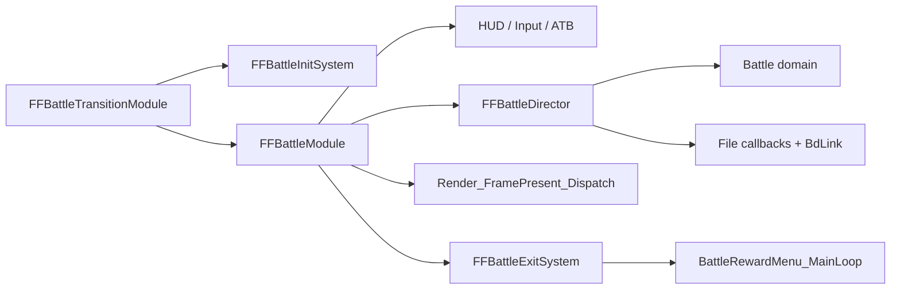

# Battle Loop Takeover Feasibility

> [!success] Verdict
> A complete battle-loop takeover is architecturally feasible on the analysed FF8 PC build. `main::FFBattleModule` (`0x47CF60`) is a centralized recurring frame callback above HUD/input/ATB, the battle director, battle rendering, and pacing. This proves the replacement seam and contract; it does not implement a DLL or renderer.

## Analysed Build

- Module: `FF8_EN.exe`
- Image base: `0x400000`
- MD5: `be8b278becf6757bb811acd45d717d9c`
- SHA-256: `064d466b5fe2ba901fd44abf19f37c0fd6a2db40aabd95c9e5959195b6589570`

Addresses in this page are build-specific.

## Proven Ownership Hierarchy

`FFBattleTransitionModule` (`0x559890`) installs three separate callbacks:

- `FFBattleInitSystem` (`0x47CE10`) — module state/timing/resolution setup;
- `FFBattleExitSystem` (`0x47CEF0`) — graphics/module exit;
- `main::FFBattleModule` (`0x47CF60`) — recurring whole-frame callback.

`FFModuleHandler_main_loop` starts at `0x4706B0`. `0x4709EC` is an interior assignment site, not the dispatcher address.

The frame callback ABI decompiles as:

```c
int __cdecl FFBattleModule(int game_object);
```

The live paused and active captures both received `game_object=0x092383C8` for that process instance.



## Live Frame Proof

### Paused frame

With `IS_BATTLE_PAUSED=1`, the captured order was:

1. `FFBattleModule`;
2. `BattleUI_HudInputAndATBTick` ×4;
3. battle end-scene/window support;
4. `Render_FramePresent_Dispatch`.

The director, active-domain block, file-callback tail, and BdLink were not reached.

### Active frame

With `IS_BATTLE_PAUSED=0`, one frame between consecutive root hits was:

1. `FFBattleModule`;
2. HUD/input/ATB ×3;
3. `FFBattleDirector_battleLoop` ×1;
4. active case at `0x47D70F`;
5. `Battle_RunFileLoadingCallbacks`;
6. `BdLink_GF_battle_input_and_texture_upload`;
7. HUD/input/ATB ×1;
8. frame/window support;
9. `Render_FramePresent_Dispatch`;
10. next `FFBattleModule`.

The native end-scene call at `0x47D228` is conditional on `!is_sleeping`; frame-skip/catch-up can omit it while the global present path still runs.

This proves that `0x47CF60` replaces the whole battle frame, while `0x47CCB0` replaces only the domain director.

## Native-Init Handoff

The exact ready state is:

```text
mode_StateGlobal == 3
mode3_substep == 3
mode3_subsub_step == 1
mode_3_subsubsubstep == 4
```

The old guard `mode3_subsub_step == 3` was incorrect.

The final init branch writes `mode_3_subsubsubstep=4` at `0x47D6F8`. It still runs the file callback tail (`0x47D702`) and BdLink (`0x47D707`) in that transition frame. The first recurring active-domain body starts on the next director entry at `0x47D70F`.

For a first takeover, the safe policy is to pass through native frames until this ready state and the transition tail have completed, then switch the `FFBattleModule` hook to external ownership.^[inferred]

## Responsibility Contract

### Authoritative and required when retaining native domain

- `BattleUI_HudInputAndATBTick` — player input, command readiness, pending commands, ATB.
- Director active-block order — end checks, pending transfer, counters, arbitration, synchronous outcome commit, status/special ticks.
- `Battle_ProcessActionCallbackChain` — AI/text/ability/GF-finalize progression.
- `Battle_ProcessDeferredCallbacks` — deferred exec-node unlinking.
- Battle RNG, slots, pending/exec queues, result globals, and native cleanup inputs.

### Native presentation and replaceable as a unit

- `battle_file_callback_2[16]` and its countdown/completion records;
- `BattleTaskQueue_Tick` and action sequences;
- BdLink tasks, camera update, parse/upload work;
- native HUD drawing, effects, geometry, and present.

The callback matrix observed:

- clean idle, Attack, cached Fira, cached Ifrit, and a stable menu window with no active file slot;
- a character/presentation load using adapter `0x482870`, countdown `4 → 2 → 1 → 0`, and completion `BattleFile_StoreCharacterLoadResult` (`0x508470`);
- an Ifrit asset completion `GF_Ifrit_AssetLoadCompletion_ClearBusy` (`0xB2BB40`).

Those targets only updated presentation readiness. During two BdLink entry/return pairs, pending bytes, action latches, party ATB, menu count, pause state, and action globals were identical.

> [!important] Partial native presentation
> File callbacks and BdLink may be removed only when the external layer owns all assets, effect tasks, camera, and uploads. Leaving a native presentation task half-owned can stall its own busy flag even though battle outcomes are already committed.

## Native Return Handoff

A disposable live victory confirmed:

1. `BattleTick_CheckAllEnemiesDead` committed result `4` in active state `3 / 3 / 1 / 4`.
2. The victory relay completed and the director entered `Battle_EndCleanupAndTransition` with `mode3_subsub_step=2`.
3. Cleanup persisted party/reward state and returned with `mode_StateGlobal=5`, `mode3_subsub_step=0`.
4. Mode 5 packaged rewards.
5. `FFBattleExitSystem` ran.
6. `BattleRewardMenu_MainLoop` (`0x4A2690`) became the recurring post-battle callback.

Pending, exec, and latch bytes remained nonzero through mode 5. Native cleanup does not require a blanket zero; the battle module abandons those buffers and the next `FFBattleInitSystem` clears the battle-state block.

The safest first return policy is to hand native-compatible actor/result state back before the native end check, then let the native result relay and cleanup complete.^[inferred]

## Feasibility Criteria

- [x] One centralized whole-frame owner exists.
- [x] Its ABI and engine-context argument were captured live.
- [x] Paused and active frame call order were captured.
- [x] The exact post-init ready guard and first active entry are known.
- [x] HUD/domain duties are separated from file/BdLink presentation duties.
- [x] Real file completions were identified and classified.
- [x] BdLink was checked at entry/return against authoritative state.
- [x] A native victory cleanup and reward handoff were captured.
- [x] No DLL, detour, or custom renderer was required to establish feasibility.

## Progressive Wicked Implementation Track

The implementation track is intentionally separate from this feasibility proof:

- [[projects/re-ff8/concepts/external-battle-renderer-architecture]] defines the x86 bridge, warm x64 Wicked host, IPC, composition, ownership, and failure boundaries.
- [[projects/re-ff8/concepts/ff8-wicked-bridge-semantic-model]] defines raw captures, replay packets, semantic objects, identities, and migration ownership.
- [[projects/re-ff8/references/legacy-ff8-render-pass-d3d12]] defines the fidelity-first D3D12 replay pass.
- [[projects/re-ff8/references/wicked-ff8-migration-phases]] defines P0–P11 entry/exit gates.
- [[projects/re-ff8/skills/implementing-wicked-ff8-bridge]] defines the procedural evidence and rollback workflow.

These pages do not change the extracted takeover facts and do not claim an implementation already exists.

## Residual Engineering Work

- Implementing a reversible x86 detour/DLL is intentionally out of scope.
- Selecting and integrating a new renderer/window/backend is intentionally out of scope.
- Wipe, timer, scripted-end, and escape exits have not all received the same live transient-byte capture as victory; this does not invalidate the centralized takeover seam.
- Additional uncached spell/GF asset completions would broaden presentation coverage, but static callers and the two captured completions already establish the mechanism.

## Related

- [[projects/re-ff8/concepts/battle-lifecycle]]
- [[projects/re-ff8/concepts/battle-state-model]]
- [[projects/re-ff8/concepts/atb-and-command-menu]]
- [[projects/re-ff8/concepts/draw-magic-and-render-bridge]]
- [[projects/re-ff8/concepts/battle-camera-architecture]]
- [[projects/re-ff8/references/battle-loop-iso-readiness]]
- [[projects/re-ff8/references/battle-address-catalog]]
- [[projects/re-ff8/concepts/external-battle-renderer-architecture]]
- [[projects/re-ff8/references/wicked-ff8-migration-phases]]
