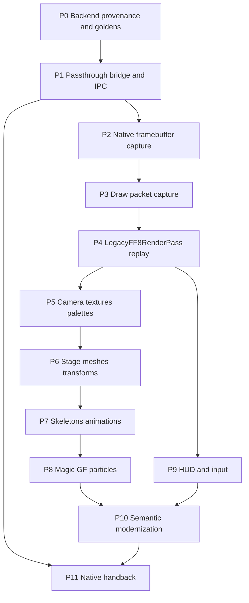

# Wicked FF8 Progressive Migration Phases

> [!important] Gate policy
> Phases are evidence gates, not calendar milestones. A later phase may be explored experimentally, but no ownership flag moves forward until the prior phase's exit criteria, rollback, and artifacts are complete.

## Program Goal

Move battle presentation from native FF8 rendering to a prewarmed Wicked Engine x64 host while:

- keeping the game playable at every phase;
- preserving a native or legacy fallback per object/effect;
- measuring parity instead of relying on screenshots by eye;
- separating rendering migration from battle-domain replacement;
- enabling future semantic materials, lighting, animation, effects, and HUD.

## Known Starting Point

Already proven by reverse engineering:

- `FFBattleModule` (`0x47CF60`) owns the whole battle frame;
- active and paused frame order;
- post-init guard `3 / 3 / 1 / 4`;
- native outcome commits before multi-frame presentation;
- HUD/input/ATB and action callbacks remain authoritative;
- file callbacks and BdLink are presentation responsibilities;
- native victory cleanup and reward handback.

Not implemented:

- bridge DLL;
- detour;
- IPC;
- Wicked host;
- framebuffer capture;
- draw packets;
- D3D12 replay;
- semantic adapters;
- shared texture.

## Dependency Graph



P11 starts early as a regression requirement and is revalidated after every ownership expansion.

## Global Requirements

Every phase supplies:

- exact FF8 executable hash and address-map ID;
- pinned bridge and Wicked commits;
- reproducible setup;
- structured evidence;
- positive and negative tests;
- performance metrics;
- rollback path;
- documented unknowns;
- soak test across repeated battles.

## Canonical Scenario Set

Minimum visual/runtime scenarios:

1. stable idle with three party actors and at least two enemies;
2. paused idle;
3. basic Attack;
4. Fira or equivalent generic magic;
5. Ifrit offensive GF;
6. support GF such as Cerberus;
7. Renzokuken or another compound camera action;
8. command menu open;
9. victory transition;
10. escape when available.

Record encounter ID, party, equipment/junction state, RNG state, and input script for each.

---

## P0 — Runtime Backend Provenance And Golden Baseline

### Objective

Identify the actual runtime rendering chain and capture trusted native reference output before any renderer modification.

### Entry criteria

- Proven frame seam and active build hash.
- IDA debugger attached to a reproducible battle.
- Native game can be run focused and unpaused.

### Native ownership

Everything remains native.

### Work

- trace static DirectDraw and OpenGL paths;
- trace runtime D3D9 `Present`/`EndScene`;
- capture call stacks and module ownership;
- determine whether D3D9 is a translation/overlay downstream of DirectDraw/OpenGL;
- identify native resolution, backbuffer format, gamma/color path, window mode, and present cadence;
- capture canonical screenshots/frame sequences;
- capture camera timelines and frame metadata;
- measure native run-to-run visual nondeterminism.

### Required probes

```text
DirectDrawCreate
IDirectDrawSurface::Flip/Blt
wglCreateContext / SwapBuffers
Direct3DCreate9
IDirect3DDevice9::EndScene/Present
Render_FramePresent_Dispatch
```

### Artifacts

- `backend-provenance.json`;
- call stacks for each present path;
- native module graph;
- golden PNG/frame sequences;
- metadata sidecars;
- native timing histogram;
- color-space note.

### Exit criteria

- [ ] Active upstream and downstream present chains identified.
- [ ] At least five canonical scenarios captured.
- [ ] Repeated native captures quantify baseline variance.
- [ ] Capture tooling does not change battle-domain state.
- [ ] Golden files include build/tick/camera metadata.

### Rollback

Remove all breakpoints/hooks; no persistent runtime modification exists.

### Main risk

Mistaking a compatibility wrapper or overlay for the game renderer.

---

## P1 — Reversible Passthrough Bridge And Read-Only IPC

### Objective

Install the x86 bridge and run a warm x64 host without changing any visible FF8 output.

### Entry criteria

- P0 provenance complete.
- Detour library/tooling selected and threat-modeled.
- Protocol v1 drafted.

### Native ownership

All battle presentation and input remain native.

### Work

- verify executable hash before patching;
- install reversible detour at `FFBattleModule`;
- call original function unchanged;
- detect post-init ready state;
- publish heartbeat, frame header, phase flags, pause, slots, camera, and lifecycle;
- launch/connect prewarmed Wicked host;
- implement named-pipe control channel;
- implement read-only shared-memory snapshot ring;
- implement host disconnect and bridge fallback;
- expose diagnostics and hotkey without taking input ownership.

### Reused tests

- `BATTLE_FRAME_OWNERSHIP_ACTIVE_001`;
- `BATTLE_FRAME_OWNERSHIP_PAUSED_001`;
- `TAKEOVER_AUTHORITATIVE_COUPLING_001`;
- phase/slot reads from `ff8re`.

### Artifacts

- hook install/remove evidence;
- protocol schema and hash;
- frame sequence logs from both processes;
- bridge overhead profile;
- host readiness timeline;
- disconnect/rollback evidence.

### Exit criteria

- [ ] Active and paused native traces remain identical.
- [ ] No visual difference from P0 goldens beyond baseline variance.
- [ ] Bridge adds less than the agreed frame budget.
- [ ] Host may crash or be killed without crashing FF8.
- [ ] Original bytes restore at a safe point.
- [ ] Unsupported build refuses to hook.
- [ ] Ten repeated battles show no stale generation/resources.

### Rollback

Atomic ownership remains `Native`; bridge invokes original function and can uninstall the detour.

### Main risk

Blocking FF8 on IPC or host readiness.

---

## P2 — Native Framebuffer Capture

### Objective

Transport the native final battle image to Wicked and display it without changing pixel content.

### Entry criteria

- P1 stable passthrough.
- Active present chain known.

### Native ownership

Native renderer still produces the complete image.

### Work

- capture before final present at the active backend;
- avoid synchronous CPU readback on the production path where possible;
- associate image with battle generation and logic/presentation IDs;
- display capture in Wicked observer window;
- implement resize/color-format handling;
- build first image-diff pipeline.

### Two capture modes

- debug CPU readback → PNG;
- production GPU/shared capture when backend permits.

### Artifacts

- native texture/frame captures;
- Wicked-displayed copies;
- color conversion test patterns;
- SSIM/absolute-difference reports;
- latency and bandwidth measurements.

### Exit criteria

- [ ] Wicked displays idle, Attack, Fira, and Ifrit frames.
- [ ] Pixel difference is explained by known color/composition conversion only.
- [ ] Captures align by frame metadata.
- [ ] Paused frame remains stable.
- [ ] Capture can be disabled instantly.

### Rollback

Stop capture; native present remains untouched.

### Main risk

Calling a framebuffer copy a renderer replacement. P2 is observability only.

---

## P3 — Draw Packet Boundary And Capture

### Objective

Capture self-contained geometry/state packets sufficient for offline replay.

### Entry criteria

- P2 goldens and alignment tooling.
- Candidate boundaries around `RenderGeometry`, effect submits, or backend draw calls.

### Native ownership

Native renderer remains final output.

### Work

- decompile and type `RenderGeometry` (`0x5099D0`);
- trace callers, args, buffers, and resource references;
- identify stage, actor, effect, particle, HUD packet families;
- decode primitive topology and vertex layouts;
- decode matrices/coordinate spaces;
- decode texture/palette and render states;
- serialize unknown bytes and provenance;
- create `LegacyDrawPacket` v1;
- build offline capture inspector.

### Capture strategy

Start with one stable idle frame. Add one packet family at a time. Do not attempt every effect before offline replay works.

### Artifacts

- typed IDA structs/comments;
- raw buffer dumps;
- packet JSONL/binary fixtures;
- resource manifest;
- packet order/hash report;
- boundary call graph.

### Exit criteria

- [ ] One idle frame packet stream is self-contained.
- [ ] Captured packet order is deterministic.
- [ ] At least one stage and one actor packet are classified.
- [ ] Texture/material references resolve without FF8 pointers.
- [ ] Unknown state is preserved, not discarded.
- [ ] Offline inspector validates every range/hash.

### Rollback

Capture remains passive; native renderer is unaffected.

### Main risk

Capturing too late, after semantic information and useful transforms have been destroyed.

---

## P4 — `LegacyFF8RenderPass` Replay

### Objective

Render captured packets through Wicked/D3D12 while retaining native output as primary or fallback.

### Entry criteria

- P3 self-contained fixture.
- Pinned Wicked build and custom render path skeleton.

### Native ownership

Native remains primary during hidden comparison. External ownership begins only after parity gates.

### Work

- create packet staging model;
- create upload, descriptor, sampler, and PSO caches;
- implement pretransformed and model-space shaders;
- implement vertex color, palette, alpha-test, blend, depth, cull, viewport/scissor;
- preserve packet order;
- render hidden/offscreen candidate;
- add packet debug views;
- compare against P2 goldens;
- add per-packet fallback/unsupported diagnostics.

### Artifacts

- offline replay executable or host mode;
- fidelity shaders;
- PSO/state mapping;
- replay images and diffs;
- unsupported packet registry;
- performance profile.

### Exit criteria

- [ ] Idle frame replays offline.
- [ ] Stage and core actor geometry visible.
- [ ] Native camera reproduces framing.
- [ ] Packet order and hashes match capture.
- [ ] Visual threshold passes for stable idle.
- [ ] Unsupported packets remain native or visible diagnostics.
- [ ] One-frame ownership rollback works.

### Rollback

Set output owner to `Native`; keep hidden candidate running for diagnostics.

### Main risk

Achieving a plausible image while silently using wrong blend, gamma, or ordering.

---

## P5 — Native Camera, Textures, Palettes, And Color

### Objective

Close the highest-impact fidelity inputs before semantic geometry promotion.

### Entry criteria

- P4 stable replay core.
- Camera RE and texture capture available.

### Native ownership

Native camera timeline and native asset loaders remain authoritative.

### Work

- consume final native eye/target/view/projection/FOV/shake;
- convert handedness, axes, storage order, and clip depth;
- support indexed textures and palettes;
- decode color key and alpha rules;
- capture sampler/filter behavior;
- match gamma/sRGB/color-space path;
- cache resources by content hash;
- preserve pause freeze and camera takeover/overlay flags.

### Reused evidence

- `cam_*.jsonl`;
- camera control-word matrix;
- callback readiness matrix;
- GF/magic asset loader documentation.

### Artifacts

- versioned coordinate conversion;
- camera fixture/timeline;
- texture/palette fixtures;
- color test suite;
- sampler/state mapping.

### Exit criteria

- [ ] Camera/FOV numeric parity across idle, magic, GF, and limit.
- [ ] Pause produces no camera drift.
- [ ] Core texture/palette cases visually match.
- [ ] Color pipeline variance is below calibrated baseline.
- [ ] Texture cache survives repeated battles without stale content.

### Rollback

Per-feature flags restore native camera/color output or full native presentation.

### Main risk

Using a modern color pipeline that makes every pixel differ despite correct geometry.

---

## P6 — Stage, Actor Meshes, And Transforms

### Objective

Promote static stage and battle actors from packets to semantic Wicked entities.

### Entry criteria

- P5 camera/textures stable.
- Mesh packet/resource boundaries decoded.

### Native ownership

Native animation may still generate poses/packets. Wicked owns selected mesh rendering only.

### Work

- decode stage resource and submeshes;
- map scene/encounter identity to resource manifest;
- decode party/enemy model buffers;
- derive stable actor identity from slot + incarnation;
- capture world transforms and visibility;
- map materials without changing appearance;
- instantiate Wicked meshes/entities;
- preserve weapon/attachment and GF geometry swap references;
- render semantic candidate beside hidden legacy reference.

### Artifacts

- mesh decoder/spec;
- stage and actor manifests;
- transform conversion tests;
- Wicked scene fixtures;
- semantic-vs-legacy diffs.

### Exit criteria

- [ ] Stage semantic render passes parity gate.
- [ ] Party and enemy transforms match across idle/Attack.
- [ ] Spawn/despawn and slot reuse do not leak entities.
- [ ] Visibility/target transitions are frame-aligned.
- [ ] Legacy fallback remains available per actor.

### Rollback

Set selected actor/stage owner back to `LegacyReplay`.

### Main risk

Treating slot index as permanent identity across spawn/replacement.

---

## P7 — Skeletons, Animations, And Attachments

### Objective

Promote native poses and timelines into semantic animation without changing action timing.

### Entry criteria

- P6 semantic meshes.
- Skeleton/pose data decoded for one actor family.

### Native ownership

Native action scheduler and effect timeline remain authoritative.

### Work

- decode skeleton hierarchy and bind pose;
- decode current native pose;
- identify animation clip/sequence IDs;
- map native frame/time and discontinuities;
- handle weapons and attachments;
- implement pose interpolation only between valid samples;
- map to Wicked armature/animation components;
- compare semantic skinning to packet replay.

### Expansion order

1. one party actor idle;
2. party basic Attack;
3. one enemy idle/attack;
4. reaction/death;
5. remaining actor families.

### Artifacts

- skeleton and pose schemas;
- clip/timeline manifest;
- attachment mapping;
- pose fixtures;
- animation parity videos/metrics.

### Exit criteria

- [ ] Idle and Attack poses pass silhouette/vertex comparison.
- [ ] Discrete transitions do not interpolate incorrectly.
- [ ] Weapon attachments remain stable.
- [ ] Death/spawn lifecycle matches native barriers.
- [ ] Legacy pose fallback is selectable.

### Rollback

Return actor to legacy packet rendering; keep semantic entity hidden.

### Main risk

Conflating rendered pose samples with reusable animation clips.

---

## P8 — Magic, GF, Special Effects, And Particles

### Objective

Promote effect families incrementally while retaining native outcome and timeline authority.

### Entry criteria

- P4 legacy effects replay or native layer compositing.
- P5 camera/textures stable.
- `EffectInstance` identity and event protocol.

### Native ownership

Native `Tick_Generic`, `Tick_GF_Cinematic`, `Tick_Special`, BdLink tasks, and effect completion remain active until each effect is promoted.

### Work

- map `effect_id` and command family;
- capture/decode `.00` resources;
- capture/decode `.01` timeline/opcodes;
- classify mesh, trail, sprite, particle, light, camera, and sound events;
- create effect-family semantic adapters;
- preserve relay/barrier completion;
- map native seed/timing where visual randomness matters;
- implement Wicked particle/effect equivalents;
- migrate by explicit `effect_id` allowlist.

### Family order

1. simple generic magic;
2. simple offensive GF;
3. support GF;
4. multi-task GF;
5. specials/Odin/Gilgamesh;
6. compound limits.

### Artifacts

- effect manifests by ID;
- `.00/.01` decoder fixtures;
- event timelines;
- particle parameter schemas;
- semantic-vs-legacy captures;
- coverage matrix.

### Exit criteria

- [ ] At least one effect in each selected family passes timing and visual gates.
- [ ] Damage/status remains native and unchanged.
- [ ] Camera barriers release on the same logical tick.
- [ ] Unknown effects automatically use legacy/native fallback.
- [ ] Resource busy flags cannot stall after ownership switch.

### Rollback

Per-effect ownership returns to native/legacy before the next invocation.

### Main risk

Ending a semantic effect visually while native progression still waits on a different completion condition.

---

## P9 — HUD Rendering And Input Ownership

### Objective

Separate visual HUD modernization from authoritative command input.

### Entry criteria

- P1 stable mirror of HUD/domain state.
- Renderer overlay/composition stable.

### Native ownership

Native input/ATB remains authoritative first.

### Work

- define semantic HUD snapshot;
- mirror party/enemy names, HP, ATB, statuses, messages, command menu, targets, cursor, summon charge, and pause;
- render read-only Wicked HUD;
- compare to native HUD;
- hide native HUD only after visual parity;
- define semantic input commands;
- validate commands against current menu/target state;
- transfer input ownership separately from rendering.

### Ownership stages

```text
Native render + Native input
Wicked render + Native input
Wicked render + Mirrored input
Wicked render + External validated input
```

### Artifacts

- HUD state schema;
- command/input protocol;
- visual goldens;
- menu state traces;
- duplicate-command and focus tests.

### Exit criteria

- [ ] Wicked HUD mirrors stable and dynamic states.
- [ ] Native input works while native HUD is hidden.
- [ ] No duplicate pending action is emitted.
- [ ] Focus/Alt-Tab/controller reconnect are handled.
- [ ] External input rollback restores native HUD/input together.

### Rollback

Restore native HUD rendering before restoring native input acceptance.

### Main risk

Treating HUD rendering and `BattleUI_HudInputAndATBTick` as one replaceable unit.

---

## P10 — Progressive Semantic Modernization

### Objective

Use Wicked's established pipeline after fidelity and semantics are stable.

### Entry criteria

- Legacy fallback covers all required battle presentation.
- Selected semantic objects pass parity.
- Feature flags and A/B capture operational.

### Native ownership

The native battle domain and lifecycle remain authoritative. Presentation ownership is selected per object/effect/profile, with `NativeFidelity` and legacy replay retained as fallbacks.

### Work

- introduce modern materials per resource;
- add semantic lights and shadows;
- choose high-resolution geometry/texture replacements;
- add modern AA, HDR, tone mapping, post-process, particles, and camera options;
- preserve a `NativeFidelity` profile;
- version art direction separately from semantic correctness;
- expose per-feature configuration and compatibility modes.

### Profiles

```text
NativeFidelity
HighResolutionLegacy
ModernMaterials
ModernLighting
FullModern
```

Each profile selects semantic/legacy ownership and graphics features without changing battle-domain behavior.

### Artifacts

- profile manifest;
- replacement asset packs;
- material/light mappings;
- performance/quality presets;
- compatibility matrix.

### Exit criteria

- [ ] NativeFidelity remains a regression baseline.
- [ ] Modern profiles do not alter battle-domain evidence.
- [ ] Unsupported assets fall back cleanly.
- [ ] GPU budgets are defined and measured.
- [ ] User can switch profile outside an active effect/battle or through a safe transition.

### Rollback

Return individual features or objects to `NativeFidelity`/legacy ownership.

### Main risk

Mixing semantic correctness changes with subjective art-direction changes.

---

## P11 — Native Handback, Rewards, And Lifecycle Closure

### Objective

Guarantee that external presentation never prevents FF8 from ending battle and entering native reward/field flow.

### Entry criteria

- Starts in P1 and remains mandatory.
- Native cleanup contract understood.

### Native ownership

Native domain, result, cleanup, rewards, and module switching remain authoritative in this renderer track.

### Work

- detect result commit and transition countdown;
- stop accepting new external presentation/input ownership;
- drain/abort host effects by generation;
- restore native output before required native UI/reward screen;
- let `Battle_EndCleanupAndTransition` execute;
- observe mode 5 and `FFBattleExitSystem`;
- release battle resources after host fence;
- validate next battle starts with a clean generation.

### Reused tests

- `BATTLE_NATIVE_CLEANUP_HANDOFF_001`;
- exit reset suite;
- escape commit/mode5 scenarios;
- repeated-battle soak.

### Artifacts

- exit sequence trace;
- ownership transition log;
- resource retirement log;
- reward-loop entry evidence;
- repeated-battle memory/resource report.

### Exit criteria

- [ ] Victory handback passes.
- [ ] Escape handback passes.
- [ ] Wipe/timer/scripted-end policy documented and tested where reproducible.
- [ ] Native reward/menu appears correctly.
- [ ] No external frame presents after generation end.
- [ ] Next battle starts without stale objects/resources.
- [ ] Host disconnect during exit still reaches native flow.

### Rollback

Force `Native` presentation ownership and discard external generation. Never patch reward globals from the renderer bridge.

### Main risk

Waiting for external visual completion after native cleanup has already invalidated battle memory.

---

## Cross-Phase Feature Flags

Minimum flags:

```text
bridge.enabled
capture.framebuffer
capture.draw_packets
renderer.legacy
renderer.camera
renderer.stage
renderer.actors
renderer.effects.<effect_id>
renderer.hud
renderer.shared_output
renderer.modern_materials
renderer.modern_lighting
```

Flags are evaluated into an ownership snapshot at a safe boundary; changing a config file does not mutate ownership mid-draw.

## Evidence Catalog

Each phase writes a manifest:

```yaml
phase: P4
ff8_build_sha256: ...
address_map: ...
bridge_commit: ...
wicked_commit: ...
protocol: 1.0
scenario: ifrit
artifacts:
  - native.png
  - legacy.png
  - diff.png
  - packets.bin
  - metadata.json
result: pass
```

Raw evidence remains separate from distilled Obsidian conclusions.

## Performance Budgets

Define budgets before optimization:

- FF8 bridge hook overhead;
- snapshot copy time;
- shared-memory backlog;
- host decode/update;
- GPU upload;
- pass recording;
- GPU frame;
- shared composition;
- end-to-end input-to-photon latency.

No phase passes solely because average FPS is acceptable; frame-time percentiles and stalls matter.

## Stop Conditions

Stop promotion and return to the prior owner when:

- unknown packet/state affects visible output;
- domain snapshot differs from native baseline;
- camera or barrier timeline diverges;
- shared memory corrupts or overruns;
- resource generation cannot be proven;
- visual comparison lacks valid frame alignment;
- fallback is not deterministic;
- the next battle inherits stale state.

## Related

- [[projects/re-ff8/concepts/external-battle-renderer-architecture]]
- [[projects/re-ff8/concepts/ff8-wicked-bridge-semantic-model]]
- [[projects/re-ff8/references/wicked-engine-integration-reference]]
- [[projects/re-ff8/references/legacy-ff8-render-pass-d3d12]]
- [[projects/re-ff8/skills/implementing-wicked-ff8-bridge]]
- [[projects/re-ff8/references/battle-loop-takeover-feasibility]]
- [[projects/re-ff8/skills/battle-re-verification]]
