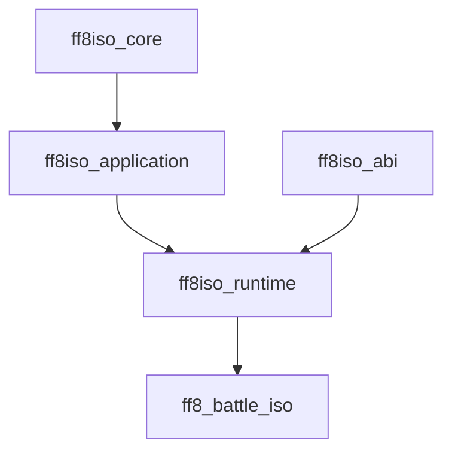

# Implementing a Full ISO FF8 Battle Migration

> [!important] Scope
> This guide targets a full in-process x86 replacement of the FF8 battle subsystem. It deliberately excludes Wicked Engine, external rendering, IPC, and an x64 host. The replacement is compiled into an injected DLL and runs inside `FF8_EN.exe`.

> [!warning] No whole-executable oracle
> This guide does **not** prescribe a frame-by-frame native oracle or lockstep execution for now. Reverse engineering is driven by IDA static analysis, focused live probes, executable `ff8re` hypotheses, data corpus analysis, and deterministic tests for the new code. This makes `FullISO` an engineering target backed by accumulated proof, not a mathematical certification until a differential oracle is later added.

## Current migration status — 2026-08-18

> [!success] Constrained P0 checkpoint validated
> [[projects/final-fantasy-viii-reimaginated/final-fantasy-viii-reimaginated|Final Fantasy VIII Reimaginated]] now contains the x86 build, hash-bound address map, C ABI, reversible `FFBattleModule` observation seam, canonical/legacy state bridge, write guard, call audit, and G00–G04 suites. The final no-debugger run passed 12/12 project tests and 151/151 [[projects/ffscriptloader/ffscriptloader|FFScriptLoader]] tests, imported a live `03/03/01/04` post-init snapshot, performed no P0-owned battle write, restored the 16-byte frame preimage exactly, and left `FF8_EN.exe` running after shutdown. See [[projects/final-fantasy-viii-reimaginated/references/p0-harness-validation]].

**Migration position:** G05–G10 are strictly closed by their promoted live
envelopes. P0.9 owns G06 input/ATB/GF/escape/readiness at four pulses per frame;
G07 owns pending/exec/arbitration/current-action lifecycle;
[[projects/final-fantasy-viii-reimaginated/references/p0-g08-target-plan-validation|G08 protocol v2]]
turns an authentic player Meteor pending into one ordered, pointer-free
TargetPlan with exact RNG accounting;
[[projects/final-fantasy-viii-reimaginated/references/p0-g09-attack-slice-validation|G09]]
live-promotes Attack `0x01` HP/event commit; and
[[projects/final-fantasy-viii-reimaginated/references/p0-g10-status-timers-validation|G10]]
live-promotes the owned Slow status/timer slice. P1 AttackSlice plus the G10
status slice are unlocked as those versioned laboratory claims.
[[projects/final-fantasy-viii-reimaginated/references/p0-g11-magic-offline-validation|G11]]
live-promotes semantic Fire HP/event/stock on DLL `0b3c4bb9…`; Magic
animation stays G14 U14.6/U14.7. Historical v1 FAIL on DLL `0977c9ec…` is
retained as SQ-G14-002. See
[[projects/final-fantasy-viii-reimaginated/references/p0-g11-magic-offline-validation]].

The strict original roadmap still carries explicit G03/G04 debt:

- `FFBattleDirector_battleLoop` is proven only for an active-only x86 pass-through gateway: live pre/post captures preserve ESP, the sampled stack window and non-volatiles, while forwarding ambient ECX. It does not grant replacement ownership.
- Three live module cycles and a field-only controlled fault passed strict G03 for the recorded DLL hash. Init/Exit entry/return contracts are live-captured; `Battle_ActiveTickEntry` and all P1 wrappers remain incomplete.
- UI/Switch seams exist as opt-in development seams, while the validated default P0 profile installs only `FFBattleModule`.

The completed checkpoint is therefore a safe, useful base for domain/application work, not a claim that every original G03/G04 checkbox or any battle behavior has been replaced.

### P0.5–P0.8 delivery state

**Finished and evidenced**

- Offline: deterministic G05 primitives (integer helpers, battle RNG, phase
  guard, active-tick shell, latches and terminal stubs) and deterministic G06
  model code (logical input, ATB, GF charge, escape and ready events).
- Offline: Reimaginated `ctest` passes 18/18; hardened FFScriptLoader baseline
  passes 151/151.
- Live: frame observation, state import, Switch descriptor observation,
  active-only Director pass-through, G04 state bridge, quiescent shutdown and
  byte-exact frame-hook restoration.
- Live ABI: fresh-process samples at `0x47D113` / `0x47D118` establish the
  Director pass-through register/stack contract. The gateway forwards ambient
  ECX, treats EAX/ECX/EFLAGS as volatile and preserves the sampled stack and
  non-volatiles.
- Live P0.6: three G03 cycles, field-only controlled fault, Init/Exit ABI
  capture, and a versioned G05 one-tick no-write probe passed. The G05
  evidence records equal observed-memory hashes, zero write/forbidden-call
  counts, success-path native handback and normal byte-exact shutdown.
- Live P0.7: all eight positive pointer-free G05 scenarios and the
  post-engagement negative fault close G05 on the final candidate hash.
- Live P0.8: four native HUD/ATB pulses per module frame are characterized; a
  four-pulse ATB-only pilot passed with guarded `cur_atb`/UI-mirror writes; and
  ready, action-freeze, pause, GF-charge and escape gates passed the automated
  read-only matrix with exact rollback.
- Live P0.9/G07: exclusive G06 cadence and command-spine ownership passed with
  the audited HUD/file-callback/BdLink presentation compatibility tail and
  byte-exact rollback.
- Live G08: the pending-writer seam authenticated one player Meteor request;
  replacement normalization, eligibility, ordered fan-out and ten RNG draws
  published one held/completed TargetPlan with no G09/native-targeting call.
- Live G09: an authentic player Attack `0x01` pending produced one direct
  TargetPlan, one HP/event commit, `0x70` idle unlock, and hook rollback.
  P1 AttackSlice is unlocked.

**Intentionally not finished**

- G03 strict is live-promoted for its recorded DLL hash; repeat the regression
  when the harness/runtime binary changes.
- Init/Exit ABI is live-promoted for observation; no P1 wrapper is yet needed
  or installed.
- The `one-tick v1` probe is historical; P0.7 supersedes it with the complete
  G05 v2 no-write scenario matrix.
- P0.7 adds a v2 scenario wire contract, pointer-free fixtures, exact
  trace/latch/RNG evidence, bounded multi-tick handback and a post-engagement
  fault. The final DLL hash completes the live matrix; this does not unlock
  G06 or P1.
- G06, G07, G08 and G09 ownership are bounded opt-in laboratory protocols; the
  default P0 bootstrap remains pass-through and makes no general gameplay claim.
- G09 Attack `0x01` is live-promoted and unlocks P1 AttackSlice. G10 and G23
  remain outside the implemented ownership boundary.

For the detailed test chronology and the distinction between model tests and
live seams, see [[projects/final-fantasy-viii-reimaginated/references/p0-5-offline-validation]].

## 1. Definition of `FullISO`

The end state reimplements every battle-owned responsibility:

- battle initialization, including scene, party, enemy, RNG, ATB, task, and asset preparation;
- the full-frame callback, pause decision, input, HUD, ATB, active director tick, rendering, and pacing;
- action queues, targeting, damage, statuses, AI VM, GF/Limit/special families, callbacks, and presentation barriers;
- battle camera, battle task queue, action sequences, battle-local asset callbacks, and battle rendering;
- cleanup, result packaging, and installation of the next field/reward callback.

> [!warning] Exactness claim
> Without source code, source-level or instruction-level identity cannot be established. `FullISO` therefore means an implementation faithful to the supported executable’s recovered contract: state effects, integer arithmetic, RNG draw order, input semantics, callback ordering, task timing, assets, render commands, frame output, and module transitions. Calling an original **battle-owned** function in the certified configuration invalidates `FullISO`.

The outer game remains the process host. Its field/world modules, operating-system APIs, generic graphics/audio services, VFS, and post-battle modules are integration boundaries. They may remain native only when the dependency ledger proves that they are generic services rather than battle logic.

## 2. The hard constraint: no source code

The original executable does not provide headers, libraries, source types, or a stable plug-in ABI. A decompiler’s `struct`, `class`, function name, or calling convention is a hypothesis until it is independently checked.

Do **not** assume that creating a C++ class with the same apparent fields “replaces” an original class:

- a native object can have a hidden vptr, a base subobject offset, a non-obvious allocator header, a reference count, or fields populated by constructor side effects;
- Microsoft x86 C++ member calls depend on the `this` register, method convention, vtable layout, and sometimes compiler-specific thunks;
- native code can retain pointers to the old object, free it through a different heap, or call it later through a callback table;
- IDA may display a generic `_DWORD *` even where the original was a C++ object, and the inverse is also possible: much of the known battle system is global-state and C-style rather than class-based.

The correct strategy is to recover an **ABI contract**, then choose an explicit integration pattern per object or service. Never rely on nominal class identity.

## 3. Fixed executable boundary

The analysed build is `FF8_EN.exe`, image base `0x400000`, MD5 `be8b278becf6757bb811acd45d717d9c`, SHA-256 `064d466b5fe2ba901fd44abf19f37c0fd6a2db40aabd95c9e5959195b6589570`. Every address in this guide is specific to that binary. See [[projects/re-ff8/references/battle-loop-takeover-feasibility]].

`FFBattleTransitionModule` (`0x559890`) installs three callbacks. A full migration owns all three:

- `FFBattleInitSystem` (`0x47CE10`);
- `FFBattleModule` (`0x47CF60`), the whole-frame owner;
- `FFBattleExitSystem` (`0x47CEF0`).

`FFBattleDirector_battleLoop` (`0x47CCB0`) is a useful internal seam for early research, but replacing it alone does not replace the frame, HUD/input/ATB, renderer, pacing, or module switching.

The post-init active guard is exactly:

```text
mode_StateGlobal == 3
&& mode3_substep == 3
&& mode3_subsub_step == 1
&& mode_3_subsubsubstep == 4
```

The frame that first writes `mode_3_subsubsubstep = 4` still runs the native file-callback and BdLink tail. A development hook must preserve that fact; the final implementation must reproduce the equivalent work. See [[projects/re-ff8/concepts/battle-lifecycle#Replacement Hook Points]].

## 4. Target codebase and isolation rules

The live remaster tree (not an aspirational `battle-iso/` rename) is:

```text
FinalFantasy_VIII_Reimaginated/
  CMakeLists.txt
  address-map/        # hash-bound symbols, globals, layouts
  contracts/          # launch/evidence C ABI
  abi/                # POD mirrors and LegacyBattleImage
  core/               # deterministic rules and canonical state
  application/        # BattleSession orchestration G05–G09+
  runtime-x86/        # host translation, codecs, TemporaryGxxNcompAdapter
  integration/
    ffscriptloader/   # launch/bootstrap protocol and typed detour adapter
  lift/               # integer/RNG lifts used by core
  tests/              # offline contracts, codecs, in-process suites
  tools/              # validate_contracts.py and evidence helpers
  evidence/           # promoted live envelopes
```

Enforce a one-way dependency graph. `ff8iso_runtime` is the infrastructure layer; do not invent `ff8iso_infrastructure`.



- **core:** rules and canonical state only. Forbidden: `#include "ff8iso/abi/`, `abi::`, `find_symbol`, RVA, NCOMP opcodes, native pods, `import_legacy`.
- **application:** orchestration. Accepts `core::BattleState` / semantic reports. May include `ff8iso/launch_contract.h` via `ff8iso_contracts`. Forbidden: `LegacyBattleImage`, codecs, host I/O, `find_symbol`, linking `ff8iso_abi`.
- **abi:** POD / address-map only. Must not include `core/`.
- **runtime:** unique host translator. Codecs (`legacy_state_codec`, `command_spine_codec`) and `TemporaryGxxNcompAdapter` (removal target U14.x).
- `presentation/` in older notes is not a current CMake target; HUD NCOMP lives in runtime adapters until U14.6.
- no `std::string`, STL container, exception, RTTI object, or C++ virtual class crosses an original-code boundary.

`ff8iso_core` must not link `ff8iso_abi`. `ff8iso_runtime` links `ff8iso_application` **and** `ff8iso_abi`. `tools/validate_contracts.py` `validate_layer_boundary` scans every `core/` and `application/` source.

> [!tip] Canonical state versus compatibility image
> `core::BattleState` is the canonical state. Legacy-shaped globals are a compatibility image decoded/encoded only in runtime. Do not let `BattleSession` or core alias raw FF8 memory, or the replacement will inherit hidden lifetime and ownership bugs.

### 4.1 FFScriptLoader reuse boundary

The sibling [[projects/ffscriptloader/ffscriptloader|FFScriptLoader]] repository at `C:\Users\djden\source\repos\FFScriptLoader` is the chosen **injection foundation**, not an implementation of the battle harness described here. Its reusable pieces are Win32 process discovery, x86 injector/target architecture checks, remote `LoadLibraryA`, CMake Win32 presets, MinHook integration, logging, TOML configuration, and plugin/task factories. Pin the exact FFScriptLoader commit in the build manifest; do not copy an unversioned snapshot into the remaster.

The G03 hardening work now provides:

- executable MD5/SHA-256 verification before any remote write, plus an in-process PE identity check;
- robust target-architecture errors, remote `kernel32`/`LoadLibraryA` resolution by module base plus export RVA, and bounded waits for every remote thread;
- RVA resolution as `main_module_base + rva`, with expected-byte validation at every hook or patch site;
- an exported post-loader-lock bootstrap with a versioned POD request/result contract;
- typed detours for each recovered ABI, atomic multi-hook enable/disable, quiescent removal, and original-byte restoration for non-MinHook patches;
- explicit ownership and fault states, in-process smoke tests, and a record of every executable page changed.

It also sends fixed-size bootstrap payloads, reuses an already loaded DLL by normalized full path, and exposes non-interactive validation/self-test commands. The exact high-level suite orchestration described in the roadmap is still split across payload-generation, injector, canary-capture, and evidence tools.

> [!warning] The current generic hook is observation-only
> `core_hook` saves registers/flags, runs parameterless tasks, then unconditionally jumps to the MinHook trampoline. It is suitable for one-shot Copy/Patch/Load tasks and development observation, but it cannot suppress the original function, preserve a typed return contract, or replace `int __cdecl FFBattleModule(int)`. Battle seams therefore require dedicated typed detours or x86 gateways.

> [!important] Recommended binary split
> Reuse an extended `app_injector.exe` to load a dedicated `ff8_battle_iso.dll`, then invoke `FF8Iso_Bootstrap` explicitly. Do not make the certified runtime a current `IPlugin`: that API crosses DLLs with C++ virtual interfaces, `std::string`, `std::function`, and allocator ownership, while the host currently takes the `CreatePlugin` pointer into a `unique_ptr` instead of using the exported `DestroyPlugin`. Keep `app_hook.dll` and `memory_plugin.dll` as optional development tooling unless their ABI and ownership are redesigned.

Development coexistence is allowed only when a patch/ownership ledger proves that FFScriptLoader tasks and the battle runtime do not hook the same instruction, mutate the same state, or free each other’s allocations. The P5 certification launch must contain only the pinned, audited injection stack.

## 5. Build and compilation contract

Use a 32-bit MSVC toolchain for `runtime-x86/` and `abi/` unless investigation proves another compiler is required. MSVC is preferred because the executable contains MSVC CRT patterns, but that is not proof that every inferred ABI can be guessed from compiler defaults.

Build rules:

- compile x86 only; use a Win32 generator/preset, test the compiler-derived `CMAKE_SIZEOF_VOID_P`, assert `sizeof(void*) == 4`, and verify the produced PE machine is `IMAGE_FILE_MACHINE_I386`; never force the cache variable to `4`;
- use `extern "C"` exports and explicit `__cdecl`, `__stdcall`, `__fastcall`, or `__thiscall` on every recovered boundary;
- write a narrow assembly or compiler-specific wrapper for every `__usercall`/register ABI; do not cast it to an ordinary C function pointer;
- use `<cstdint>` types, `static_assert(sizeof(T) == expected)`, and `static_assert(offsetof(T, field) == expected)` for every mirrored structure;
- never use C++ bitfields, `bool`, enum-size defaults, `long`, `wchar_t`, or implicit padding in a host-visible structure;
- apply `#pragma pack` only to the individual recovered declaration and prove it against writes/reads. Do not set a project-wide packing mode;
- disable exceptions and RTTI across native boundaries. If the project uses them internally, catch/contain them before the ABI layer;
- never allocate in one CRT/arena and free in another. Each object records its allocation domain;
- pin compiler, linker, Windows SDK, optimization, runtime-library, exception/RTTI settings, FFScriptLoader commit, and third-party dependency revisions in the build manifest.

`DllMain` performs no game work: no file I/O, heap graph construction, hooks, graphics calls, or thread synchronization. The loader verifies the executable, loads the DLL, then invokes a separate exported bootstrap at a known safe point. This avoids loader-lock deadlocks and installation during an active battle frame.

The loader-lock refactor is implemented in the hardened branch: `app_hook` keeps `DllMain` inert and exposes `FFSL_Bootstrap`/`FFSL_Shutdown`; the battle DLL likewise keeps attach work minimal and performs initialization/teardown through explicit exports, following [Microsoft’s loader-lock guidance](https://learn.microsoft.com/en-us/windows/win32/dlls/dynamic-link-library-best-practices).

Use a thread-procedure-compatible bootstrap such as `extern "C" DWORD WINAPI FF8Iso_Bootstrap(void*)`. After remote `LoadLibraryA` returns the x86 `HMODULE`, the injector resolves the export RVA from the DLL image, computes `remote_module + export_rva`, copies a fixed-size `BootstrapRequest` into the target, invokes it with a bounded timeout, and reads a fixed-size result. The call is idempotent and fails closed; diagnostic code must not `LoadLibrary` the battle DLL inside the injector process.

## 6. ABI recovery ledger

Before using a recovered type or function, add one record to `address-map/<build>/abi-ledger.yaml` with:

- symbol/address and executable hash;
- category: global POD, host service, opaque object, replacement object, callback table, allocator, or module callback;
- size, alignment, field offsets, signedness, endianness, and packing;
- constructor/reset path, mutation sites, readers, destructor/cleanup path, and allocation domain;
- function signature, return ownership, calling convention, register inputs/outputs, callee/caller cleanup, and clobbers;
- callback/vtable slot if applicable, lifetime of the function pointer, and whether it can survive a module transition;
- evidence links: static decompile, xrefs, disassembly, live watchpoint, corpus sample, and test;
- confidence and an explicit “safe to call from replacement” decision.

The existing `FF8BattleSlotData_s` pseudocode is a useful starting point, not a complete ABI declaration. It is known to be `0xD0` bytes and includes pointers at `+0x00/+0x04`, status words, timers, coordinate fields, transient AI bytes, and stats. Its unknown fields must remain opaque until their writer/reader contract is recovered. See [[projects/re-ff8/references/battle-slot-and-command-layouts]] and `docs/tech/reference/battle_action_resolve.h`.

> [!note] High-value layout anchors
> Pending storage starts at `0x1D28D44` and contains three slot-local 24-byte blocks, each holding three 8-byte entries. Exec storage starts around `0x1D288E8` but belongs to a larger `3 groups × 11 cells × 24 bytes` layout; each cell has two packed subrecords and three target-mask words per subrecord. Group heads are `0x1D28C00..0x1D28C02` with empty sentinel `0xFF`. These are footprint constraints, not permission to expose raw queue memory to `core/`.

`Battle_UpdateDamage` (`0x48EF80`) writes at `0x1D28344 + 24 * ATTACK_HIT_COUNT_1`. Writer-proven fields, capacity 32, and overflow fail-closed are recovered for G09 Attack `0x01`; live consume/idle is proven on the 2026-08-15 Attack envelope. See [[projects/final-fantasy-viii-reimaginated/references/p0-g09-attack-slice-validation]].

> [!note] Director ABI: proven gateway, blocked interior entry
> IDA renders `FFBattleDirector_battleLoop` as `void __thiscall(void*)`, but
> its battle-frame callsite at `0x47D113` performs a direct call without
> establishing ECX. P0.5/P0.6 live captures therefore prove only the active
> x86 gateway contract: ambient ECX is forwarded, ESP plus the normalized
> stack window and EBX/ESI/EDI/EBP are preserved, while EAX/ECX/EDX/EFLAGS are
> volatile. This authorizes the register-preserving pass-through gateway and
> the limited one-tick probe; `Battle_ActiveTickEntry` at `0x47D70F` remains
> blocked-evidence and is not a C++ call surface.

> [!note] Current evidence on “classes”
> The battle core is currently evidenced as several fixed global regions—principally slots, queues, latches, and result buffers around `0x1D27xxx`–`0x1D28xxx`, plus RNG state at `0x1D2A228..0x1D2A230`—not as one heap-allocated `BattleContext` object. The practical answer to “replace the original classes” is therefore usually **POD mirrors plus explicit global-image synchronization**, not C++ inheritance. True object/vtable work is currently concentrated in generic rendering and some GF/animation infrastructure.

### 6.1 Type categories and the right replacement pattern

Use one of these patterns deliberately:

- **POD mirror:** a packed fixed-width structure used only to read/write a proven legacy memory layout. `FF8BattleSlotData_s`, pending action entries, queue cells, kernel rows, and the action context belong here. It has no methods or ownership.
- **Opaque host handle:** an original pointer passed only to a recovered generic service. The replacement never dereferences its internals. This is acceptable for platform services such as the generic graphics driver only after an ABI record proves it is not battle-owned.
- **Replacement-owned object:** a new C++ object entirely allocated, updated, and freed by the DLL. Original battle code must never receive its pointer.
- **Compatibility façade:** a POD memory image or C callback table that the non-battle host reads. It contains no C++ object and does not expose a new vptr.
- **Service adapter:** an `extern "C"` wrapper over a generic native service such as VFS, audio, renderer begin/end frame, or module switch. It is permitted only when the dependency ledger classifies the service as outside battle ownership.

Do not build a façade that inherits from an unknown native class. Do not overwrite a presumed vtable in place. Do not pass a `std::shared_ptr`, `std::function`, or C++ lambda across the boundary.

### 6.2 When a native class or vtable is truly present

For every suspected class:

1. Find allocations, constructors, resets, destructors, and all field xrefs in IDA.
2. Prove the object start: distinguish `this`, a member subobject, an array element, and an allocator header.
3. Read the first word at runtime only after the object is initialized. If it points to read-only function pointers, map every used vtable slot and every adjustment thunk.
4. Decompile each virtual target and record the exact `this` adjustment and calling convention.
5. Track the object through every callback, list node, global, and deferred task that retains it.
6. Prove destruction order and allocator pairing before replacing the factory.
7. Create a layout test that validates offsets and a lifecycle test that verifies construction, use, reset, and teardown.

Only after all seven gates pass may a factory/dispatcher be redirected to a replacement-owned object. If an original non-battle component must still consume the object, prefer a C-compatible façade or keep the interaction at a generic service boundary instead of attempting class substitution.

## 7. Original-process dependency ledger

The DLL will depend on parts of the original executable. That is expected. The requirement is to make each dependency intentional and non-battle-owned.

For every call, global, callback table, allocator, and resource pointer, classify it as one of:

- **replace:** the replacement owns the behavior and must not call the original;
- **adapt:** a generic host service remains native behind a narrow C ABI;
- **mirror:** the host reads a legacy-shaped value while the replacement owns the canonical state;
- **observe only:** allowed during research, prohibited by the certified configuration;
- **forbid:** unsafe to call until ABI/lifetime evidence exists.

The ledger must explicitly cover:

- battle globals and the 11-slot `BATTLE_SLOT_DATA` array;
- pending actions, all three exec groups, action contexts, damage-result buffer, result flags, and phase globals;
- savegame and battle-local party copies, especially magic stock and item/equal-item buffers;
- kernel tables, `.dat` sections, scene data, strings, palettes, and resource archives;
- module dispatcher/callback installation and the field/reward handoff;
- VFS/archive/file loading, generic graphics driver, texture/TIM utilities, audio, input, and timing;
- every callback table, including `MagicList_Logic`, `MagicList_TextureLoad`, task callbacks, and effect-specific function pointers;
- every allocator/arena, especially the shared magic arena and task/list allocation pools.

`Battle_ProcessActionCallbackChain` (`0x482D50`) and `Battle_ProcessDeferredCallbacks` (`0x482DC0`) are authoritative domain progression and become `replace` when P2 claims the gameplay domain. File callbacks, BdLink, action sequences, camera, effects, and draw may remain only as the single sealed `NCOMP` presentation unit allowed through P3.

> [!danger] Never share allocation domains casually
> The original process has CRT allocation paths, list/task allocation paths, and the shared 1 MB magic arena. A pointer returned by a new DLL heap must not be released by original code; an original allocation must not be freed by the DLL. Cross-heap free is a crash even if the structure layout is correct.

FFScriptLoader `MemoryRegion` buffers are replacement/tool-owned CRT allocations. They may hold copied fixture or patch data, but they are not valid backing storage for an FF8 object, task, effect context, or arena node unless a completed ABI record proves that no original path retains or frees the pointer.

## 8. Injection and module takeover

### 8.1 Bootstrap sequence

1. The extended FFScriptLoader launcher identifies the target with `IsWow64Process2`, hashes the on-disk executable, and refuses unsupported machine/hash combinations before injection.
2. It extends the existing injection mechanism to resolve `LoadLibraryA` in the target, load the dedicated x86 battle DLL with a bounded wait, and validate the remote thread result; `DllMain` stores the module handle and returns immediately.
3. It invokes the exported bootstrap after loader lock with a versioned POD request. The bootstrap resolves `GetModuleHandle(nullptr)`, verifies PE timestamp/size and selected code bytes, then selects the hash-bound address map.
4. Detours are created disabled. Each target is `module_base + rva`, its expected preimage is checked, and all development hooks are enabled in one queued transaction at a safe non-battle point.
5. `FFBattleTransitionModule` is observed to confirm how Init, Frame, and Exit callbacks are installed for that run.
6. The replacement callback family is registered only at a module-transition boundary, never while a battle callback is executing. Before a replacement-owned Init begins, the runtime commits to either native or replacement ownership for that battle generation.
7. Runtime state advances explicitly through `Unloaded`, `Observed`, `Ready`, `BattleInit`, `BattleActive`, `BattleExit`, `Detached`, or `Faulted`.
8. Shutdown outside battle, or after a normal proven Exit handoff, first blocks new replacement entries, waits for the active-callback count to reach zero outside `DllMain`, disables/removes hooks as one transaction, and restores audited manual patches. The DLL may remain loaded but inert; unload is permitted only when no original callback, task, allocation, or retained code pointer can still reach it.

The known frame ABI is `int __cdecl FFBattleModule(int game_object)`. P0.6
live entry/return captures establish `FFBattleInitSystem` as
`int __cdecl(void)` and `FFBattleExitSystem` as
`int __cdecl(int game_object)` for the supported executable; both use a near
`ret`, preserve the sampled non-volatiles and consume only the return address.
They remain `safe_to_call_from_replacement: false` until a future group needs
and tests a wrapper. The `game_object` value is a host engine/application
context, not proof of a C++ class.

The generic FFScriptLoader task stub is allowed only for `observe only` hooks. Replacement detours must expose the original trampoline through a typed wrapper, make the pass-through/replace decision before mutating shared state, and contain every exception.

> [!important] Battle ownership commitment and fault policy
> A full replacement does not treat the native battle loop as a crash-recovery target. Once a replacement-owned Init commits a battle generation, the DLL owns that generation through its normal Exit handoff. A fault during this interval latches `Faulted`, records evidence, and enters a fail-stop policy; it never improvises a return to native battle logic from a partially owned frame. Only an observation/no-write probe may use an explicitly documented success-path handback, such as one controlled G05 tick returning to native on the following safe invocation. Controlled detach/rollback tests belong outside combat, before Init commitment or after a normal Exit handoff.

### 8.1.1 Operational validation rules — mandatory

For every future live batch, follow this operational sequence before changing
the next ownership boundary:

1. In Windows PowerShell, do **not** chain validation/build/test with `&&`.
   Run each command and stop explicitly on `$LASTEXITCODE`. Use the correct
   Win32 presets: Reimaginated uses `debug-x86`/`relwithdebinfo-x86`;
   FFScriptLoader uses `default-x32` for CTest.
2. Capture unknown ABI only with IDA attached and no battle DLL. The IDA MCP
   `py_eval` bridge can add breakpoints, inspect registers and record the
   dynamic return address at `[ESP]`; read the paused stack with
   `ida_bytes.get_bytes`, retain IDAPython objects in `__main__`, then remove
   every breakpoint and detach IDA before injection.
3. Before injection, require an Open World/menu canary and original hook
   preimage. After injection, require the post-init guard before arming a
   Director-domain probe. Never use a debugger-attached process for this
   phase.
4. A loaded candidate DLL can make the linker fail with `LNK1168`. Treat this
   as a required scenario/process restart, rebuild the DLL and record its new
   SHA-256; do not silently merge evidence from different hashes.
5. Derive every pass/fail result from runtime evidence (state, canaries, call
   audit, write violations and memory diff), not merely from a caller-supplied
   assertion. A `Faulted` G05 run is negative evidence even if its requested
   assertion said “pass”.

The reusable procedure for every future live batch lives in
[[projects/re-ff8/skills/ff8-live-validation-operations]]. Concrete P0.6
examples and their candidate-specific evidence remain in
[[projects/final-fantasy-viii-reimaginated/skills/p0-6-live-validation-playbook]].
The P0.7 strict G05 matrix lives in
[[projects/final-fantasy-viii-reimaginated/skills/p0-7-live-validation-playbook]].

### 8.2 What the full frame actually owns

IDA decompilation of `FFBattleModule` confirms that a frame is more than one director call. It includes resolution/draw-buffer work, begin-scene, pause decision, HUD/input/ATB passes gated by `mode_Battle_AnimationState == 3`, the unpaused director, menu/cursor work, module switching, swirl/pause rendering, end-scene/viewport work, input reset, pacing, and music-volume update. The replacement must preserve this ordering or make a proven equivalent change.

The native code’s broad frame shape is:

```text
graphics setup and begin scene
  -> pause decision
  -> when battle animation state == 3: HUD/input/ATB x3
  -> director once when unpaused
  -> when battle animation state == 3: HUD/input/ATB x1 and menu/cursor
  -> battle-to-field/reward module switch
  -> battle draw/end scene/present support
  -> input reset, frame pacing, audio-volume tick
```

The captured paused shape is also normative: when `IS_BATTLE_PAUSED == 1` and battle animation state is `3`, `BattleUI_HudInputAndATBTick` still runs four times, while the Director, file-callback tail, and BdLink do not run. Its internal pause gates prevent ATB progression; the calls still service HUD/input state. A window-inactive early return can occur after the three pre-passes and before the Director/post-pass, so focus loss needs its own fixture.

The code must split this into named adapters and test each boundary. A monolithic detour that calls the original for “just rendering” is not `FullISO`.

## 9. Canonical state and legacy compatibility image

The known original design is global-backed, not a single `BattleContext*`. The practical replacement should use:

- `core::BattleState`: canonical strongly typed state, stable ownership, no host pointers;
- `abi::LegacyBattleImage`: packed mirrors of globals/slots only for host-visible boundaries;
- `runtime::import_legacy` / `runtime::export_observable_fields` / `runtime::decode_command_spine`: codecs in `runtime-x86`, never in `core/`;
- `application::BattleSession`: accepts `core::BattleState` / `core::CommandSpineState` already decoded. It must not take `LegacyBattleImage`;
- `runtime::StateSynchronizer`: explicit one-way or two-way copy operations named by lifecycle boundary;
- `runtime::PointerResolver`: converts only proven resource handles to host pointers, with generation/lifetime checks.

At battle entry, create a canonical state from save, scene, encounter, kernel, and resource data. During battle, the replacement updates its own state. At explicit host boundaries, runtime decodes the host image, the session ticks canonical state, then runtime encodes only the fields proven visible to generic host services. At exit, write the documented save/reward/module-handoff image before invoking the next non-battle module.

Do not use the original `BATTLE_SLOT_DATA` memory as an untyped mutable backdoor into the core. If it must remain exposed for a generic host consumer, rebuild the exact `0xD0 × 11` image from canonical state and validate every pointer field against the dependency ledger.

Treat serialization latches as first-class state, not padding. In particular, `BYTE1(TARGET_SLOT_ID)` at `0x1D28DFD` is the cross-frame action-in-progress latch; lock/unlock paths at `0x4876D0`/`0x4876B0` gate arbitration, resolve, and status ticking. Canonical state and the compatibility image must synchronize it only at named ownership boundaries.

## 10. Rebuilding the deterministic battle core

The only normative implementation order is §18 and [[projects/re-ff8/references/battle-iso-migration-milestones]]. At capability level, it is:

1. **G05–G09:** integer/RNG/lifecycle primitives, input/ATB, queues, targeting, and one complete Attack slice;
2. **G10–G14:** statuses, Magic/Item/Draw, authoritative callbacks, relays, and the minimal barrier scheduler required before AI;
3. **G15–G20:** `.dat` AI VM, reactions/specials, GF, command abilities, and every Limit family;
4. **G21–G23:** bounded data readers, autonomous initialization, all terminal families, persistence, and handoff.

[[projects/re-ff8/references/battle-formulas]] is the arithmetic specification. [[projects/re-ff8/concepts/command-action-pipeline]], [[projects/re-ff8/concepts/atb-and-command-menu]], and [[projects/re-ff8/concepts/targeting-system]] provide ordering and state contracts.

### 10.1 Integer and RNG discipline

Match signedness, integer width, division truncation, overflow, shift, and comparison behavior at every ported expression. Do not “improve” calculations with floats or wider integers.

The battle RNG is a fixed 256-byte table with eight cursors and one active lane. The seed and every draw position are observable state. A new helper may never consume the battle RNG for presentation convenience; camera randomness is separately sourced and must stay separate. See [[projects/re-ff8/concepts/battle-state-model]] and [[projects/re-ff8/concepts/battle-camera-architecture#Camera RNG is decoupled from gameplay RNG]].

An in-battle replay captures the nine mutable bytes at `0x1D2A228..0x1D2A230`. Reproducing the same battle across process runs also captures the statically linked MSVC CRT `holdrand` state before the one-shot `rand()` call at `0x47D50A` seeds the battle RNG. Tests assert both output values and cursor movement, because an apparently correct formula can still consume one draw too many.

## 11. Enemy AI: VM, executor, and base-game interaction

The enemy AI is not an isolated script evaluator. It depends on battle slots, `.dat` sections, kernel tables, target helpers, action queues, task relays, UI text, and action/presentation latches.

The recovered call path is:

```text
BattleArbitration_SelectNextAction
  -> EnemyAI_PrepareTurnAction
  -> EnemyAI_DispatchSection
  -> EnemyAI_VM_ExecuteScript
  -> Command intent / target / text / relay / spawn mutations
  -> queue or direct-action executor
```

The interpreter stops on `STOP` or after emitting an action with a valid target; an action that cannot commit advances according to the recovered bytecode path rather than implicitly ending the section. Encode this as an explicit VM result (`Stopped`, `ActionReady`, `YieldedBarrier`, `Invalid`) so PC advancement and queue commit remain testable.

`Battle_ApplyDamageOrHeal` also invokes AI reactions. The canonical semantics and opcode table are in [[projects/re-ff8/references/enemy-ai-opcodes]]; do not rely on older partial descriptions when they conflict.

### 11.1 Replacement VM architecture

Implement the VM with explicit components:

- `DatReader`: validates section bounds, offsets, endianness, text offsets, and ability tables;
- `AiExecutionContext`: slot ID, section ID, program counter, local/global variable spaces, prepared command, target mask, text request, and relay request;
- `AiOpcodeDispatcher`: one tested handler per opcode, no implicit access to host globals;
- `ActionIntent`: a typed request sent to the replacement queue/executor;
- `PresentationIntent`: text, camera barrier, spawn/activation, animation, and sound requests sent to the replacement scheduler;
- `AiCommitAdapter`: resolves the VM’s final action through the same replacement action pipeline used by menu and GF commands.

An opcode may read or mutate battle state, but it must do so through the canonical `BattleState` API. It must never call the original `EnemyAI_*`, `Battle_QueueDirectAction`, or original task functions in the certified build.

### 11.2 AI research gates

Before a VM family is marked complete:

1. decode operands and every bytecode advancement path;
2. enumerate all read/write fields and RNG draws;
3. validate malformed/out-of-range input behavior against the original static control flow;
4. run every opcode against a corpus of real monster scripts, not synthetic examples alone;
5. verify command, target, text, relay, spawn, death, and reward side effects;
6. test control-flow loops, branch skips, empty target paths, and action-emission stop conditions;
7. test AI interaction with Double/Triple, Counter, Cover, Return Damage, Angelo, Odin/Gilgamesh, and status gates.

### 11.3 Relays are scheduler dependencies

AI relays `0x70` and `0x71` prove that script execution depends on presentation completion:

- `0x70` waits for the camera/summon barrier;
- `0x71` waits for an actor to become animation-idle, then invokes an actor-ready callback;
- `0x74` performs escape exit presentation.

They must become replacement scheduler tasks with the same visible completion conditions. Replacing the VM while leaving original relays active creates a half-owned state machine and is unsafe. See [[projects/re-ff8/concepts/enemy-ai-vm#Relay Semantics (0x70 and 0x71)]].

This is why G14’s typed barriers and minimal scheduler precede G15–G16. Headless tests may complete a barrier deterministically, but the in-process profile must wait on the same semantic condition exposed by the sealed `NCOMP` adapter or replacement presentation scheduler.

## 12. Action executor, callbacks, and queues

The action executor is the contract between input/AI and presentation:

```text
Input or AI
  -> PendingAction
  -> ExecQueue group 0/1/2
  -> Arbitration
  -> Action context
  -> Target fan-out
  -> Compute and commit
  -> Damage/status event records
  -> Callback/task/presentation schedule
```

The replacement must keep these concerns separate:

- **authoritative state:** slots, queues, RNG, action globals, result, and save mutations;
- **presentation schedule:** action sequence, camera, effect callback, task completion, and busy latches;
- **compatibility image:** only the values required by generic host services or the post-battle module.

The authoritative tail includes `Battle_ProcessActionCallbackChain` (`0x482D50`) and `Battle_ProcessDeferredCallbacks` (`0x482DC0`). The first progresses AI/text/ability/GF-finalize work; the second owns deferred-node unlink timing. They are not presentation helpers and cannot remain inside the sealed native presentation unit once P2 claims callbacks.

> [!warning] Draw command-ID correction
> Current static evidence identifies Draw as `command_id = 0x06`; an older routing bullet in [[projects/re-ff8/concepts/command-action-pipeline]] still says `0x0D`. G13 fixtures and queue routing must use `0x06` and the stale wiki statement must be corrected before that page is treated as a generated-enum source.

The original damage bridge calls `Battle_UpdateDamage` (`0x48EF80`) and writes one 24-byte event at `BATTLE_DAMAGE_RESULT_BUFFER + 24 * ATTACK_HIT_COUNT_1`, base `0x1D28344`. G09 recovered writer-proven fields and capacity 32 for Attack `0x01`; native `Battle_ApplyDamageOrHeal` remains forbidden. The domain now publishes a semantic damage event. Every NCOMP opcode, HUD render, file-callback pump, BdLink, relay, popup, or latch write belongs in a `TemporaryGxxNcompAdapter` under `ff8iso::runtime::temporary_ncomp` (removal target U14.x). Do not grow an adapter with domain work, and do not invent a G08 adapter for symmetry: G08 has no NCOMP; `BattlePendingAction_Write` stays a runtime seam. G06 owns `BattleUI_RenderHud` / `BATTLE_UI_HUD_PHASE`; G07 owns `Battle_RunFileLoadingCallbacks` / `Battle_BdLinkPresentation`; G09 owns relays `0x68`/`0x70`, popup, latch, and `BATTLE_ACTION_EXECUTION_ACTIVE`. Live consume/idle is proven on the 2026-08-15 Attack envelope. See [[projects/final-fantasy-viii-reimaginated/references/p0-g09-attack-slice-validation]] and `docs/tech/systems/render_bridge.md`.

## 13. Presentation scheduler, callbacks, and task ownership

The presentation system is a concrete execution dependency, not decoration.

Known scheduler chain:

```text
BattleTaskQueue_Tick (0x500CC0)
  -> BattleTaskQueue_Dispatch (0x502380)
  -> BattleActionSequence_DispatchTick (0x50A790)
  -> Tick_Generic / Tick_GF_Cinematic / Tick_Special
  -> camera, animation, HUD, effect, resource, and completion work
```

The replacement must recover and reimplement:

- list node layout, allocation domain, free/occupied sentinel values, insertion order, iteration, move-to-tail behavior, and dispatch return codes;
- callback signature, context layout, parent/child task relationship, completion marker, and cancellation;
- action sequence context, state bytes, command/effect IDs, target/damage context references, and action lock/unlock timing;
- all file-callback slots, callback signatures, active flags, resource-result fields, busy flags, and teardown;
- every behavior that can keep `BYTE1(TARGET_SLOT_ID)`, pause, camera busy, or a task node active.

`BdLinkTask_CreateAndInitContext` (`0x8DC540`) demonstrates that effect task construction carries a tick function pointer, context size, parent context, cleared tail, and nesting relationship. The replacement must use its own scheduler and context storage; it must not pass new task contexts to original BdLink functions. See `docs/tech/gforce/gf_shared_infra.md`.

For P1–P3, the sealed adapter exposes only typed `PresentationSignals` such as camera-busy, actor-idle, file/effect-busy, and task-complete. Those are observations; replacement pointers, task contexts, callbacks, or allocators never enter native lists.

## 14. Rendering without Wicked

The absence of Wicked does not remove the rendering workload. It moves the work into the injected x86 process and requires a precise adapter to the original generic graphics backend.

### 14.1 Separate generic graphics services from battle rendering

The decompiled `FFBattleModule` calls generic graphics operations for resolution, draw buffers, begin scene, end scene, viewport, present support, input reset, and pacing. Those may remain native **only** as host services after their ABI and ownership are recovered.

Battle rendering itself must be reimplemented:

```text
replacement battle state/events
  -> replacement camera and task scheduler
  -> replacement stage/actor/effect draw building
  -> replacement geometry and render-state decoding
  -> generic host graphics service adapter
  -> original backend present path
```

This is different from calling original `BdLink`, `BS_RenderRelated`, or `RenderGeometry`. The replacement submits its own draws through the proven generic service boundary.

### 14.2 Backend provenance is mandatory

The executable statically contains DirectDraw and OpenGL paths:

- OpenGL present: `RenderGL_Present` → `GL_FlushSwap_EndFrame` → `SwapBuffers`;
- DirectDraw present: `RenderDDraw_Frame` → `RenderDDraw_Present` → surface blit.

The observed process also loaded D3D9-related modules, which may be a compatibility layer. Do not infer the active backend from loaded modules. Use IDA and focused runtime probes to map actual calls, driver state, surface/context ownership, texture lifetime, resolution changes, palette path, and present cadence for the supported build.

### 14.3 Geometry and render-state recovery

`RenderGeometry` (`0x5099D0`) is a decoded boundary, not a ready-made public API. It iterates enabled mesh segments, invokes `ParseVertices` (`0x50F900`) and `ParsePolygons` (`0x50FDF0`), and mutates a parser/render context. Reconstruct:

- each input pointer, segment table, enabled mask, and count;
- parser context field layout, cursor ownership, vertex format, polygon format, primitive topology, and alignment;
- color, palette, texture page, UV, blend, alpha-test, depth, cull, clipping, viewport, and ordering state;
- model/stage transform and the camera/projection data read by the renderer;
- all resource ownership and release paths.

Do not replace `RenderGeometry` by drawing “equivalent” modern meshes. The goal is to rebuild the original packet semantics and emit them through the same generic backend service.

### 14.4 Camera is an executable state machine

Camera update belongs to the unpaused battle tick. It has a two-slot script pool, fixed-point blend state, a separate camera RNG, layered versus full-takeover ownership bits, a view-matrix builder, and projection sinks. It cannot be moved to an arbitrary render-thread cadence without changing behavior.

The replacement must reproduce:

- stage camera selection and separate camera RNG;
- camera pool allocation/binding, keyframe decode, script progression, and release;
- `dword_1D97704`, `cameraRelated_pointerAnimColl`, update flags, blend register, shake/pan, and FOV semantics;
- GF, magic, basic-action, and Limit family routing;
- pause freeze: view updates and matrix rebuild stop while the battle is paused.

See [[projects/re-ff8/concepts/battle-camera-architecture]] for the recovered state, writers, and update order.

## 15. Effect, GF, and magic dependencies

Effect execution is a major ABI and resource-lifetime problem.

The original uses two parallel 400-entry function-pointer tables:

- `MagicList_Logic` at `0xC81774`;
- `MagicList_TextureLoad` at `0xC81DB8`.

Runtime `effect_id` indexing is one-based at this boundary; normalize it once in the replacement registry and reject zero/out-of-range IDs rather than compensating differently in each caller.

The replacement must not patch these tables to point at partially compatible C++ callbacks. Instead:

1. create a replacement effect registry keyed by `effect_id`;
2. parse kernel GF/non-GF mappings into replacement descriptors;
3. load `.00` and `.01` through a replacement loader;
4. build replacement effect contexts and replacement scheduler tasks;
5. emit replacement camera/render/audio events;
6. release all effect resources through the replacement allocation domain.

The original effect loader uses a shared 1 MB bump arena and resets it per effect. Reproducing its byte-visible behavior may require a replacement arena with the same reset, alignment, capacity, and aliasing contract. Never hand a pointer from a new allocator to an original effect callback. See [[projects/re-ff8/references/gf-asset-loading-and-authoring]].

The `.00` section roles and `.01` scene opcode format are still incomplete. They are explicit rendering blockers, not optional polish. Decode them before claiming effect-family support.

## 16. Data and asset boundaries

The replacement needs parsers for:

- `scene.out` encounter state and stage/camera references;
- monster `.dat` sections, including info, abilities, AI, text, and model/effect data;
- kernel battle tables for magic, items, command abilities, enemy attacks, GF, and non-junctionable GF actions;
- savegame/party and battle-local `F_CHAR_DATA` working copies;
- TIM/palette/texture data, stage/actor geometry, magic `.00`, and animation `.01`.

Every parser must be bounds-checked and preserve original signedness, array stride, sentinel, and failed-load behavior. Maintain an asset manifest that maps each runtime pointer in the legacy compatibility image to a replacement-owned resource handle and generation.

The field/world encounter roll and formation selection remain outside the battle ownership boundary. P3 may accept the native handoff (`COMBAT_SCENE_ID` plus encounter flags) and then own all battle initialization; replacing `Field_Encounter_RollAndSelectScene` is required only if a future profile explicitly claims field/world encounter selection. See [[projects/re-ff8/concepts/encounter-to-battle-handoff]].

## 17. Focused evidence workflow without a whole-native oracle

Use IDA MCP, `ff8re`, and corpus inspection to turn unknowns into implementation-ready facts:

1. state a narrow question: one type, field, function ABI, opcode, task, draw packet, or callback;
2. locate all static xrefs, callers, callees, and writes;
3. decompile and disassemble the relevant functions; record both where the decompiler is ambiguous;
4. inspect the live process only at a safe breakpoint and capture registers, stack, memory range, and call stack;
5. convert the finding into an ABI-ledger entry, a typed declaration, and a focused automated test;
6. update the canonical wiki page with extracted versus inferred confidence;
7. do not promote the finding to a production dependency until the test passes.

Useful existing probes include the active/paused frame ownership tests, callback coupling test, cleanup handoff test, pending/exec tests, GF tests, and the exit-followup suite under `ff8re/tests/`.

`ff8re` and `binaryTribunal` are the research/evidence layer, not the injected P0/T3 harness. Use them as follows:

- run `python -m ff8re validate` before a live suite, then execute one narrow hypothesis or a suite with explicit `before_each`;
- use tier-1 layout and tier-2/3/4 live hypotheses to close a `blocked-evidence` item; their tier numbers do not correspond to T0–T5 certification levels;
- promote every accepted evidence JSON into a ledger entry containing executable hash, IDB/function address, observed registers/stack, R/W ranges, confidence, and the fixture that consumes it;
- for pending-action injection, patch bytes individually when required, write the active byte last, and read all eight bytes back before continuing; a bulk debugger write is not accepted as proof;
- while replacement callbacks own battle state, `ff8re` is read-only. A test that mutates slots, pending bytes, HP, status, or breakpoints requiring process resume first moves the runtime to an explicit observation/test state.

Current evidence is intentionally partial: breakpoint hits and YAML assertions prove named invariants, not native/replacement lockstep. `verdict_prompt` text and a PASS result are not substitutes for typed assertions or a deterministic fixture.

## 18. Executing the migration

The architecture above is implemented through the canonical unit-group roadmap:

> [!important] Operational roadmap
> [[projects/re-ff8/references/battle-iso-migration-milestones]] defines 32 dependency-ordered groups (`G00`–`G31`) containing 240 small reviewable units. Each group has a test pack, a gate, and any delivery profile it unlocks. Do not replace that page with an informal checklist in an issue tracker.

The roadmap defines a target one-command `validate`/`test` interface and ends every group with one `Invoke-IsoGroup` scenario. G03 delivered the underlying non-interactive injector, bootstrap-payload, timeout, module-reuse, self-test, canary-capture, and evidence mechanisms. The exact manifest/suite-aware `Invoke-IsoGroup` wrapper remains a consolidation task; the P0 live run used those primitives directly. G00–G02 retain their original non-injected gates to avoid a circular harness dependency.

### 18.1 Fidelity profiles

The project uses explicit profiles instead of one ambiguous “working” state:

| Profile | Gate | Meaning |
| --- | --- | --- |
| **P0 Harness** | G04 | Typed ABI/maps/hooks and state bridge; native battle remains authoritative |
| **P1 AttackSlice** | G09 | One scripted physical Attack path runs inside the replacement Director seam |
| **P2 GameplayDomain** | G20 | Supported commands, GF, Limits, AI, callbacks, latches, and ATB work from an imported post-init state; terminal detection/handoff is not yet claimed |
| **P3 BaseLoop** | G23 | Replacement owns supported battles from init through persistent handoff; input may be scripted and native presentation may remain sealed as one compatibility unit |
| **P4 FrameOwned** | G30 | DLL owns Init/Frame/Exit, UI/HUD, scheduler, camera, effects, and draw; declared visual gaps may remain |
| **P5 FullISO** | G31 | Certified content matrix has no original battle call, hidden fallback, or known fidelity gap |

`BaseLoop` therefore has one precise definition: it is reached only after autonomous initialization and all five terminal/handoff families pass. It is not reached merely because Attack/Magic/Item/Draw and enemy turns work.

### 18.2 Ownership rules during progressive cutover

- P1–P2 may retain native init and the outer frame while the replacement owns the Director-domain slice.
- When a future profile owns Init, it commits ownership for the entire battle generation. Mid-battle fault recovery is fail-stop, not native fallback; the only regular release is the profile’s proven Exit handoff.
- P1–P3 may retain native presentation only as one sealed `NCOMP` unit: file callbacks, BdLink tasks, action sequences, camera, effects, and battle draw stay under one owner.
- `BattleUI_HudInputAndATBTick` is not a presentation-only helper. Once replacement input/ATB/pending ownership begins, the native function must be disabled or replaced at its seam so it cannot mutate the same state.
- P3 may use deterministic scripted input; playable command UI is a later group.
- P4/P5 permit only proven generic `HOST` services such as VFS, audio, OS input/timing, graphics backend, and field/reward modules.
- No profile may call an original battle helper from inside a component that profile claims as replaced.
- G10+ work is semantic domain in `core/`, session orchestration in `application/`, and host translation in `runtime-x86`. Packing native bytes, RVA, or NCOMP into `core/` or `BattleSession` is not a valid shortcut.

### 18.3 Lift strategies

Every reachable function or dispatcher is assigned one strategy:

- **`SEM` — semantic port:** implement from a typed recovered specification;
- **`CLIFT` — C lift:** clean decompiler output while preserving control/arithmetic order and replacing absolute references;
- **`BLIFT` — opaque binary lift:** copy instructions into the DLL and relocate every branch, data reference, jump table, import, and callback escape;
- **`HOST` — host adapter:** retain a proven generic non-battle service behind a narrow C ABI;
- **`NCOMP` — native compatibility unit:** temporary complete native subsystem, permitted only outside the profile’s claimed boundary and forbidden in P4/P5;
- **`DEFER` — deferred:** unsupported by the current completed profile.

Opaque logic is acceptable; opaque boundaries are not. A `BLIFT` block can qualify for `FullISO` because it executes from the DLL, but only after its ABI, global accesses, direct/indirect call closure, relocation, retained pointers, and runtime call audit are complete.

> [!warning] Do not subtract documented functions
> A function remains in the reachable implementation graph even when the wiki explains it perfectly. Documentation changes its likely strategy to `SEM`; it does not remove the need to implement or lift it.

### 18.4 Multi-root closure

The persistent port manifest is rooted at all four ownership callbacks:

- `FFBattleInitSystem`;
- `FFBattleModule`;
- `FFBattleDirector_battleLoop`;
- `FFBattleExitSystem`.

It also includes indirect reachability through function-pointer tables, vtables, jump tables, task/file/action callbacks, stored code pointers, and global code-pointer xrefs. A direct-callee graph alone is insufficient.

### 18.5 Testable units and group gates

Every unit records its source RVAs, ABI, R/W set, dependencies, strategy, allocation domain, fixtures, confidence, and blockers. It passes through:

1. **T0 Static:** layouts, closure, relocation, unresolved-edge report;
2. **T1 Unit:** exact helper/parser/opcode/formula assertions;
3. **T2 Subsystem:** deterministic group scenario and RNG/state assertions;
4. **T3 In-process:** hook safety, memory-write allowlist, and runtime call audit;
5. **T4 Profile:** complete scenario matrix for the newly unlocked profile;
6. **T5 Certification:** content, visual, failure, soak, and reproducibility evidence.

A group is complete only when every unit and its group test pack pass. Regression is cumulative: the highest unlocked profile and all prior T1/T2 suites run at every later gate.

Do not equate `ff8re/tests/tier*` with these T-levels. Existing YAML tests supply research evidence and some fixture seeds; T3 begins only when the injected DLL, typed detours, write allowlist, and runtime call audit execute in-process.

### 18.6 Group map

#### Foundation and harness

- **G00:** scope, content matrix, profiles, ownership, fallback policy;
- **G01:** persistent multi-root direct/indirect call and global closure;
- **G02:** lift rules, host cut set, relocation and call-audit policy;
- **G03:** hardened FFScriptLoader launch/bootstrap, x86 harness, module observation, typed Director/BattleUI seams, quiescent rollback;
- **G04:** ABIs, POD layouts, canonical/legacy state, synchronization, allocators → **P0**.

#### Deterministic direct-action core

- **G05:** integer/RNG primitives, phase/latch model, exact active-tick shell;
- **G06:** normalized input, ATB, summon charge, escape polling, BattleUI ownership switch;
- **G07:** pending/exec pools, groups, allocation, arbitration, current action;
- **G08:** target masks, eligibility, random choice, fan-out, redirects;
- **G09:** physical Attack `0x01` HP/event slice live-promoted; **P1 AttackSlice** unlocked;
- **G10:** status application, timers, expiration, Regen, Doom;
- **G11:** Magic;
- **G12:** Item;
- **G13:** Draw Cast/Stock and direct-family matrix;
- **G14:** authoritative domain callbacks, relays, minimal scheduler, sealed native-presentation adapter.

#### AI and advanced gameplay

- **G15:** AI parser, control flow, variables, conditions, targeting;
- **G16:** AI actions, mutations, spawn/remove, text, rewards, relays, script corpus;
- **G17:** on-hit/death reactions, Counter/Cover, forced actions, Odin/Gilgamesh/Phoenix/Angelo;
- **G18:** GF gameplay, charge, Boost, damage, absorb pool, support/special GF;
- **G19:** command abilities and reward-affecting commands;
- **G20:** common crisis path and every character Limit family → **P2**.

#### Autonomous BaseLoop

- **G21:** bounded scene/kernel/save/party/monster data readers;
- **G22:** complete battle initialization and ready-transition contract;
- **G23:** five terminal families, persistence, field/reward handoff, repeated battles → **P3**.

#### Presentation and full-frame ownership

- **G24:** playable input, command UI, target UI, HUD semantics;
- **G25:** complete task/action scheduler and file callbacks;
- **G26:** camera;
- **G27:** effect registry, loaders, arena, resources, lifetimes;
- **G28:** `.00`/`.01` decoding and effect-family closure;
- **G29:** stage/actor/effect draw construction and generic backend adapter;
- **G30:** complete Init/Frame/Exit callbacks and frame cadence → **P4**;
- **G31:** content closure, semantic/visual parity, reachability audit, failure/soak, reproducible evidence → **P5**.

### 18.7 Execution discipline

Work on one ownership boundary at a time. Parallel groups are allowed only when their typed interfaces are frozen and they cannot mutate the same native queue, callback table, task pool, arena, or busy flag.

When a unit encounters an unproven ABI, offset, indirect target, allocator, or format:

1. mark it `blocked-evidence`;
2. create one narrow IDA/`ff8re` hypothesis;
3. add the result to its function/unit dossier;
4. resume only after the blocker becomes a typed and tested fact.

The detailed units, fixtures, gates, profile ownership, and dependency graph live in [[projects/re-ff8/references/battle-iso-migration-milestones]].

Stop the change if `#include "ff8iso/abi/` or `abi::` appears in `core/` or `application/`. Decode in runtime, then pass `BattleState`. Every new NCOMP symbol goes in a new or existing `TemporaryGxxNcompAdapter`; do not inline `find_symbol` in `runtime.cpp` for those names.

## 19. Mandatory test matrix

The minimum test corpus includes:

- idle, pause/unpause, command menu navigation, target selection, focus changes, and frame skip;
- Attack, Magic, Draw cast/stock, Item, GF, support GF, all command groups, and auto-command;
- random/group/revive targets, Cover, counter, death script, monster spawn/remove, and forced specials;
- status families, timer expiry, Regen/Doom, Berserk, Confuse, Angel Wing, and GF absorption;
- every character Limit family, including Renzokuken trigger timing;
- stage camera, magic overlay camera, GF takeover camera, Limit camera, shake, blend, and pause freeze;
- every shipped scene, actor family, effect family, `.00/.01` family, and renderer state combination;
- victory, escape, wipe, timer expiry, scripted end, rewards, and two consecutive battles;
- unsupported build, bad asset, allocator exhaustion, task overflow, device/backend loss, and safe detach during development outside combat or after a normal Exit handoff.

The harness-specific pack also covers wrong bitness, unknown hash, expected-byte mismatch, bootstrap timeout/idempotency, partial hook-install failure, removal with an active callback, restoration of manual patches, and proof that no hook is installed before the selected safe point.

## 20. Stop conditions

Stop implementation and return to research when:

- a `#include "ff8iso/abi/` or `abi::` token would be required in `core/` or `application/` to make the unit compile;
- a host pointer, offset, calling convention, vtable slot, or allocator pair is unproven;
- a new object would be consumed or freed by original code without a completed façade contract;
- a battle helper outside an explicitly profile-approved sealed `NCOMP` unit is required for forward progress;
- a task, file callback, effect, camera, or busy flag is only partially owned;
- a current FFScriptLoader parameterless task hook or C++ plugin ABI appears on a boundary claimed as typed/replaced;
- the 24-byte damage event layout, hit-index capacity, or consumer lifetime is needed but remains unproven;
- a debugger mutation and a replacement callback could write the same battle state concurrently;
- a `.dat`, kernel, `.00`, `.01`, geometry, texture, or camera format is not decoded for a claimed supported route;
- a terminal path cannot install the expected post-battle module or leaves stale state for the next battle;
- the executable hash, address map, or backend provenance differs from the certified build.

## 21. Definition of done

The migration is complete only when:

- every battle-owned function family, data format, callback, task, and allocator has an ABI-ledger entry and tests;
- the x86 DLL owns Init, Frame, and Exit and makes no battle-native call;
- all interoperation with original code is through documented generic host-service adapters;
- all claimed game content is parsed, scheduled, rendered, and cleaned up by replacement code;
- all terminal paths and repeated battles preserve field/reward behavior;
- no unsupported route is hidden behind a native fallback;
- the launcher/runtime manifest pins FFScriptLoader and every dependency, and the certification package contains no unaudited `app_hook` task or overlapping patch;
- the evidence manifest identifies no unresolved known uncertainty affecting any route in the certified build/content matrix.

## Related

- [[projects/final-fantasy-viii-reimaginated/final-fantasy-viii-reimaginated]]
- [[projects/final-fantasy-viii-reimaginated/references/p0-harness-validation]]
- [[projects/ffscriptloader/ffscriptloader]]
- [[projects/ffscriptloader/skills/hardening-x86-dll-injection]]
- [[projects/re-ff8/references/battle-loop-takeover-feasibility]]
- [[projects/re-ff8/references/battle-loop-iso-readiness]]
- [[projects/re-ff8/references/battle-iso-migration-milestones]]
- `.agents/skills/implementing-iso-layer-boundary/SKILL.md` (G10+ layer law)
- [[projects/re-ff8/concepts/battle-lifecycle]]
- [[projects/re-ff8/concepts/battle-state-model]]
- [[projects/re-ff8/concepts/command-action-pipeline]]
- [[projects/re-ff8/concepts/targeting-system]]
- [[projects/re-ff8/concepts/timed-status-expiry]]
- [[projects/re-ff8/references/battle-formulas]]
- [[projects/re-ff8/references/enemy-ai-opcodes]]
- [[projects/re-ff8/concepts/limit-break-architecture]]
- [[projects/re-ff8/concepts/gforce-cinematic-architecture]]
- [[projects/re-ff8/concepts/escape-mechanics]]
- [[projects/re-ff8/concepts/battle-camera-architecture]]
- [[projects/re-ff8/concepts/draw-magic-and-render-bridge]]
- [[projects/re-ff8/references/gf-asset-loading-and-authoring]]
- [[projects/re-ff8/skills/battle-re-verification]]
